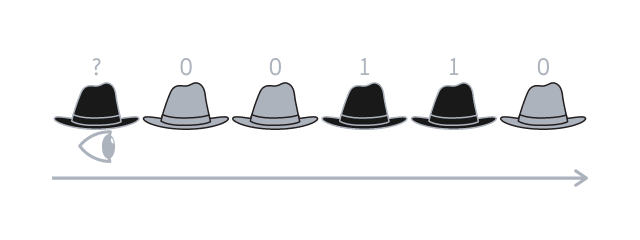
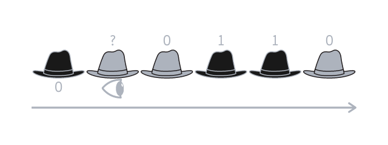
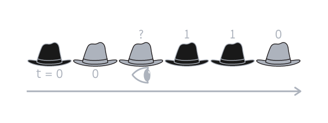
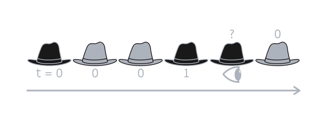
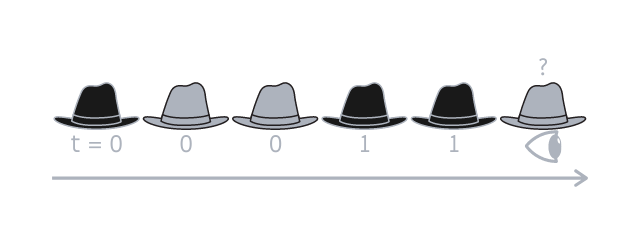

---
metadata:
    description: This blog post contains my proposed solution to one of the problems of this blog.
title: 'Solution #024 - hats in a line'
---

This post contains my proposed solution to [Problem #024 - hats in a line][prob]. Please do not read this solution before making a serious attempt [at the problem][prob].

===

### Solution

Let us say there's $n$ people standing in the line.
We will show that the best strategy always saves $n - 1$ people and that the
$n^\text{th}$ person is saved with a $50\%$ probability.

In order to do this, we have to do two things:

 1. Show there is no strategy with a better success rate.
 2. Show there is a strategy with this success rate that works.

In approaching problems of this type, where one has to “find the best strategy
possible”, my approach is often one of a wishful thinker.
If someone poses a problem like this, *usually* it's because there is an amazing
strategy with a very good success rate.
When that is the case, I always try to see if there can be a **perfect**
strategy.
More often than not, there is a perfect strategy or one that comes quite close
to it.

For this particular problem, it is easy to see there cannot be a truly perfect
strategy: the first person that guess their own hat will have **no** information
whatsoever. Other than the colours of the hats of the *other* people, of course,
but those are completely independent from the colour of their own hat.
This means the first person
will never be able to do better than randomly guessing, which has a $50\%$
success rate.

It is after the first person guesses their hat that things get interesting,
because the person that guesses first can use their guess to convey *some*
information to the other $n - 1$ people and, if we do this right, that
information can help the next people to guess their hat correctly.

I'll show you how to do this.
To make explaining the strategy simpler, let us identify dark hats with the
number $1$ and light hats with the number $0$.

The first person that will say something will be the one at the end of the line,
as that is the person that has more information available, because they can see
everyone else in the line.
Let me illustrate the explanation with an example, assuming $n = 6$ and that the
hats are $1~0~0~1~1~0$, assuming the first person (the person that sees
everyone) has the black hat represented by the first $1$ from before.

The first person thus knows that the hats are distributed like this
$?~0~0~1~1~0$, with the only unknown being their own hat.

The first person will then sum the value of every hat in front of them, which
would be $2$ in this case, and check the parity of that number (i.e. answer the
question “is the number even or odd?”). $2$ is even, of course.

The first person is then tasked with letting the others know what is the parity
of what their hats add up to, so that like a domino all of them guess their hats
correctly.

In our example, $2$ is even and so the first person guesses that their hat is
light-coloured, because that is the colour associated with $0$.
(Unfortunately, this is one of the cases where the first person doesn't make it
but their sacrifice saved everyone else!)
After that, the second person in line knows that their hat, plus the others in
front of them, have a specific parity.

The second person can see $n - 2$ hats and knows their parity.
On top of that, the second person knows what is the parity of the $n - 1$ hats,
because the first person told them that.
This means that the second person can know the parity of its own hat.
In our example, the second person sees hats that sum to $2$, which is even, and
they also know that $2$, plus their hat, should give an even number.
The second person concludes that their hat is represented by $0$ and is thus
light-coloured.

Then the process is repeated.
Let us prove with induction that this works well.
We will prove that if persons $2, 3, \cdots, k$ get it right, then so does the
$(k + 1)^\text{th}$ person, where the base case is for $k = 2$.
The base case was already proven, so we are left with the induction step.

Let $h_i$ represent the number associated with the hat owned by person $i$.
In our example we have $h_1 = h_4 = h_5 = 1$ and $h_2 = h_3 = h_6 = 0$.
Our induction hypothesis tells us that we know the values of $h_2, \cdots, h_k$
(because those people guessed their hats correctly)
and that we also know the parity of $t = h_2 + h_3 + \cdots + h_n$, because the
parity of $t$ is the hint that the first person gives us.
Finally the $(k + 1)^\text{th}$ person can see, with their own eyes, the values
of $h_{k+2}, \cdots, h_n$.
In essence, $t$ is the sum of $n - 1$ variables and person $k + 1$ knows $n - 2$
of those values, meaning they can determine $h_{k+1}$:

$$
t - \left(h_2 + \cdots + h_k \right) - \left(h_{k+2} + \cdots h_n \right) =
h_{k+1} \text{ mod } 2
$$

Of course we can only do this $\text{mod } 2$ because we can only work with
parities, but that is enough.

This is the proof that the strategy works.
I will now complete the example we had been going over.

The third person knows the hats are like this: $?~0~?~1~1~0$ and knows that
$0~?~1~1~0$ should add up to something even.

The third person can then guess their hat is light-coloured, because
$0 + ? + 1 + 1 + 0$ only adds up to something even if their hat (the $?$) is
$0$.

Next is the fourth person, that knows the hats are like this: $?~0~0~?~1~0$ and
knows that $0~0~?~1~0$ should add up to something even.

The fourth person can then guess their hat is dark-coloured, because
$0 + 0 + ? + 1 + 0$ only adds up to something even if their hat is $1$.

Next is the fifth person, that knows the hats are like this: $?~0~0~1~?~0$ and
knows that $0~0~1~?~0$ should add up to something even.

The fifth person can then guess their hat is dark-coloured, because
$0 + 0 + 1 + ? + 0$ only adds up to something even if their hat is $1$.

Next is the sixth, and final, person, that knows the hats are like this:
$?~0~0~1~1~?$ and knows that $0~0~1~1~?$ should add up to something even.

The last person can then guess their hat is light-coloured, because
$0 + 0 + 1 + 1 + ?$ only adds up to something even if their hat is $0$.

And that is it!
I hope my explanation was clear!

If you have any questions about my solution, found any mistakes (whoops!) or would like to share *your* solution, be sure to leave a comment below.

Also, [don't forget to subscribe to the newsletter][subscribe] to get bi-weekly
problems sent straight to your inbox!

[prob]: ../../problems/{{ page.slug }}
[subscribe]: https://mathspp.com/subscribe
