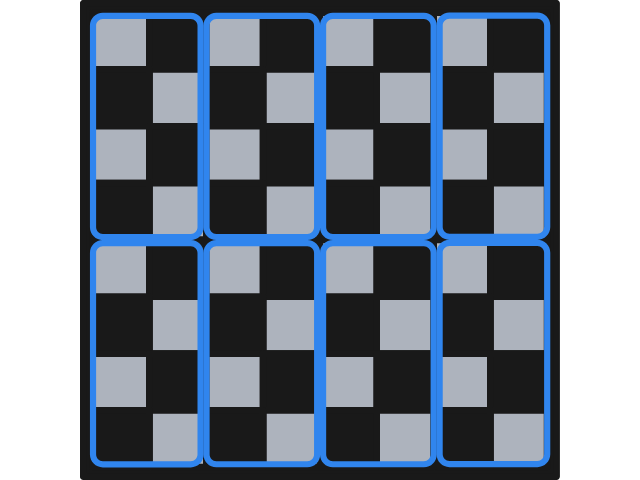
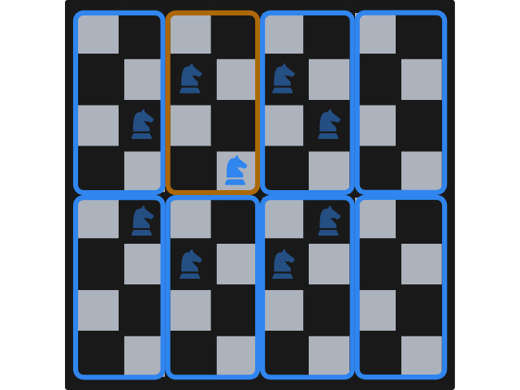
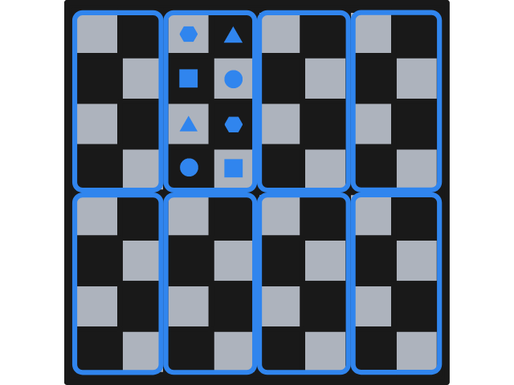

---
metadata:
    description: This blog post contains my proposed solution to one of the problems of this blog.
title: "Solution #025 - knight's tour"
---

This post contains my proposed solution to [Problem #025 - knight's tour][prob]. Please do not read this solution before making a serious attempt [at the problem][prob].

===

### Solution

We will show that Bob (the second player) can always win the game.
To do that, we will follow a very simple strategy: we show that,
regardless of what Alice plays, Bob *always* has a legal move he can make.
If Bob can *always* play something, and if the game is always a finite game
(because there are $64$ squares in a chessboard, the game can never last
for longer than $64$ moves), then Alice is sure to lose.

The first thing we do is consider a division of the chessboard
into rectangles $8$ with dimensions $4 \times 2$, like the figure below shows.

Notice that all squares of the chessboard lie inside one of those rectangles and,
*most importantly*, notice that each square is such that the knight only has a legal move that starts and ends in the same $4 \times 2$ rectangle.

As an example, take a knight that is as central in the chessboard as possible,
in the fourth row from the top and the fourth column from the left.
Such a night has $8$ possible moves, but only one lands in the same rectangle as the
one the knight is standing one.
This is shown in the next figure, with the slightly transparent knights representing
possible moves and with a different frame colour for the rectangle that holds the
initial knight position and the only move that lands in that same rectangle.

This can be seen as a very well established pattern, as each rectangle is the same.
In the next figure we schematise the pairs of squares, within a rectangle, that
can be travelled to and from by a chess knight.
In the example above, the knight was standing in one of the positions marked with a
filled square and could jump to the other filled square.
If the knight had been standing in one of the positions marked with a filled circle,
it could only have jumped to the other filled circle (if the knight wanted to remain
inside the rectangle).

Let this sink in for a bit.

Now that you have understood what this means, it should become fairly clear why
Bob always wins and how he should play to win.

Alice starts off by placing the knight anywhere she'd like, and whenever Bob plays
he just has to move the knight to the only legal position there exists inside the
rectangle where the knight is.
This position is always free, so Bob can always make that move!
On the other hand, when it is Alice's turn her move always changes the knight to
a different rectangle than the one it currently is, to a pair of positions that
the knight hasn't visited yet!

This is it, this is how you can beat Alice if you are player 2.
You can test out this strategy by playing against the computer [here][game].

If you have any questions about my solution, found an error (woops!) or want to share
*your* solution, please **leave a comment** below!
Otherwise just leave an “upvote” reaction!

Also, [don't forget to subscribe to the newsletter][subscribe] to get bi-weekly
problems sent straight to your inbox!

[subscribe]: https://mathspp.com/subscribe
[game]: /games/knights-tour
[prob]: ../../problems/{{ page.slug }}
