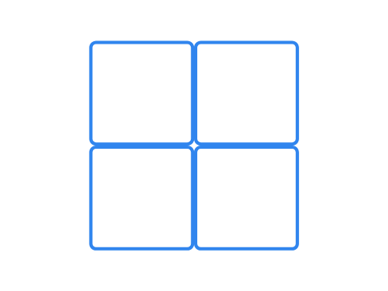
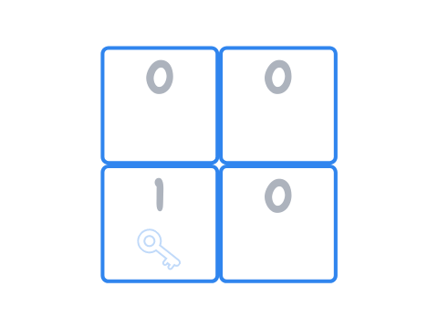
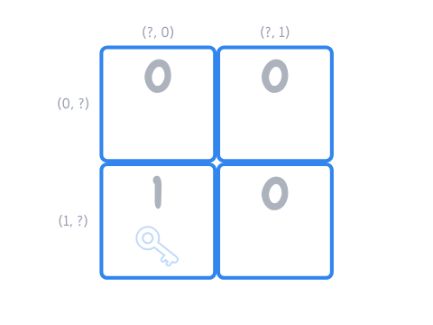
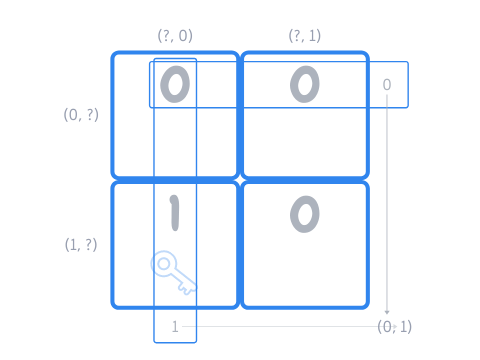
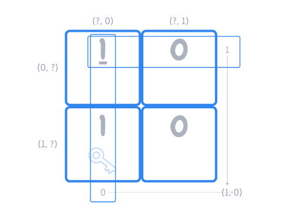

---
metadata:
    description: "This blog post contains my proposed solution to problem #029 of this blog."
title: "Solution #029 - hidden key 2 🗝️🗝️"
---

This post contains my proposed solution to [Problem #029 - hidden key 2][prob].
Please do not read this solution before making a serious attempt [at the problem][prob].

===

### Solution

The solution I will be sharing is not the original solution I thought of,
I decided to share with you the solution that someone [posted][reddit-sol]
online when I shared this puzzle on reddit.

What we are going to do is imagine the four boxes are laid out in a two by two square:

The next thing we do is interpret the sides of the coins as zeroes and ones,
because it is easier to do maths with binary numbers.
So a random configuration of the coins (of the zeroes and ones) and the
(hidden) key could be:

The next thing we do is agree that each box can be represented by its coordinates,
in the sense that we can identify each box by the row and column it is in.
To make things easier for us, we will start counting the rows and columns from zero,
so that the top left box is in position $(0, 0)$, the top right box is in position
$(0, 1)$, the bottom left box is in position $(1, 0)$ and the bottom right box
is in position $(1, 1)$:

In the example image above, the key is currently in box $(1, 0)$.

Now that we have settled all the important details, we can determine our strategy:

 - the parity of the sum of the first row of zeroes and ones
will encode the row the key is in; and
 - the parity of the sum of the first column of zeroes and ones
will encode the column the key is in.

We are talking about the “parity” of the sum because if the row contains two $1$s,
then we sum them and get $2$, which is *not* a valid row.
Likewise for the columns.
Hence, if the first row sums to an even number, then the key is in the first row,
and if the first row sums to an odd number, then the key is in the second row.
Similarly, if the first column sums to an even number, then the key is in the first
column, and if the first column sums to an odd number, then the key is in the second column.

In our example, the first row sums to $0$ and the first column sums to $1$,
which indicates that the key should be in box $(0, 1)$, which is wrong:

To solve our example, what we would have to do is flip the top left coin
(i.e., make it a $1$) so that both the first row and the first column
now got the correct sum:

We can see that this strategy always works:

 - if the $0$s and $1$s are already correct, we can flip the coin of the bottom right box;
 - if the $0$s and $1$s already tell us the correct row, but the incorrect column,
flip the coin of the bottom left box;
 - if the $0$s and $1$s already tell us the correct column, but the incorrect row,
flip the coin of the top right box; and
 - if the $0$s and $1$s tell us the wrong row and the wrong column (like in our example),
then we flip the coin of the top left box.

If you have any questions about my solution, found an error (woops!) or want to share
*your* solution, please **leave a comment** below!
Otherwise just leave an “upvote” reaction!

[Don't forget to subscribe to the newsletter][subscribe] to get bi-weekly
problems sent straight to your inbox!

[subscribe]: https://mathspp.com/subscribe
[prob]: ../../problems/{{ page.slug }}
[reddit-sol]: https://www.reddit.com/r/puzzles/comments/leoye2/identify_a_box_by_turning_a_single_coin_in_an/gmh34a4?utm_source=share&utm_medium=web2x&context=3
