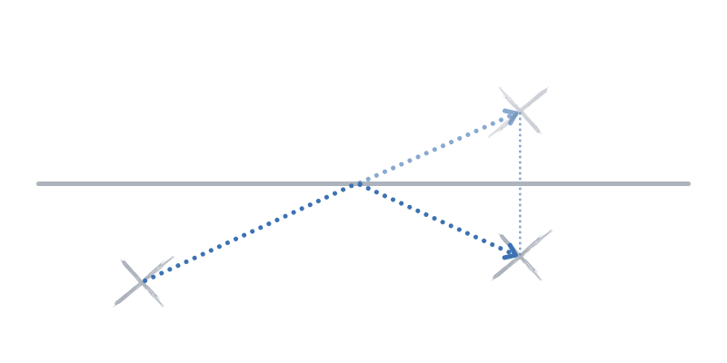

---
metadata:
    description: "This blog post contains my proposed solution to one of the problems of this blog."
title: "Solution #030 - efficiency at the beach"
---

This post contains a proposed solution to [Problem #030 - efficiency at the beach][prob].
Please do not read this solution
before making a serious attempt [at the problem][prob].

===

### Solvers

Congratulations are in order!
Several people sent me the correct solution, namely “Todi Liju” in the
[comment section](http://disq.us/p/2faafjt), João F. emailed me the
correct solution, and some others (António, David, Eleonora, ...) also reached out to me.
However, some sent me overcomplicated solutions!

### Solution

The easiest way to formulate the solution is as follows:

You just have to reflect one of the umbrellas to the other side of the shoreline,
and then the shortest path between the reflection and the other umbrella is a straight
line.
This path crosses the shoreline, so it does what is needed.
When you reach the shoreline, instead of walking into the ocean you turn around
and keep walking in a straight line to the other umbrella.

This works because the distance from any point in the shoreline to an umbrella
is the same as the distance from that same point to the umbrella reflected along
the shoreline.

If you have any questions about my solution, found an error (woops!) or want to share
*your* solution, please **leave a comment** below!
Otherwise just leave an “upvote” reaction!

[Don't forget to subscribe to the newsletter][subscribe] to get bi-weekly
problems sent straight to your inbox!

[email]: mailto:rodrigo@mathspp.com?subject=Solution%20to%20{{ page.title|regex_replace(['/ /'], ['%20']) }}
[subscribe]: https://mathspp.com/subscribe
[prob]: ../../problems/{{ page.slug }}
