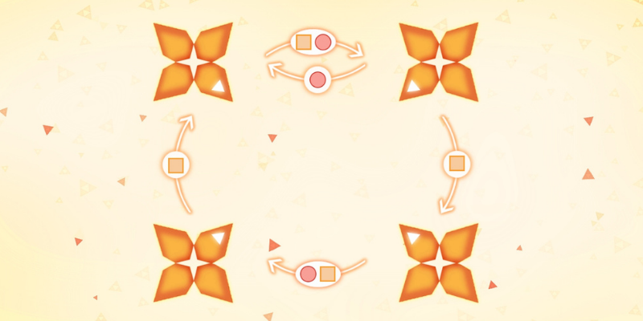

---
metadata:
    description: "Este artigo contém a minha proposta de solução para um dos problemas deste blogue."
title: "Solução #033 - syncro"
---

Este artigo contém a minha solução proposta
para o [Problema #033 - syncro][prob].
Por favor, não leias esta solução se ainda não tentaste
resolver [o problema][prob] a sério.

===

### Submissões

Parabéns a todos os que conseguiram resolver o problema e,
em particular, aos que me enviaram as suas soluções:

 - Filippo M., Itália;
 - Attila K., Hungria;
 - André S., Portugal.

(A lista não está ordenada.)

### Solução

O problema é difícil de resolver sem uma representação visual do que
se está a passar, por isso deixa-me relembrar-te do aspeto do problema:

Queremos descobrir qual é a sequência mais curta de quadrados e círculos
que consegue unir os quatro triângulos brancos das pétalas numa única flor.

Vemos que o quadrado roda as pétalas todas
e que o círculo troca as pétalas de cima ao mesmo tempo que junta as
pétalas de baixo no canto inferior esquerdo.

Há algumas observações que vão ser importantes para resolver o problema:

 - não faz sentido começar com um quadrado;
 - dois círculos de seguida são redundantes;
 - a solução precisa de usar o círculo pelo menos três vezes;
 - a solução termina com um círculo.

Isto mostra que é impossível haver uma solução com menos de 5 passos,
já que o mínimo absoluto necessário é `○⎕○⎕○`, que não funciona.
Sabemos, assim, que a solução tem 6 ou mais passos.

Se testares um pouco e se fores experimentando, eventualmente hás
de encontrar uma solução de 8 passos:

 > `○⎕⎕○⎕⎕⎕○`

Esta é, efetivamente, a solução mais curta.
Para o provar, basta-nos mostrar que não há soluções de 6 ou 7 passos.
Para o fazermos "no papel" há que explorarmos as várias possibilidades
com cuidado, por isso aqui vamos:

 1. círculo – não faz sentido começar com um quadrado;
 2. quadrado – dois círculos de seguida são redundantes. Estamos assim:

$$
\begin{bmatrix} 2 & 1 \\ 0 & 1\end{bmatrix}
$$

Depois de `○⎕` não é óbvio se devemos usar um círculo ou quadrado,
por isso tentamos as duas opções:

 3. círculo – estamos a testar esta opção;
 4. quadrado – depois de um círculo vem um quadrado. É assim que estamos:

$$
\begin{bmatrix}1 & 1 \\ 0 & 2\end{bmatrix}
$$

 5. quadrado – se usarmos um círculo, voltamos ao ponto em que estávamos logo a seguir ao primeiro círculo de todos,
 e portanto teríamos desperdiçado 4 jogadas.
 Este é o estado em que estamos:

$$
\begin{bmatrix}0 & 1 \\ 2 & 1\end{bmatrix}
$$

Neste momento concluímos que não conseguimos acabar o puzzle
em 3 passous ou menos, já que ainda temos de usar, no mínimo,
os movimentos `○⎕○` e esses movimentos não resolvem o puzzle
no estado em que ele está.

Ou seja, o 3⁰ passo _não_ é um círculo:

 3. quadrado. Heis o estado do puzzle:

$$
\begin{bmatrix}0 & 2 \\ 1 & 1\end{bmatrix}
$$

 4. círculo – se usarmos um quadrado, vemos que não conseguimos acabar o puzzle a tempo.
 5. quadrado – depois dum círculo vem um quadrado.
 Estamos nesta posição:

$$
\begin{bmatrix}2 & 2 \\ 0 & 0\end{bmatrix}
$$

Os passos restantes revelam-se diante dos nossos olhos, e vemos
que o que falta é `⎕⎕○`, criando uma sequência final `○⎕⎕○⎕⎕⎕○`.

Se tens alguma questão sobre a minha solução, se encontraste algum erro (woops!) ou se gostavas de partilhar a *tua* solução, deixa um comentário em baixo.
Caso contrário podes só deixar um “upvote”!

[Não te esqueças de subscrever a newsletter][subscribe] para receberes
um problema diretamente no teu email de quinze em quinze dias!

[email]: mailto:rodrigo@mathspp.com?subject=Resposta%20de%20{{ page.title|regex_replace(['/ /'], ['%20']) }}
[subscribe]: https://mathspp.com/subscribe
[prob]: ../../problems/{{ page.slug }}
