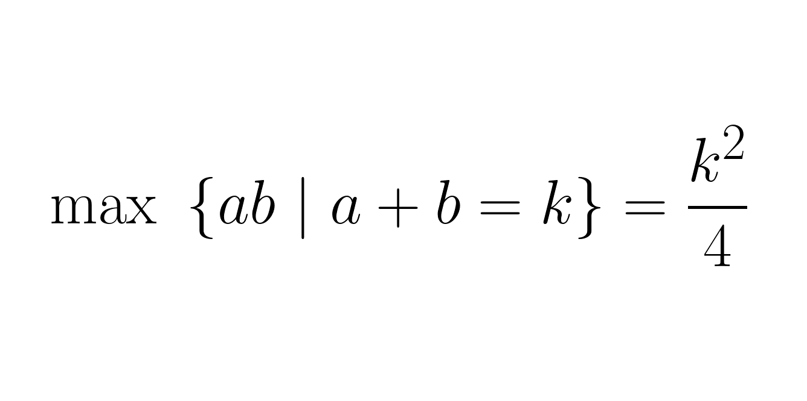

---
metadata:
    description: Nesta prova num tweet vou mostrar como maximizar o produto de dois termos cuja soma está fixa.
title: 'Prova num tweet: maximizar o produto com soma fixa'
---

Vamos provar que, para maximizar $ab$ com $a + b$ igual a um valor constante $k$, temos de tomar $a = b = \frac{k}{2}$.

===

### Prova num tweet

Seja $s = k/2$. Se $a = s+h$ então $b = s-h$, de onde sai que $ab = (s+h)(s-h) = s^2 - h^2$. Porque sabemos que $h^2 \geq 0$, $ab$ é máximo quando $h = 0$, ou seja, quando $a = b = s = k/2$.

<blockquote class="twitter-tweet">
Twitter proof: Take s = k/2. If a = s+h then b = s-h, from which we get that ab = (s+h)(s-h) = s^2 - h^2. Because we know h^2 &gt;= 0, ab is maximised when h = 0, that is a = b = s = k/2.<a href="https://t.co/9ypegSMF2F">https://t.co/9ypegSMF2F</a>
&mdash; Mathspp (@mathsppblog) <a href="https://twitter.com/mathsppblog/status/1324435707918721025?ref_src=twsrc%5Etfw">November 5, 2020</a></blockquote>  

Tens uma ideia para uma prova num tweet? Faz-me saber na secção de comentários!
