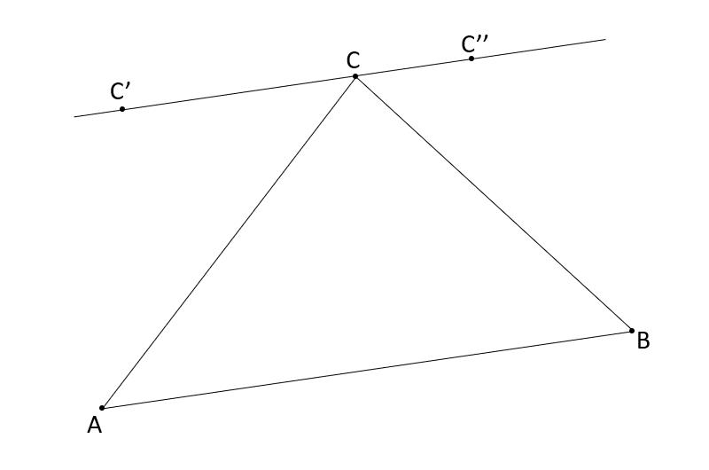

<!-- v -->
This post's format will be a bit different from the usual and the first of a series of posts of this type. In this post, I will state a problem and then present my solution.

===

<!-- ^ -->

## Problem statement

Let $[ABC]$ be any triangle. We now define a transformation of the triangle which moves one vertex and leaves the other two unchanged.
To apply a transformation, start by picking the vertex you want to move.
Assume it was $C$.
Consider the line that goes through $C$ which is parallel to $[AB]$, and pick any point $C'$ in it.
Your transformed triangle is $[ABC']$.
You can repeat this process as many times as you want.

Can the original triangle be transformed into a triangle where all sides were doubled?
How/why?

!!! Give it some thought...

If you need any clarification whatsoever, feel free to ask in the comment section below.

## Solution

The answer to the question is _no_, one cannot apply the transformation a given number of times and get to a triangle with sides that are twice the original size. To see why, we will show that the area of the triangle remains unchanged when you apply the transformation. If we do that and if we realize that doubling up the lengths of the sides makes the area four times bigger, then we conclude that we cannot create the triangle we wished.

Say we have a triangle $[ABC]$ and, without loss of generality, we are going to apply the transformation to $C$. Furthermore, we can assume $[AB]$ is horizontal (this is not needed, just makes it even simpler to visualize the proof). We know that $C$ is going to be moved to a point $C'$ in a line that is parallel to $[AB]$. We know that the area of a triangle is $\frac{b \times h}{2}$ where $b$ is the length of the base and $h$ is the height. If $[AB]$ is seen as the base (its length doesn't change when $C$ moves to $C'$) we see that the height $h$ is the length of the line segment that goes from $AB$ to $C$ and is perpendicular to $AB$. But the line segment that goes from $C'$ to $AB$ and is perpendicular to it has exactly the same length, so the area of the triangle didn't change.

<!-- v -->
!!! This problem does remind me of [problem 36][prob36],
!!! so you might want to take a look at that one too!

[email]: mailto:rodrigo@mathspp.com?subject=Solution%20to%20{{ page.title|regex_replace(['/ /'], ['%20']) }}
[prob36]: /blog/problems/huge-tiny-triangle
<!-- ^ -->
