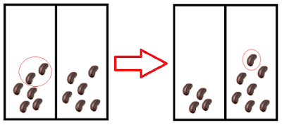
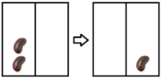
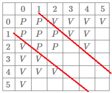
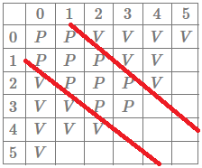

---
metadata:
    description: 'Two pints of beer and two stacks of beans: get ready for a maths game.'
title: 'Problem #006 - stacks of beans'
---

I find the problem in this post rather fun to think about because it is a problem about a game that can actually be played between two players.

===

# Problem statement

Suppose you have two stacks of beans, one with $19$ and another with $20$.
John and Mary are going to play a game with those beans: each turn, one of them takes $2n$ beans from one of the stacks and puts $n$ beans on the other stack, where $n$ is at least $1$.

For example, in the first turn Mary could pick $10$ beans from the stack with $19$ (leaving it with $9$ beans) and then put $5$ beans back in the stack that had $20$ (leaving it with $25$ beans).
Mary plays first and the first player that cannot make a move loses.
Does any of the players have a winning strategy?

!!! Give it some thought...
!!! My suggestion would be to try and figure out in what positions you can know for sure whether you won or lost.

This game is really simple and it is worth playing it against someone just to get a better feel for the rules.
You don't have to use beans, you can use coins or cards or whatever you have at hands.

Below you can find a Python script so that you can play the game against a computer.
The computer is rather dumb so you shouldn't lose too often.
Just hit the green triangle to play and write your plays down in the terminal.
Those plays you write are the new sizes of the stacks.

For example, if you make the example play of the problem statement you would write `9, 25`.
The computer goes second by default but you can change that by writing a `1` in place of the `0` in `GOES_FIRST = 0`.

<iframe allowfullscreen="true" allowtransparency="true" frameborder="no" height="400px" sandbox="allow-forms allow-pointer-lock allow-popups allow-same-origin allow-scripts allow-modals" scrolling="no" src="https://repl.it/@RojerGS/StackedBeans?lite=true" width="100%"></iframe>

If you need any clarification whatsoever, feel free to ask in the comment section below.

# Solution

We will show that John has a winning strategy.
Instead of just proving it, I will try to recreate the train of thought it took me to get there.

Let us represent the sizes of the stacks by a pair $(x, y)$. The first thing to note is that the plays you can make while at $(x, y)$ are the same plays you can make while at $(y, x)$, which means everything we conclude about position $(x, y)$ can also be concluded about position $(y, x)$. Now we follow the first hint and note that if our turn starts and we are at either of $(0,0), (1,0), (0,1)$ or $(1,1)$, we lose, because we cannot remove any beans from either stack. This means that we want to play in such a way that, at a given point, we are at position $(x, y)$ and make a move such that the game state becomes any of those 4 positions, making our opponent lose. From what positions can we make that decisive play?

We can see that it is impossible to reach position $(0, 0)$ given that each move consists of removing some beans from one stack and then adding some beans to the other stack; let us focus on $(1, 0)$. How can one get there? It is fairly easy to see that we can only reach $(1, 0)$ from $(0, 2)$ by making the (obvious) play in the figure:

In a similar fashion we can conclude that to reach the position $(1, 1)$ we must have been at $(3, 0)$ (or $(0, 3)$ of course). At this point, we can already determine the outcome of a game played by two perfect opponents if the game starts at any of the following positions: $(0,0), (1,0), (0,1), (1,1), (2,0), (0,2), (3,0), (0,3)$. We shall keep exploring positions this way and fill a table with our conclusions. We say we have a losing position $L$ if the first player loses a game starting at that position and similarly we say we have a winning position $W$ if the first player wins a game starting at that position. As an example, $(1,0)$ is a losing position. So far, this is what we know:

$$
\begin{array}{|c|c|c|c|c|c|c|}
\hline   & 0 & 1 & 2 & 3 & 4 & 5 \\
\hline
 0 & L & L & W & W &   &   \\
\hline 1 &  L & L &   &   &   &   \\
\hline
 2 &  W &   &   &   &   &   \\
\hline 3 & W &   &   &   &   &   \\
\hline 4 &    &   &   &   &   &   \\
\hline 5 &    &   &   &   &   &   \\
\hline
\end{array}
$$

We will keep filling the table up, noticing with relative ease that positions $(2,1)$ and $(2,2)$ are losing positions; after that we conclude that positions $(3,1), (4,0), (4,1), (5,0), (6,0)$ and $(4,2)$ are winning positions, because from all of those we can get to either $(2,1)$ or $(2,2)$. Note that for a position to be a winning position it is enough that there exists **one** specific move that sends it to a losing position. For example, from $(4,0)$ we can go to $(2,1)$ or $(2,0)$. If we go to $(2,1)$ we win, because $(2,1)$ is an $L$ position, but if we go to $(2, 0)$ we just offered a victory to our opponent.
On the other hand, for a position to be a losing position it is necessary that **all** positions that derive from it give the victory to our opponent, i.e. player $A$ is in a losing position if, regardless of its move, player $B$ receives a winning position.

If we fill the table with our new findings we get:

$$
\begin{array}{|c|c|c|c|c|c|c|}
\hline   & 0 & 1 & 2 & 3 & 4 & 5 \\
\hline
 0 & L & L & W & W & W & W \\
\hline 1 &  L & L & L & W & W &   \\
\hline
 2 &  W & L & L &   & W &   \\
\hline 3 & W & W &   &   &   &   \\
\hline 4 & W  & W & W &   &   &   \\
\hline 5 & W  &   &   &   &   &   \\
\hline
\end{array}
$$

At this point we could start to notice a pattern that I try to make more explicit in the following figure:

Hopefully the red lines are hinting at a possible conjecture: the losing positions are positions of the form $(x, x+1), (x,x)$ and $(x+1, x)$.

Before we try to prove our conjecture we will check positions $(3,2), (3,3), (2,3)$. If those positions are also $L$ positions, then our conjecture gains strength and it will make sense to test it.

If we are at $(3,2)$ we can only go to $(4,0)$ or $(1,3)$ which are both $W$ positions, hence $(3,2)$ (and therefore $(2,3)$ as well) is a losing position. We can also verify that $(3,3)$ is an $L$ position:

We could keep on going and fill the whole table, but at this point I thought it would be worth it to try and prove the conjecture. If it turns out that the conjecture is false, then maybe we might get some more insight into what other positions are also losing positions.

**Conjecture:** a position $(x, y)$ is an $L$ position if and only if $y \in \{x-1, x, x+1\}$. That is, every $L$ position is of the form $(x, x-1), (x,x)$ or $(x, x+1)$ and every position of that form is an $L$ position.

We start by proving that every position of the form stated is a losing position by induction on the size of the first pile. The base case is for the positions $(1,0),(1,1), (1,2)$ which is true by our table. For the inductive step, we assume that for any $k < x$ (with $x > 1$) all three positions $(k, k-1), (k,k), (k, k+1)$ are losing positions and proceed to show that it implies the positions $(x,x-1), (x,x)$ and $(x, x+1)$ are also losing positions; for that, we will show that regardless of the move made, the opponent can always reply in such a way that we go back to the red zone. We recall that the case $(x, x-1)$ comes for free by the induction hypothesis, given that $(x, x-1) \approx (x-1, x) = (k, k+1), k = x-1$ is an $L$ position.

It should also be noted that if we could go from position $(x, y)$ to $(x - 2n, y + n)$, then if we also assume that $y + n \geq 2n$ then the opponent can reply with $(x - 2n, y+n) \to ((x-2n) + n, (y+n) - 2n) = (x - n, y - n)$, i.e. the final outcome of the two moves is that the difference between the stacks is the same ($(x-n)-(y-n) = x-y$) but both piles got smaller. We are now left with showing that from both the case $(x,x)$ and $(x, x+1)$ we can play like we described above. We will show how to prove it for the position $(x, x+1)$: the first player can take us to $(x - 2n, x + n + 1)$ or $(x + n, x - 2n + 1)$.

If we are at $(x - 2n, x + n + 1)$ it is obvious that we can take $2n$ beans from the second pile: after all, if we could take $2n$ beans from a stack with $x$ beans we can take $2n$ beans from a stack with $x + n + 1$ beans, leaving us at $(x - n, x + 1 - n)$ which, by the induction hypothesis, is a losing position. If we are at $(x + n, x - 2n + 1)$ we necessarily have $2n \leq x + 1 \implies n \leq \frac{x+1}{2}$ because $x-2n+1\geq 0$. Now, $x + n \leq 2n \iff x \leq n \iff \frac{x}{2} \leq \frac{n}{2} \implies \frac{x+1}{2} \leq \frac{n+1}{2} = \frac{n}{2} + \frac{1}{2} \leq \frac{n}{2} + \frac{n}{2} = n$ and so we can make the move $(x - 2n, x + n + 1) \to (x - n, x + 1 - n)$ which, by the induction hypothesis, is a losing position.

We conclude that all positions of the form $(x, x-1), (x,x), (x,x+1)$ are losing positions. To show all losing positions are of that form it suffices to show that every other position is a winning position. As a matter of fact, if we are at $(x, y)$ with $x > y+1$ then there is an $n \geq 1$ such that $(x - 2n, y + n)$ is of the previous form (in particular taking $n = \lfloor \frac{x-y}{3}\rfloor$).

Assuming $x > y + 1$ then $x - y = 3n \vee x - y = 3n-1 \vee x - y = 3n + 1$ for some $n \geq 1$. Making a play with said $n$ works as intended.

We conclude the proof of our conjecture and we see that the position in the problem statement is a losing position, i.e. John has a winning strategy if he follows the strategy outlined in our proof.

In the terminal below you can try playing against a computer that will follow the winning strategy. To play, press the triangle "play" button to execute it. Making a play corresponds to writing the sizes of the stacks after moving the beans according to the rules.

<iframe allowfullscreen="true" allowtransparency="true" frameborder="no" height="400px" sandbox="allow-forms allow-pointer-lock allow-popups allow-same-origin allow-scripts allow-modals" scrolling="no" src="https://repl.it/@RojerGS/PerfectStackedBeans?lite=true" width="100%"></iframe>
