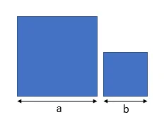
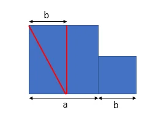
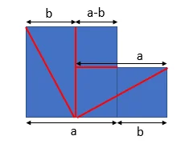
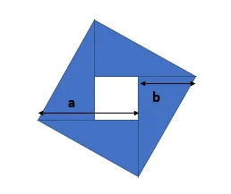

Given some paper squares, can you slice them and then glue them back together to form a single square?

===

## Problem statement

Given $n$ squares of side lengths $a_1, a_2, \cdots, a_n$, is it possible to cut them in a way that the cut pieces can be rearranged into a single, larger square with no holes or no overlapping pieces?

You can actually try this out with paper squares and a pair of scissors!

## Solution

The first step is to recognize it suffices to prove the statement for two squares.
That is, given two squares of side lengths $a$ and $b$, it is always possible to cut them into pieces and rearrange those pieces to create a single square.

Let us start by considering the case where $a > b$.

Take the bigger square and make a cut parallel to one of the sides in order to create two rectangles: one of dimensions $a \times b$ and the other of dimensions $a\times (a-b)$.
Take the rectangle that is $a \times b$ and cut it along the diagonal, getting two identical right triangles with sides $a$ and $b$.

Cut the rectangle that is $a \times (a-b)$ in order to obtain a square $(a-b) \times (a-b)$ and a rectangle $b \times (a-b)$, putting it next to the smaller square ($b \times b$) to create a new rectangle $b \times a$, which we cut along the diagonal.

At this point, we have $4$ right triangles of sides $a$ and $b$ and a square that is $(a-b) \times (a-b)$. All we need is to put the pieces together in a convenient way:

The hole that is missing is filled by the square $(a-b) \times (a-b)$ that hasn't been used.

Note that the side of the new square is $\sqrt{a^2 + b^2}$, as expected: the sum of the areas of the two initial squares is $a^2 + b^2$, meaning a square made out of those two would need to have sides of length $\sqrt{a^2 + b^2}$.

In the beginning we assumed $a > b$.
If $a = b$ we just need to cut the two squares along the diagonal and glue together the $4$ right triangles.
The case $a < b$ can be handled similarly to the case $a > b$ by swapping the two squares.

We have proved we can transform two squares into a single one by a succession of cuts and rearrangements.
To prove this holds for a generic number of initial squares we proceed to prove the statement by complete induction.
The base case, $n = 2$, is done.

For the induction step, we suppose it is true for any number of squares between $2$ and $n$ and it becomes easy to check it works for $n+1$ as well: start by cutting two squares to get one single square out of those two; we just got from $n+1$ squares with side lengths $a_1, a_2, \cdots, a_{n+1}$ to $n$ squares with side lengths $a_1, a_2, \cdots, a_{n-1}, a'$, with $a' = \sqrt{a_n^2 + a_{n+1}^2}$.
By the induction hypothesis we can cut the $n$ remaining squares and then glue all the pieces back together to form a single square, thus concluding the induction step!
