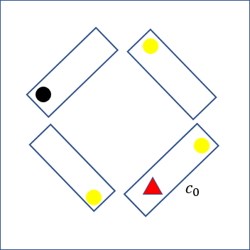

Can you find out how many carriages this circular train has?

===

This is that type of problem that can be phrased as a riddle that you can tell everyone.
Of course, some people will try to think it through while other people will just ask you for the solution.

## Problem statement

Suppose you are in a circular train, i.e. a train where the first carriage is connected to the last carriage.
Suppose, furthermore, that all carriages are identical and that you have no way to tell them apart.
Additionally, each carriage has a light bulb that you can turn on and off to your own liking.

If you are inside such a train, alone, how can you find how many carriages the train has, if the light bulbs in the carriages start in any arbitrary state?

To sum up, the main characteristics of this riddle are:

 - the train is circular, hence you can go forward indefinitely; the same backwards;
 - all train carriages are exactly identical, so you can't tell them apart;
 - each carriage has a light bulb that you can turn on/off;
 - each carriage will start with its light bulb in a random state;
 - you have no way to leave the train nor to contact the exterior;
 - you are the only person in the train; and
 - the number of carriages in the train is unknown and you are supposed to find it.

The solution must be purely logical and not rely on loopholes, items you "happen to have with you", or other shenanigans.

## Solution

You start off in some carriage that I will call $c_0$, pick a direction - that I will call "forward" - and you make sure the light bulb is on.
The point of calling that carriage $c_0$ is to say that the next carriage is $c_1$, the one after is $c_2$, and so on up until the last carriage.

You start walking forward, going through carriages and counting them until you reach a carriage $c_{k_1}$ that has its light bulb on; you turn the light bulb off and go $k_1$ carriages back, to $c_0$.
If you get there and the light bulb is off, then you must have turned it off while in $c_{k_1}$ and thus $c_0 = c_{k_1}$ meaning that the train has $k_1$ carriages.

If the light in $c_0$ is still on, then $c_{k_1}$ was just a regular carriage, and you keep going: walk forward until a carriage $c_{k_2}$ (with $k_2 > k_1$) has its light on, turn it off, go back $k_2$ carriages, check the light in $c_0$.
Rinse and repeat.
This will create a sequence $k_1, k_2, \cdots$ of carriages that were turned on and because the train is finite, this process will eventually end (and in particular, no light bulb will be turned on!). Below you can find an animation of the solution for a small train with four carriages.

## Bonus question

Can you find a solution that is more efficient?

If $N$ is the size of the train, then the algorithm I explained above is $O(N^2)$ in the worst case scenario (all light bulbs start turned on) and $O(N)$ in the best case scenario (all light bulbs start turned off).
Can you find a solution that is better either in the best case or the worst case?
(I have no idea if such a solution exists.)
