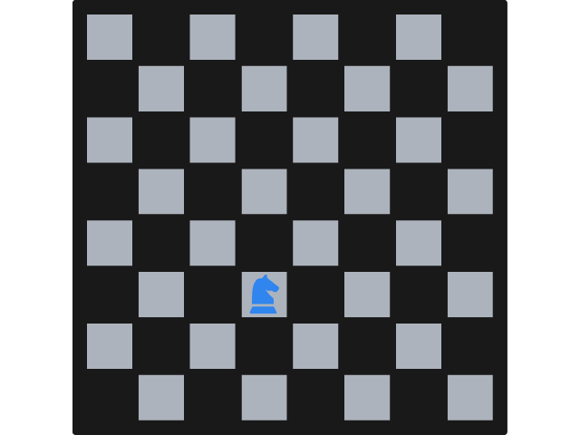
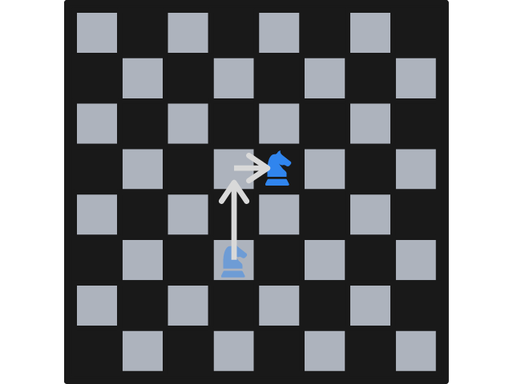
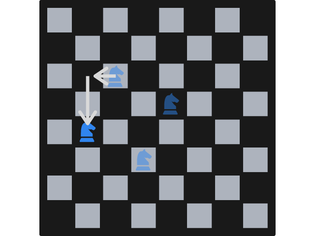
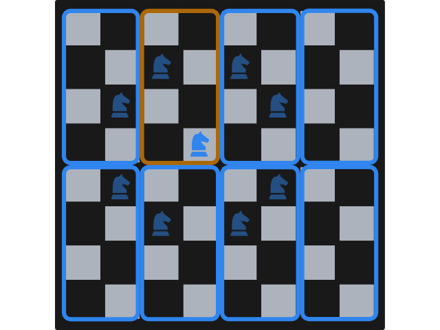

---
metadata:
    description: This problem pits Alice against Bob in a little game that takes place in a chessboard.
title: "Problem #025 - knight's tour"
---

Alice and Bob sit down, face to face, with a chessboard in front of them.
They are going to play a little game, but this game only has a single knight...
Who will win?

===

## Problem statement

Alice and Bob will play a special game of “chess”.
Alice will take the knight and place it in some square of the chessboard, any square she likes.

Then, Bob will take the knight and move it (according to chess rules) to a square of his choosing.

Then it's Alice's turn to do the same, and they will alternate moving the knight.
There is only a catch:

 > They **cannot** move the knight to a position that has already been visited by the knight.

In the example image below, the knight cannot be moved one row down and two columns right, as that is the place the knight started at.

Thus, the player who cannot make a valid move loses.

Can any of them guarantee a win? Who? How?

!!! Give it some thought...

If you want, you can try playing the game against the computer [here](https://mathspp.com/games/knights-tour).

If you need any clarification whatsoever, feel free to ask in the comment section below.

This problem was posed to me by a university colleague that plays a lot of chess!

## Solution

We will show that Bob (the second player) can always win the game.
To do that, we will follow a very simple strategy: we show that,
regardless of what Alice plays, Bob *always* has a legal move he can make.
If Bob can *always* play something, and if the game is always a finite game
(because there are $64$ squares in a chessboard, the game can never last
for longer than $64$ moves), then Alice is sure to lose.

The first thing we do is consider a division of the chessboard
into $8$ rectangles with dimensions $4 \times 2$, like the figure below shows.

Notice that all squares of the chessboard lie inside one of those rectangles and,
*most importantly*, notice that each square is such that the knight only has a legal move that starts and ends in the same $4 \times 2$ rectangle.

As an example, take a knight that is as central in the chessboard as possible,
in the fourth row from the top and the fourth column from the left.
Such a knight has $8$ possible moves, but only one lands in the same rectangle as the
one the knight is standing one.
This is shown in the next figure, with the slightly transparent knights representing
possible moves and with a different frame colour for the rectangle that holds the
initial knight position and the only move that lands in that same rectangle.

This can be seen as a very well established pattern, as each rectangle is the same.
In the next figure we schematise the pairs of squares, within a rectangle, that
can be travelled to and from by a chess knight.
In the example above, the knight was standing in one of the positions marked with a
filled square and could jump to the other filled square.
If the knight had been standing in one of the positions marked with a filled circle,
it could only have jumped to the other filled circle (if the knight wanted to remain
inside the rectangle).

Let this sink in for a bit.

Now that you have understood what this means, it should become fairly clear why
Bob always wins and how he should play to win.

Alice starts off by placing the knight anywhere she'd like, and whenever Bob plays
he just has to move the knight to the only legal position there exists inside the
rectangle where the knight is.
This position is always free, so Bob can always make that move!
On the other hand, when it is Alice's turn her move always changes the knight to
a different rectangle than the one it currently is, to a pair of positions that
the knight hasn't visited yet!

This is it, this is how you can beat Alice if you are player 2.
You can test out this strategy by playing against the computer [here][game].

[Don't forget to subscribe to the newsletter][subscribe] to get bi-weekly
problems sent straight to your inbox and to add your reaction below.

[sol]: ../../solutions/{{ page.slug }}
[subscribe]: https://mathspp.com/subscribe
