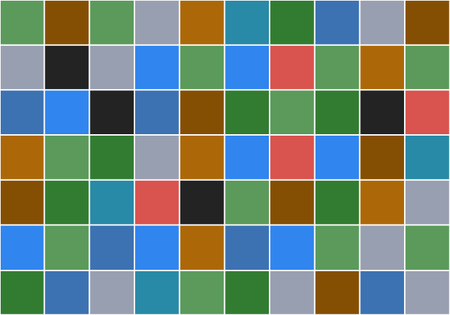
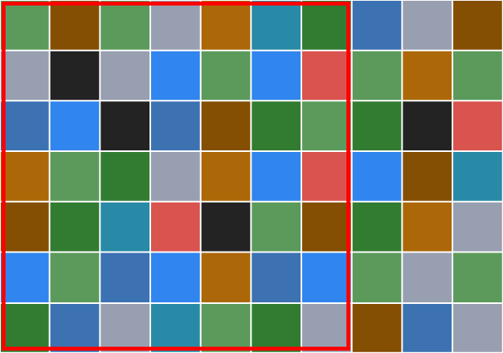
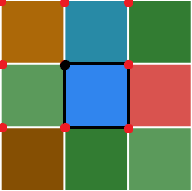
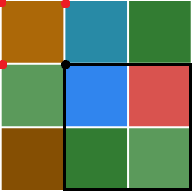
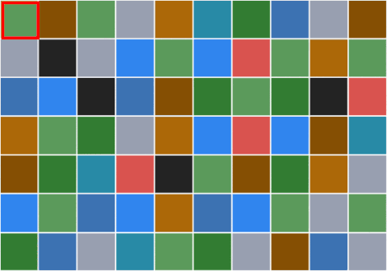

---
metadata:
    description: You just have to count squares to solve this problem... Should be simple enough, right?
title: 'Problem #026 - counting squares'
---

I bet you have seen one of those Facebook publications where you have a grid and you have to count
the number of squares the grid contains, and then you jump to the comment section and virtually
no one agrees on what the correct answer should be...
Let's settle this once and for all!

===

## Problem statement

The image above is a colourful grid that has $7$ rows and $10$ columns.
How many squares are hiding in that grid?

The problem in this post is not about complicated theorems or weird proofs, it is just about
finding a way to systematically count all the squares in a figure like this...
Other than
tracing the squares with one's finger and whispering the count as you go, of course.

You can start with something simpler to warm up.
How many squares are there in this smaller $3 \times 3$ grid?

!!! Give it some thought...

If you need any clarification whatsoever, feel free to ask in the comment section below.

## Solution

Let's count the squares in this 7 by 10 grid:

This is a type of problem that shows up often in social platforms.
Scrolling through the comment section of those posts usually shows
that there are as many different solutions as people commenting:
no two people agree on the correct solution!

A foolproof way of dealing with this is by figuring out the formula that
counts the squares for you, instead of tracing them with your finger
and counting them in your head.

Here is how *I* like to do it: I start by looking at the grid and determining
how big the squares can get.
The grid is 7 by 10, so the largest squares it can contain are 7 by 7, like the
one in the figure below:

Then, we just have to figure out how many squares of each size the grid contains.
This is a train of thought similar to the one outlined in [this blog post about
probabilities][pokemon]:
instead of solving a big problem, we break it into smaller subproblems that we
solve one by one.
The smaller squares are $1\times 1$, then there's $2\times 2$ squares, etc,
all the way until the $7\times 7$ squares.
Finally, to know how many $n\times n$ squares there are in the grid, we just
need to calculate the number of locations where the top left corner of the square
could go.

For example, in a smaller 3 by 3 grid, there are 9 possible positions for the
top left corner of a 1 by 1 square, shown in the figure below.
One of the 9 possible corners is shown with its corresponding 1 by 1 square.

If we consider, instead, 2 by 2 squares, how many corners can still be the top
left corner of the square?
Now that our square is bigger, the corners that are all the way to the right
or at the bottom cannot be used, because those do not leave enough space for
a $2\times 2$ square.
We are left with 4 useful corners,
like the image below shows:

All that matters for this process is the calculation of how many corners are useful.
In a $n \times m$ grid, how many corners are useful as the top left corner of a
$k \times k$ square, assuming $k \leq \min(n, m)$?
Along a side with length $n$ you can use $n - k + 1$ positions, and along a side
of length $m$ you can use $m - k + 1$ positions.
If you consider the product of the two, because you can go along both sides at
the same time, you end up with $(n-k+1)(m-k+1)$ positions in total.

Think of it like this (and make a drawing as you read along), there is a line
segment with length $n$, and the line segment is divided into smaller segments
of length $1$ (there are $n$ of those, of course).
Now we want to count how many line segments of length $k$ you can draw on top
of the larger line segment, assuming the smaller one has to be aligned by the
smaller ones.
You can see there are $n - k + 1$ of those.
For example, if the larger line segment has length $7$ and you want to draw line
segments of length $4$, then there are $4$ of those because $7 - 4 + 1 = 4$.

Therefore, a $n \times m$ grid can have $(n - k + 1)(m - k + 1)$ squares
of size $k\times k$.

Now we just have to go over the possible values of $k$, which go from
$1$ to $7$ in a $7 \times 10$ grid.
If $S(n, m)$ is the number of squares in a $n \times m$ grid, with $n \leq m$,
then we have that

$$
S(n, m) = \sum_{k = 1}^{n} (n-k+1)(m-k+1) ~ .
$$

For our case, we want to compute $S(7, 10)$:

$$
S(7, 10) = (7\times 10) + (6\times 9) + (5\times 8) + (4\times 7) + (3\times 6) + (2\times 5) + (1\times 4) = 224 ~ .
$$

Therefore, there are $224$ squares in the $7 \times 10$ grid I showed, and here is an animation showing all of them highlighted:

The process we used to compute the number of squares in the grid could also be used to
compute the total number of rectangles in the grid.
Can you do it?
Let me know in the comments how it goes!

[Don't forget to subscribe to the newsletter][subscribe] to get bi-weekly
problems sent straight to your inbox and to add your reaction below.

[subscribe]: https://mathspp.com/subscribe
[sol]: ../../solutions/{{ page.slug }}
