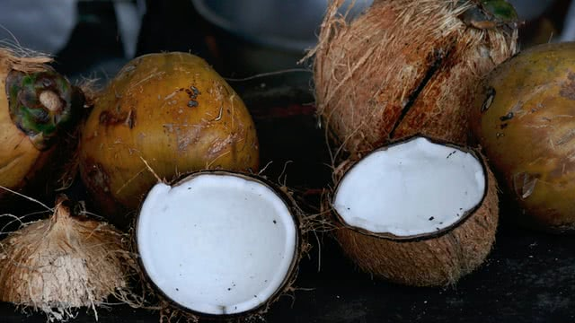

---
metadata:
    description: "In this problem, we calculate how many coconuts a group of sailors found in a desert island."
title: 'Problem #027 - pile of coconuts 🥥'
---

Five sailors and their monkey were washed ashore on a desert island.
They decide to go get coconuts that they pile up.
During the night, each of the sailors, suspicious the others wouldn't behave fairly,
went to the pile of coconuts take their fair share.
How many coconuts were there in the beginning..?

===




## Problem statement

A group of five sailors and a monkey wash ashore on a desert island.
After the initial shock subsided, they decided the best thing to do was to gather
supplies for the upcoming days.
They split up and when they got back together, the only thing they managed
to find was coconuts, that they piled up, before deciding to go get some sleep.

In the middle of the night, the first sailor -- who was suspicious the others wouldn't
be fair in the division of the coconuts -- went to the pile of coconuts to divide it
evenly in five and get their fair share.
When the sailor divided the pile, they realised there was an extra coconut that could
not go in any pile, so they gave it to the monkey, and then took a fifth of the
remaining coconuts and went to sleep.

A while later, the second sailor did the same.
They went to the coconut pile and divided it evenly in five parts, only to find out
there was one coconut too many.
The sailor gave that coconut to the monkey, took a fifth of the remaining coconuts and
then went to bed.

This happened for the other three sailors as well: all of them woke up, went to the
coconut pile and divided it in five, gave a coconut in excess to the monkey and then
took exactly one fifth of the remaining coconuts before heading back to sleep.

What is the minimum number of coconuts that there had to be in the pile in order
for this to be possible?

!!! Give it some thought...

If you need any clarification whatsoever, feel free to ask in the comment section below.


## Solution

The problem of determining the amount of coconuts that the sailors gathered
can be tackled with a bit of modular arithmetic.

Let us say that after all sailors fiddled with the pile, there were $x$ coconuts left.
We will use $x$ to write an expression for the number of coconuts originally available,
and then we solve for $x$.

Recall that the fifth sailor gave a coconut to the monkey and took a fifth of the
coconuts available, leaving the pile with exactly $x$ coconuts.
So, when the fifth sailor got to the pile, the pile had exactly these many coconuts:

$$
\frac54 x + 1 ~ .
$$

Repeating the process of multiplying by $\frac54$ and adding $1$,
we see that the pile had

$$
\frac54\left(\frac54 x + 1\right)  + 1 = \frac{25}{16}x + \frac94
$$

coconuts when the fourth sailor got to the pile, which means that when the third
sailor got to the pile, it had

$$
\frac54\left(\frac{25}{16}x + \frac94 \right) + 1 = \frac{125}{64}x + \frac{61}{16}
$$

coconuts.
Repeating this process two more times, we see the pile had

$$
\frac54\left(\frac{125}{64}x + \frac{61}{16}\right) + 1 =
\frac{625}{256}x + \frac{369}{64}
$$

coconuts the moment the second sailor got to the pile and exactly

$$
\frac54\left(\frac{625}{256}x + \frac{369}{64}\right) + 1 =
\frac{3125}{1024}x + \frac{2101}{256}
$$

when the first sailor got there, i.e. the initial amount of coconuts in the pile is

$$
\frac{3125}{1024}x + \frac{2101}{256} = \frac{3125x + 8404}{1024} ~ .
$$

From the problem statement, we know that the initial number of coconuts is a whole
number (that is, the sailors collected a whole number of coconuts).
This means that $3125x + 8404$ must be a multiple of $1024$, so that the fraction
above evaluates to an integer.
In mathematical notation, that is written as

$$
3125x + 8404 \equiv 0 \mod 1024 ~ .
$$

Now, notice that $3125 = 53 + 3\times 1024$ and $8404 = 212 + 8\times 1024$.
We can replace these two equalities in the expression $3125x + 8404$ to obtain

$$
53x + 3\times 1024x + 212 + 8\times 1024 ~ ,
$$

which is a number that should be a multiple of $1024$.
Obviously, the terms that are being multiplied by $1024$ are already multiples
of $1024$, so we just need $53x + 212$ to be a multiple of $1024$.
In mathematical notation, we write the intermediate step as

$$
3125x + 8404 \equiv 53x + 212 \mod 1024 ~ .
$$

This means we now have a simpler equation to solve:

$$
53x + 212 \equiv 0 \mod 1024
$$

Another thing we can do to simplify this equation is notice that
$53x + 212 = 53(x + 4)$.
We need $53(x + 4)$ to be a multiple of $1024 = 2^{10}$, that is,
we need $53(x + 4)$ to be divisible by $2$ ten times.
However, the number $53$ is *not* divisible by $2$ (not even once!) so it is the
factor $x + 4$ in $53(x + 4)$ that has to be divisible by $2$ ten times.

Now that we know that $x + 4$ is a multiple of $2^{10} = 1024$,
and remembering that $x$
was the number of coconuts in the final pile (so that $x > 0$), we have that
$x + 4$ must be in the following list:

$$
1024, 2048, 3072, 4096, \cdots
$$

or, in other words, $x$ must be in the list

$$
1020, 2044, 3068, 4092, \cdots
$$

The problem statement asked for the *minimum* number of coconuts, so we have to pick
the smallest value in the list, which is $x = 1020$.
If $x = 1020$, then the initial number of coconuts in the pile was

$$
\frac{3125\times 1020 + 8404}{1024} = 3121 ~ _\blacksquare
$$

Therefore, $3121$ is the answer to the coconut problem.

This problem had a solution with more calculations than the usual problems I post
in this blog.
What did you make of it?
Do you prefer problems with more or with less calculations?
Let me know in the comment section below.


### Code

I also ran some basic Python code in a REPL session to double-check my solution.
Here's the session code:

```pycon
>>> def f(x):
...     return 4 * (x - 1) / 5
...
>>> def g(x):
...     return f(f(f(f(f(x)))))
...
>>> from itertools import count
>>> for x in count(1):
...     if int(g(x)) == g(x):
...         print(x); break
...
3121
>>> g(3121)
1020.0
```

[subscribe]: https://mathspp.com/subscribe
[sol]: ../../solutions/{{ page.slug }}
