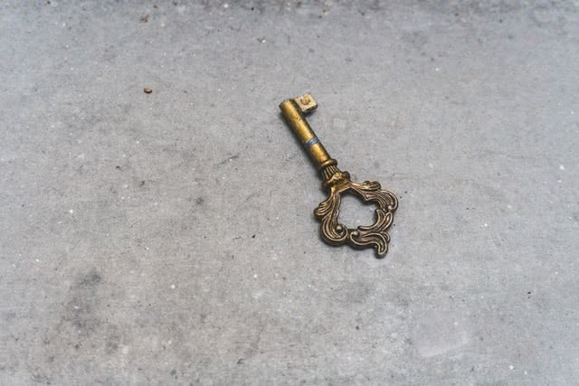

---
metadata:
    description: "Three boxes, three coins and a hidden key - can you find it?"
title: "Problem #028 - hidden key 🗝️"
---

There is a key hidden in one of three boxes and each box has a coin on top of it.
Can you use the coins to let your friend know where the key is hiding?

===

# Problem statement

You and your best friend are locked in jail for no reason at all, but you are
given the opportunity to escape.
You are taken to a room that has three opaque boxes.
The key to your cell will be put inside one of the boxes, and then a (regular)
coin is placed on top of each box.
You may pick a single coin and reverse its face up,
and then your friend will enter the room.

When your friend enters the room you are not allowed to talk, and your friend
must open a box.
If your friend opens the box with the key, you are set free.
Otherwise, you are locked for eternity...

What is the strategy that you and your friend should agree upon, so that
your friend can always find the key?

!!! Give it some thought...

If you need any clarification whatsoever, feel free to ask in the comment section below.

# Solution

There are multiple solutions to this problem, but the most simple and elegant one (that I know of) is as follows:
flip a coin, so that the box with the key is under a coin whose face
up is different from the other two coins.

What is interesting is that this is always possible,
regardless of how the coins are originally placed on top of the boxes.
I invite you to have a go at demonstrating that the solution
I just described actually works, before you keep on reading
my solution.

If you number the boxes $1$ to $3$, with the box holding the key being
box number $1$, then there's $8$ different ways the coins could be
placed on top of the three boxes.
However, we don't care about the exact coin faces facing up!
Much like “[Problem #021 - predicting coin tosses][p21]”, we only
care about the relationships of the outcomes, which are three
and can be identified by the number of boxes whose coin face up is the same
as the coin face that is up on top of the box with the key.
That was a long sentence, reread it if you must!

For example, if the box with the key has a coin with tails face up, then one
of these three must be true:

 1. all coins have tails face up.
 2. two coins have tails face up, one on top of the box with the key and another
on top of some other box.
 3. only the coin on top of the box with the key has tails face up.

If we are in situation 1., then we turn the coin on top of the box with the key,
so that its face up is now heads (and it is the only coin with heads facing up).
If we are in situation 2., then we turn the coin that has tails face up and that
is **not** on top of the box with the key, so that the box with the key is now
the only box with a coin whose face up is tails.
If we are in situation 3., then we do not need to do anything, as the box with
the key is the only box with a coin whose face up is tails.

If the box with the key had the coin with heads facing up, then we just have to
follow the instructions above, except we start by swapping all occurrences of
"heads" with "tails" and vice versa.

[Don't forget to subscribe to the newsletter][subscribe] to get bi-weekly
problems sent straight to your inbox and to add your reaction below.

[subscribe]: https://mathspp.com/subscribe
[sol]: ../../solutions/{{ page.slug }}
