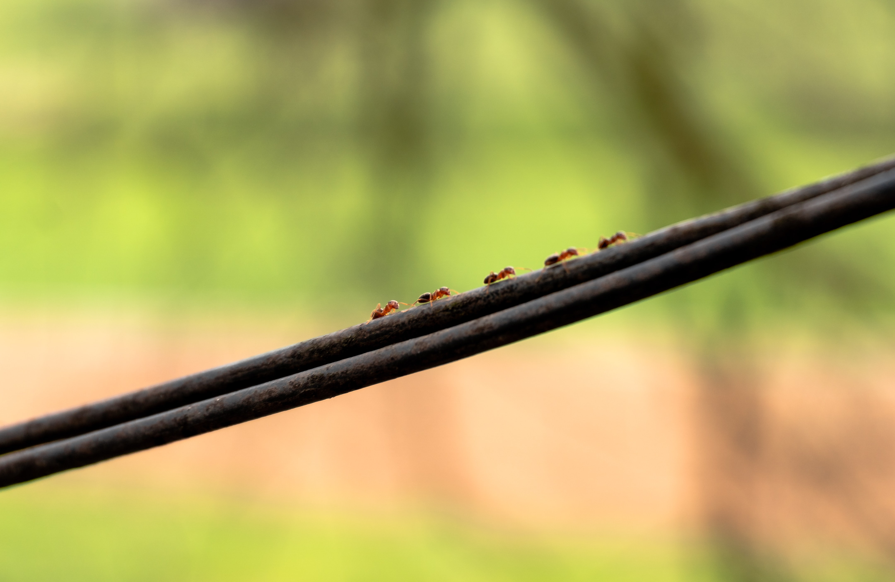

A bunch of ants are left inside a very, very, tight tube,
and they keep colliding with each other and turning around.
How long will it take them to escape?

===

# Problem statement

Suppose you have a very thin pipe.
The pipe is the exact width of an ant, so that ants
can travel inside the pipe, but they can't cross paths because
the pipe isn't wide enough for that.
Assume an ant takes exactly 1h to travel through said pipe.

I will now place several ants along the pipe, facing different
directions, and all ants will start walking in a straight line.
When two ants collide, they both turn around and continue
walking in the opposite direction they were walking in.
When an ant reaches the end of the pipe, the ant just leaves the pipe.

What is the shortest amount of time that ensures all ants have left the pipe?

!!! Give it some thought!

# Solution

This problem may look quite confusing if you try to imagine all the interactions/bumps
there might be between an arbitrary number of ants inside the pipe.
However, the only thing that matters to us is the time each ant takes to leave the pipe,
and not the number of times the ants bump against each other!

Imagine that two ants, $A$ and $B$, bump against each other at a given location
of the pipe.
Let us suppose that $t_A$ is the time it would take ant $A$ to leave the pipe if it
were alone in the pipe, and similarly for $t_B$ and ant $B$.
When the two ants $A$ and $B$ bump against each other and turn around, ant $A$ is
now facing in the direction that $B$ was facing, and therefore has to walk whatever
$B$ _was_ going to walk, therefore the time that the ant $A$ is going to take is now $t_B$.
Similarly, when the ant $B$ turns around and faces the same distance that $A$ _was_
going to walk, the time it will take ant $B$ to leave the pipe becomes $t_A$.

When two ants bump, they swap the respective times they would take to leave the pipes
if they were alone in the pipe.
This shows that the ants bumping against one another does not make them spend more time
_in total_, it just means that the ants swap the roles of the ants that were closer to
the exit and farther away from the exit.

[Don't forget to subscribe to the newsletter][subscribe] to get bi-weekly
problems sent straight to your inbox and to add your reaction below.

[email]: mailto:rodrigo@mathspp.com?subject=Solution%20to%20{{ page.title|regex_replace(['/ /'], ['%20']) }}
[subscribe]: https://mathspp.com/subscribe
[sol]: ../../solutions/{{ page.slug }}

