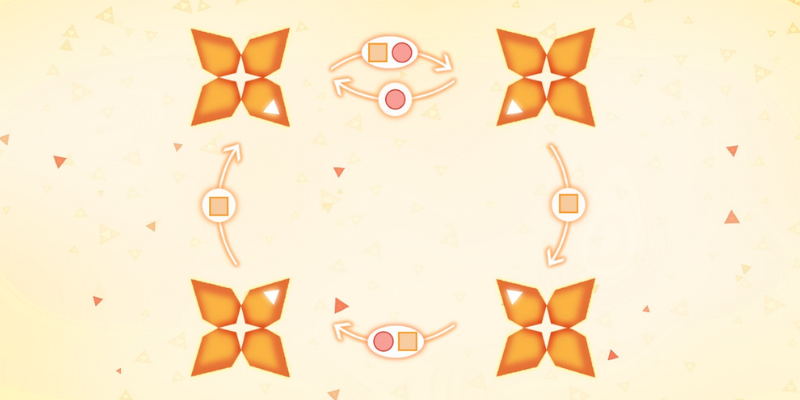
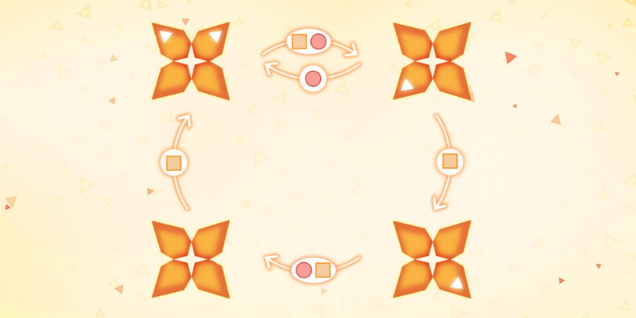

Syncro is a beautiful game where you have to unite all the petals
in a single flower.
In how many moves can you do it?

===

## Problem statement

Look at the image above.
There are four “flowers”, each one with four “petals”.
Notice that each of the flowers has one coloured petal.
There are also arrows going from one flower to the other:
this means that the corresponding shape sends the coloured
petals in that direction.

For example, the square makes all coloured petals rotate once
in the clockwise direction, or if you take the image above
and do “circle + square” then the coloured petals end up like this:

Your objective is to find a sequence of circles and squares that
put all coloured petals in a single flower, in the smallest
number of steps possible.

!!! Give it some thought...

If you need any clarification whatsoever, feel free to ask in the comment section below.

## Syncro

Syncro is a desktop/mobile game developed by some friends of mine, and the objective
of the game is the same as that of this problem, except the game itself has several
levels.

This game can be played <a class="external-link no-image" href="https://rawegg.itch.io/syncro">online</a> and there is also an
<a class="external-link no-image" href="https://play.google.com/store/apps/details?id=com.RawEgg.Syncro">Android app</a>.

If you complete the game, you can even end up in the [hall of fame][hof]!

## Solvers

Congratulations to the ones that solved this problem correctly and, in particular, to the ones
who sent me their correct solutions:

 - Filippo M., Italy;
 - Attila K., Hungary;
 - André S., Portugal.

(The list is in no particular order.)

## Solution

This problem is really hard to solve without a visual representation of what is going on,
so let me remind you of what the problem looks like:

We want to figure out what is the shortest sequence of circles and squares sends the four white triangles
in the four petals into a single flower.

We see that the square rotates the whole thing while the circle swaps the top corners
and joins the bottom corners on the bottom left.

Making a couple of smart remarks will make it easier to solve the problem:

 - it makes no sense to start out with a square;
 - two circles in a row are superfluous;
 - the solution uses circle at least three times;
 - the solution ends with circle.

This shows that a hard minimum amount of moves we need is 5,
because that is the sequence `○⎕○⎕○`, which is the absolute
minimum we could need, as we need at least 3 circles and
we cannot have consecutive circles.
This clearly doesn't work, so the solution is at least 6 steps long.

After that, and playing around a bit, you can figure out that
the shortest solution has eight steps and it is

 > `○⎕⎕○⎕⎕⎕○`

There is, obviously, a more rigorous solution that _proves_ that this is the shortest solution.
Doing so in paper involves keeping track of some branching possibilities, so I will do my best to do it here for you, without too much detail:

 1. circle – it makes no sense to start with a square;
 2. square – two circles in a row make nothing, so then we use square. Here is the position we are at:

$$
\begin{bmatrix} 2 & 1 \\ 0 & 1\end{bmatrix}
$$

After `○⎕` it is not obvious whether we should use a circle or a square, so let us try both:

 3. circle – we are trying the 3. circle variation;
 4. square – after a circle there is always a square. Here is what we are at:

$$
\begin{bmatrix}1 & 1 \\ 0 & 2\end{bmatrix}
$$

 5. square – if we used a circle, then we'd be back at the position we
were after the very first circle, meaning we had spent 4 moves doing nothing. Here is our status:

$$
\begin{bmatrix}0 & 1 \\ 2 & 1\end{bmatrix}
$$

At this point, we see we cannot complete the puzzle in 3 moves or less,
as we would still need to do, _at least_, `○⎕○` and those moves
don't solve the puzzle.

We conclude, thus, that the 3rd step is _not_ circle:

 1. square – circle as step 3. didn't work. We are at this point:

$$
\begin{bmatrix}0 & 2 \\ 1 & 1\end{bmatrix}
$$

 4. circle – from the reasoning above, doing square again wastes too much time.
 5. square – after a circle comes a square. We are in this position:

$$
\begin{bmatrix}2 & 2 \\ 0 & 0\end{bmatrix}
$$

At this point it becomes clear what must be done to put the two 2s together, and that is `⎕⎕○`, so the final sequence is `○⎕⎕○⎕⎕⎕○`.

[Don't forget to subscribe to the newsletter][subscribe] to get bi-weekly
problems sent straight to your inbox and to add your reaction below.

[email]: mailto:rodrigo@mathspp.com?subject=Solution%20to%20{{ page.title|regex_replace(['/ /'], ['%20']) }}
[subscribe]: https://mathspp.com/subscribe
[sol]: ../../solutions/{{ page.slug }}
[hof]: /syncro
