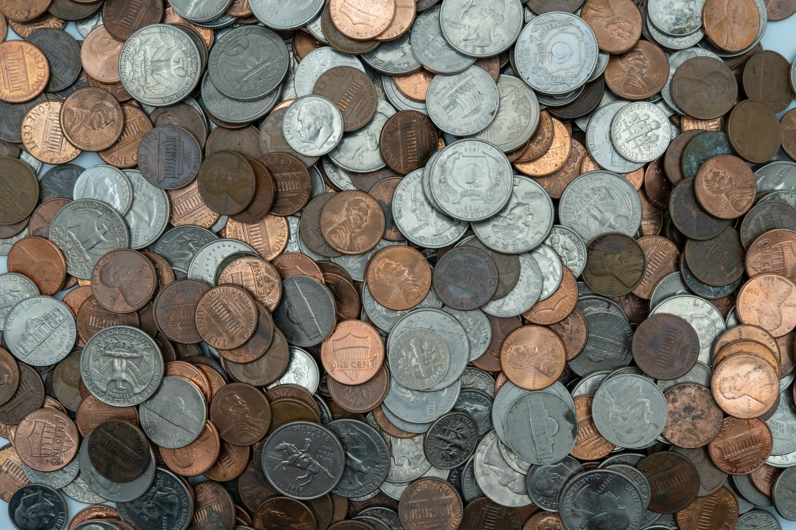

This is an algorithmic puzzle where you just have to turn some coins.

===

## Problem statement

You are inside a dark room, sitting at a table.
The table in front of you is covered with coins, which you can feel,
but you can't really see what their face up is.
You are told, however, that exactly 20 of those coins have _heads_ facing up
and all the others have _tails_ facing up.

Your task is to divide the coins in two groups,
such that both piles have the exact same number of coins with their _heads_ face up.

The only things you can really do are

 - move coins around (to put them in one group or the other); and
 - turn coins upside down.

Recall that the room is _so_ dark, you can't really tell which face each coin has up,
nor can you feel it with your touch.

!!! Give it some thought and [send me your solution][email]!

If you need any clarification whatsoever, feel free to ask in the comment section below.

This problem was shared by @TodiLiju, who comments these “problem”
posts from time to time.

## Solvers

Congratulations to the ones that solved this problem correctly and, in particular, to

 - Attila K., Hungary.

for sending in a correct solution.

## Solution

Because there are so many things that we don't know about the
coins, when we start, and because of how little we control
(we can't look at a coin and see which face is up)
there are not many things that we can try to do.
The only thing we know for sure is that there are $20$
coins that have the “heads” face up.

This “$20$” is the only thing we have/know,
so why not make a group of $20$ coins,
and leave the rest of the coins in their own group?
Assume $n$ is the total amount of coins on the table,
and say that the group of $20$ coins has $k$ coins that
have their “heads” face up.

Here is a summary of the situation:

| Coins in group | | Heads | | Tails |
| :- | :- | :- | :- | :- |
| $20$ | | $k$ | | $20 - k$ |
| $n - 20$ | | $20 - k$ | | $n - 40 + k$ |

What we need, now, is to have the same number of coins with their
“heads” face up in both groups.
Currently, the group with $20$ coins has $k$ coins like that
and the group with $n - 20$ coins has $20 - k$ coins like that.
However, if we flip _all_ the coins in the group of $20$ coins,
then all coins would swap their face up,
which means we would get a total of $20 - k$ coins with their “heads”
face up, matching the other group.

In conclusion, what we need to do is:

 1. grab a total of $20$ coins at random;
 2. flip all of them.

[Don't forget to subscribe to the newsletter][subscribe] to get bi-weekly
problems sent straight to your inbox and to add your reaction below.

[email]: mailto:rodrigo@mathspp.com?subject=Solution%20to%20{{ page.title|regex_replace(['/ /'], ['%20']) }}
[subscribe]: https://mathspp.com/subscribe
