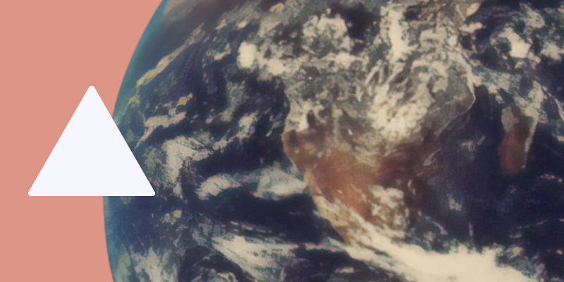

Can you find a really large triangle that is also really tiny?

===

## Problem statement

Does there exist a triangle that has an area larger than the Earth's surface
(approximately 510 million km²)
but whose heights sum up to less than one centimetre?

!!! Give it some thought and [send me your solution][email]!

I saw this problem in the Facebook page of [a group of maths students from a local university][nucm-fb].

If you need any clarification whatsoever, feel free to ask in the comment section below.

## Solution

Yes! There exists such a triangle.

Let $[ABC]$ be a triangle with sides $a$, $b$, $c$,
and let its respective heights be $h_a$, $h_b$, $h_c$.

The area of this triangle is, therefore,

$$
\frac{ah_a}2 = \frac{bh_b}2 = \frac{ch_c}2 ~~~.
$$

From the equalities above we conclude

$$
\begin{cases}
ah_a = ch_c \iff h_a = \frac{ch_c}a \\
bh_b = ch_c \iff h_b = \frac{ch_c}b
\end{cases} ~~~.
$$

Because we are talking about a triangle, we know that
$c < a + b$, which means we can take a look at the equation
above and remove $c$ from there:

$$
h_a = \frac{ch_c}a \leq \frac{(a + b)h_c}{a} ~~~.
$$

If, additionally, the triangle $[ABC]$ has two equal sides,
$a = b$, we get

$$
h_a \leq 2h_c ~~~,
$$

and, similarly,

$$
h_b \leq 2h_c ~~~.
$$

Now, all we have to do is sum the three heights of the triangle:

$$
h_a + h_b + h_c \leq 2h_c + 2h_c + h_c = 5h_c ~~~.
$$

Therefore, in our isosceles triangle with equal sides $a$, $b$,
we have that the sum of the three heights is less than or equal
to $5h_c$, where $h_c$ is the height relative to the side
that is unequal to the other two.
With that in mind, we can make a really “long” triangle
(that is, for which $c$ is large)
that is short
(that is, for which $h_c$ is small)
so that it satisfies the restrictions in the problem statement.
In fact, our reasoning shows that there are triangles with areas
that can be arbitrarily large, while their three heights sum
up to values that are arbitrarily small.

Makes sense?

[Don't forget to subscribe to the newsletter][subscribe] to get bi-weekly
problems sent straight to your inbox and to add your reaction below.

[email]: mailto:rodrigo@mathspp.com?subject=Solution%20to%20{{ page.title|regex_replace(['/ /'], ['%20']) }}
[subscribe]: https://mathspp.com/subscribe
[nucm-fb]: https://www.facebook.com/nucmfctnova
