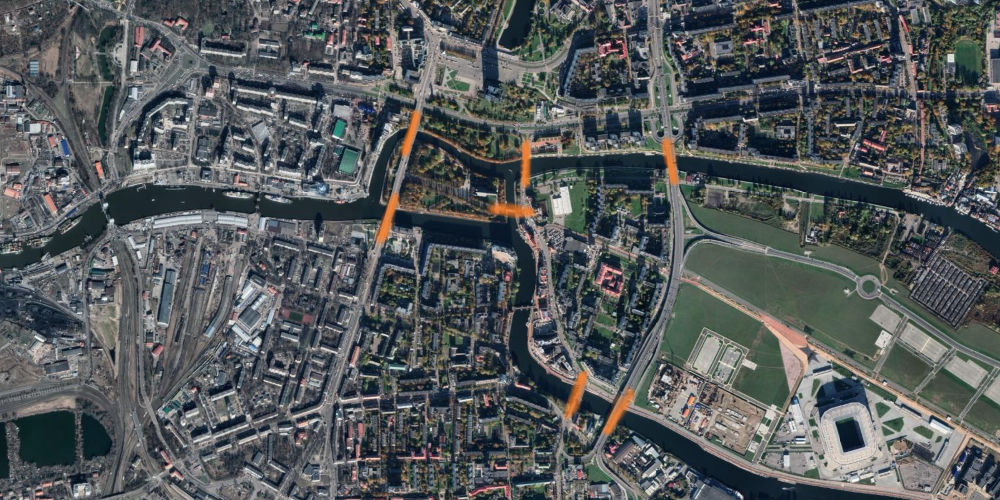
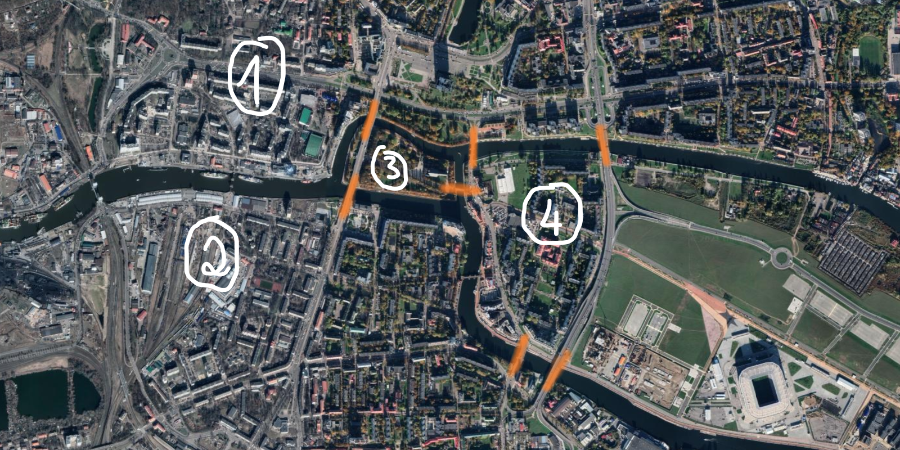

You are on vacation and must find the most efficient way to
cross all bridges.
How will you do that?

===

## Problem statement

If you like solving riddles and puzzles, it is likely that you have
already encountered this puzzle.
But even if you have, it is always good to go back
and think about the classics.
On top of that, I will formulate the problem in a slightly different
way, so that you can be entertained for a bit even if you already
know the more classic version.

Take a look at this satellite view from Kaliningrad, Russia,
where I have highlighted seven bridges:

Your task is to figure out what route to take if what you want to do
is cross all of the highlighted bridges at least once but,
at the same time, keep the total number of crossed bridges as low
as possible.

Having said that, what is the best route you can come up with?

(Just to be clear, I don't care about the length of the route –
the number of miles/kilometres you would walk/drive – I only
care about the number of bridges you cross.)

!!! Give it some thought!

If you need any clarification whatsoever, feel free to ask in the comment section below.

In case you are wondering, the classic version of this puzzle is
dubbed “the seven bridges of Königsberg” because that
is what this place was called when a famous mathematician first
dwelled on this problem.

## Solvers

Congratulations to the ones that solved this problem correctly and, in particular, to the ones
who sent me their correct solutions:

 - Attila K., (Hungary)

## Solution

There are seven distinct bridges that we want to traverse,
so we know the shortest path has to go over seven bridges, minimum.
What we will show is that, actually, we need to go over eight bridges
in total in order to visit all seven bridges.

In order to show that is the case, consider the following figure:

In the figure above we can see that I numbered the four pieces
of land to which the bridges are connected.

How many bridges does each piece of land connect to?

 1. connects to 3 bridges;
 2. connects to 3 bridges (as well);
 3. connects to 3 bridges (as well); and
 4. connects to 5 bridges.

Now we will use this information to show that it is impossible to create
a path that visits all bridges exactly once.

Let us think about a hypothetical path we would do,
in order to traverse all the bridges exactly once.
More specifically, let us think about what happens
in the middle of our walk.
If we are in the middle of our path,
when we enter some piece of land through a bridge,
we have to leave that piece of land through another bridge.
In other words, for each time we _arrive_ at a piece of land,
we also have to _leave_.

Suppose that the piece of land with the number $1$ is neither
the departing point nor the arrival point.
This means that whenever we reach land number $1$ we also have to leave it,
which means that we need an even number of bridges connected to $1$,
so that we are _sure_ we can leave it whenever we _arrive_ at it...
But land number $1$ has an odd number of bridges,
so land number $1$ must be the departing point or the arrival point.

However, all four pieces of land have an odd number of bridges,
so all four pieces of land would have to be either the departing
or the arrival point, which cannot happen because we can't
depart from/arrive to multiple points.
Therefore, a path that crosses each bridge exactly once won't cut it.

Now, can you come up with a path that crosses every bridge
and only repeats one of them?

Here is an example of such a path:

This is actually one of the problems I solve with the participants
in my [workshop on recreational maths][ws-recreational-maths]
and I have to tell you: it is always fun to explore the mathematics
behind such a misleading puzzle!

For those of you who are curious enough,
what we touched upon on this problem is what we call an
[“Eulerian path”][euler-path].

[Don't forget to subscribe to the newsletter][subscribe] to get bi-weekly
problems sent straight to your inbox and to add your reaction below.

[email]: mailto:rodrigo@mathspp.com?subject=Solution%20to%20{{ page.title|regex_replace(['/ /'], ['%20']) }}
[subscribe]: https://mathspp.com/subscribe
[ws-recreational-maths]: /education/workshops/recreational-mathematics
[euler-path]: https://en.wikipedia.org/wiki/Eulerian_path#Properties
