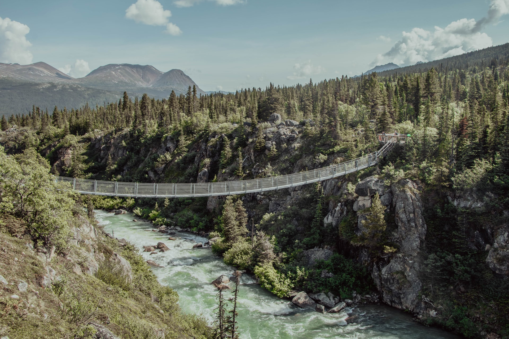

It's night time and 4 friends need to cross a fragile bridge,
but they only have one torch.
What's the order in which they should cross?

===

## Problem statement

4 friends are doing some trekking by night,
when they hit a rope bridge that they need to cross.

They decide that it is best if only 2 cross at a time,
because the bridge looks really fragile,
and the bridge has some holes in it,
so they better only cross if they have any way of lighting their way.
Because the friends only have a single torch, they figure out that
every time 2 people cross to the other side, someone has to come back
with the torch, which will cost them some time...

The 4 friends want to cross that bridge as fast as possible.
How can they do that if they each take 1, 2, 5, and 10 minutes to cross the bridge?

!!! Give it some thought!

If you need any clarification whatsoever, feel free to ask in the comment section below.

## Solvers

Congratulations to the ones that solved this problem correctly and, in particular, to the ones
who sent me their correct solutions:

 - Jairo, Brazil;
 - Martin J., Czech Republic;
 - David H., Taiwan;
 - Gerard M., Ireland;

Join the list of solvers by [emailing me][email] your solution!

## Solution

If you follow what is called a greedy approach, you will get to the following answer: 19 minutes.

_However_, there is a way of arranging the crossings that is even faster than that and that only takes 17 minutes.
Can you figure it out?

I'll explain how, but in order to make it simpler for me,
I'll refer to the people by the time they take to cross the canyon.

 - 1 & 2 cross (**+2**);
 - 1 comes back (**+1**);
 - 5 & 10 cross (**+10**);
 - 2 comes back (**+2**); and
 - 1 & 2 cross again (**+2**).

This takes up only 17 minutes!
(There is another similar arrangement that also takes 17 minutes,
and that's if 2 comes back alone first, and then 1.)

But how can we be sure that this is the _fastest_ way to cross the canyon?
We can try _all_ the valid canyon crossings,
and check all of them take 17 minutes or more.
Or we can try to reason about the problem, and conclude that any way
we cross the canyon is going to take 17 minutes or more.

Let's go for the second approach, where we reason about the problem.

Because the torch has to be present in all the crossings,
we see the canyon needs to be crossed a total of 5 times.
Let `o` represent a person, `x` the torch, and `|` the canyon:

 1. two people go forward, and we are at `o o | o o x`;
 2. one person comes back with the torch: `o o o x | o`;
 3. two people go forward: `o | o o o x`;
 4. one person comes back with the torch: `o o x | o o`; and
 5. the two that are left, go forward: `| o o o o x`.

The person that takes 10 minutes to cross cannot go forward and back,
as that would already take 20 minutes.
Therefore, person 10 crosses only once.

Now, let us reason about the moment when person 5 crosses.
Person 5 either crosses with person 10 or doesn't.

If person 5 _doesn't_ cross with person 10,
then their two crossings already take 15 minutes.
The 3 remaining crossings will take _at least_
3 minutes total (1 minute per crossing),
and that means the whole endeavour would take 18 minutes
_at least_, which is already more than 17 minutes.

This means that the fastest arrangement cannot have persons 5 and 10 cross
separately, as a combination of two facts we know:

 - we know of an arrangement that takes 17 minutes and where
persons 5 and 10 cross together; _and_
 - we just saw that if persons 5 and 10 cross separately, then we need a minimum of 18 minutes.

Now we investigate what happens if persons 5 and 10 cross together.

Persons 5 and 10 can go together in crossing 1, crossing 3, or crossing 5.
If person 5 comes back at any point in time,
then we end up taking up too much time again:

 - 10 minutes for when 5 & 10 cross together; and
 - 5 minutes for when 5 comes back.

Three crossings remaining, and they will add up to more than 17.
Therefore, 5 & 10 cross together _and_ both of them only cross
the canyon _once_.

This implies that they cannot cross together on crossing 1,
as one of the two persons that goes first also has to come back.

Similarly, that implies they cannot cross together on crossing 5,
because that would be too late:
after crossing 3, three different persons already crossed,
which means at least one of persons 5 and 10 would have had to cross
the canyon, which cannot happen.

So, persons 5 & 10 cross together in crossing 3.

For that to happen, persons 1 and 2 cross together in the first crossing,
and then one of the two comes back.

Then, for crossing number 3, persons 5 & 10 cross the canyon.
Now, for crossing number 4, someone needs to come back.
That can't be neither person 5 nor person 10,
because they are too slow, so it has to be the other person
that is there.
If person 1 was the person that came back on the second crossing,
then now it is person 2 that has to go back.
If person 2 was the person that came back on the second crossing,
then now it is person 1 that has to go back.

Either way, we see that persons 1 and 2
now return separately, in crossings 2 and 4.
Finally, they have to cross together, again, in crossing 5.

This shows that this is the absolute best arrangement we can make,
and it takes 17 minutes in total.

Did this make any sense?
Feel free to ask questions in the comments!

<!-- v -->
[Don't forget to subscribe to the newsletter][subscribe] to get bi-weekly
problems sent straight to your inbox.
<!-- ^ -->

[email]: mailto:rodrigo@mathspp.com?subject=Solution%20to%20{{ page.title|regex_replace(['/ /'], ['%20']) }}
[subscribe]: https://mathspp.com/subscribe
[source]: https://www.reddit.com/r/puzzles/comments/o62ddq/dozen_total_puzzle/
