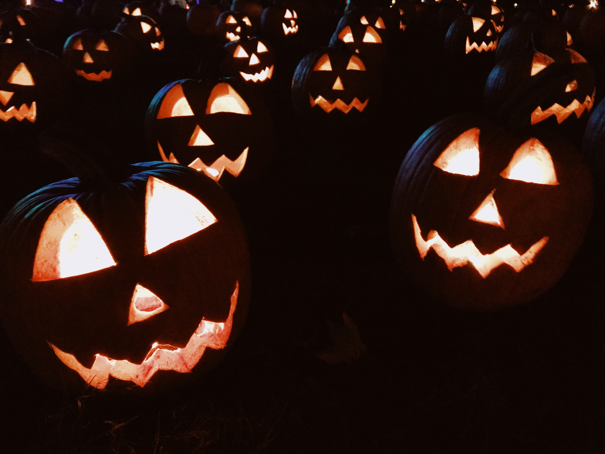

Can you help these kids trick or treat their entire neighbourhood in this Halloween special?

===

# Problem statement

It's Halloween night.
Jack, Frank, and their 98 friends are getting ready to trick or treat their entire neighbourhood.

This year, the group of 100 friends decided they wanted to be very efficient...
Hence, tonight they won't be walking together as a huge group.
Instead, they'll be having fun at the park, and each friend will visit one of the 100 houses of the neighborhood at a time.

The 100 friends agreed on assigning one house per friend, so as to maximise the amount of candy they could get.
Jack is the first to go, but completely forgets the house he was assigned, so he decides to go trick or treating a random house instead.
From there on, throughout the night, each friend would go to their assigned house, unless one of the other friends already went there.
If that's the case, the friend will just pick one of the remaining houses randomly.

Frank is the last of the 100 friends to go.
What is the probability that Frank will go trick-or-treating at the house he was assigned originally?

!!! Give it some thought!

If you need any clarification whatsoever, feel free to ask in the comment section below.

# Solvers

Congratulations to the ones that solved this problem correctly and, in particular, to the ones
who sent me their correct solutions:

 - [Matthias W.](https://twitter.com/m2u_84), Germany;
 - Kees L., Netherlands;
 - David H., Taiwan;

Know how to solve this?

Join the list of solvers by [emailing me][email] your solution!

# Solution

This problem is very neat, in my opinion.
That's because there is a very neat solution that does not involve many calculations.

If you are like me, and hate calculations, you are going to love this solution.

When Jack goes out and has to pick one of the 100 houses,
one of three things happens:

 1. Jack picks his own house (that happens with a probability of 1/100);
 2. Jack picks Frank's house (that happens with a probability of 1/100); and
 3. Jack picks another friend's house (that happens with a probability of 98/100).

If 1. happens, we know that Frank gets to go to his originally assigned house.

If 2. happens, we know that Frank will _not_ go to his originally assigned house.

Notice how scenarios 1. and 2. are equally likely to occur.

If 3. happens, Frank (not) going to his originally assigned house will depend
on what happens next.
Let's say that Jack visits (by mistake) the house that was destined for friend $i$,
where $i < 100$.
($i = 100$) is Frank, and that would mean we are in situation 2.

After Jack visits the house that was assigned to his friend $i$,
the friends 2, 3, ..., all the way to $i$, go to their originally assigned houses.

When it comes the time for friend $i$ to go trick-or-treating,
how many houses are still free?
There's Jack's house, that Jack didn't visit.
And there are also the $100 - i + 1$ houses that correspond to the friends
that haven't gone trick-or-treating yet.

Therefore, if Jack visits $i$'s house, then one of three things happens:

 1. $i$ picks Jack's house (that happens with a probability of 1/$(101 - i)$);
 2. $i$ picks Frank's house (that happens with a probability of 1/$(101 - i)$); and
 3. $i$ picks another friend's house (that happens with a probability of $(99 - i)/(101 - i)$).

Notice how scenarios 1. and 2. are, once more, equally likely to occur.

If 1. happens, then all the friends that are left get to go to their own houses,
and therefore Frank will go to his originally assigned house.

If 2. happens, then Frank cannot go to his house.

If 3. happens, then that's because $i$ just picked the house of friend $j$, where $j < 100$.
If this happens, then the problem of deciding if Frank visits his originally assigned
house was just pushed a little bit further down the line, and we need to go over
this scenario once again.

As we do so, we will keep seeing that situations 1. and 2. are always equally likely to happen,
and eventually one of the scenarios 1. or 2. is chosen.
However, if scenarios 1. and 2. are _always_ equally likely to occur,
that means that the overall probability of Frank being able to go to his originally assigned
house is 50%!

Moreover, we see that this probability does _not_ depend on the total number of friends which,
in my opinion, is quite neat!

Was my explanation good enough?
Let me know if it was not.

[Don't forget to subscribe to the newsletter][subscribe] to get bi-weekly
problems sent straight to your inbox.

[email]: mailto:rodrigo@mathspp.com?subject=Solution%20to%20{{ page.title|regex_replace(['/ /'], ['%20']) }}
[subscribe]: /subscribe
