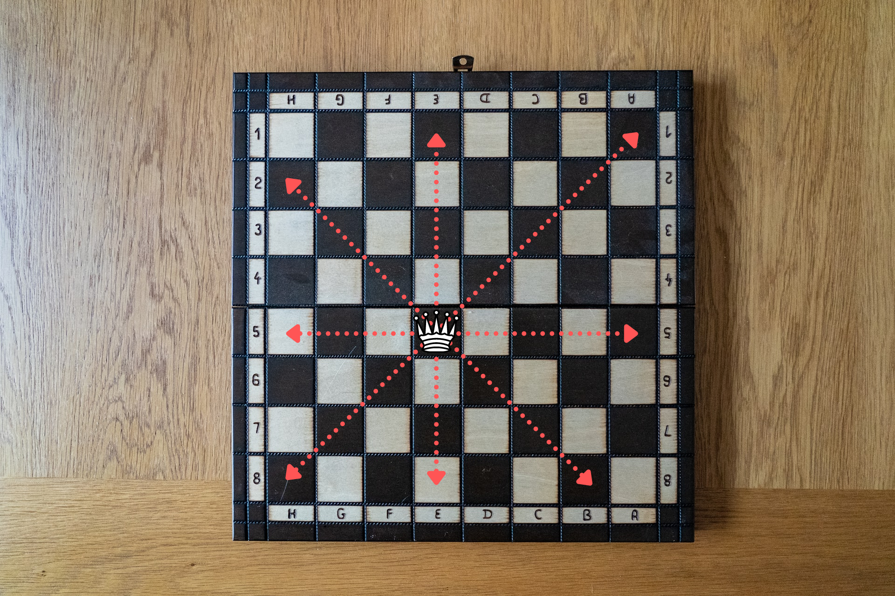
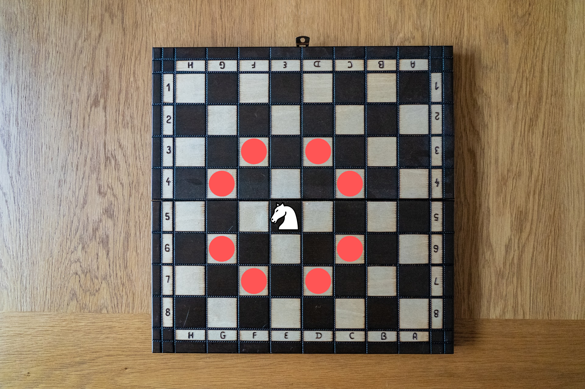
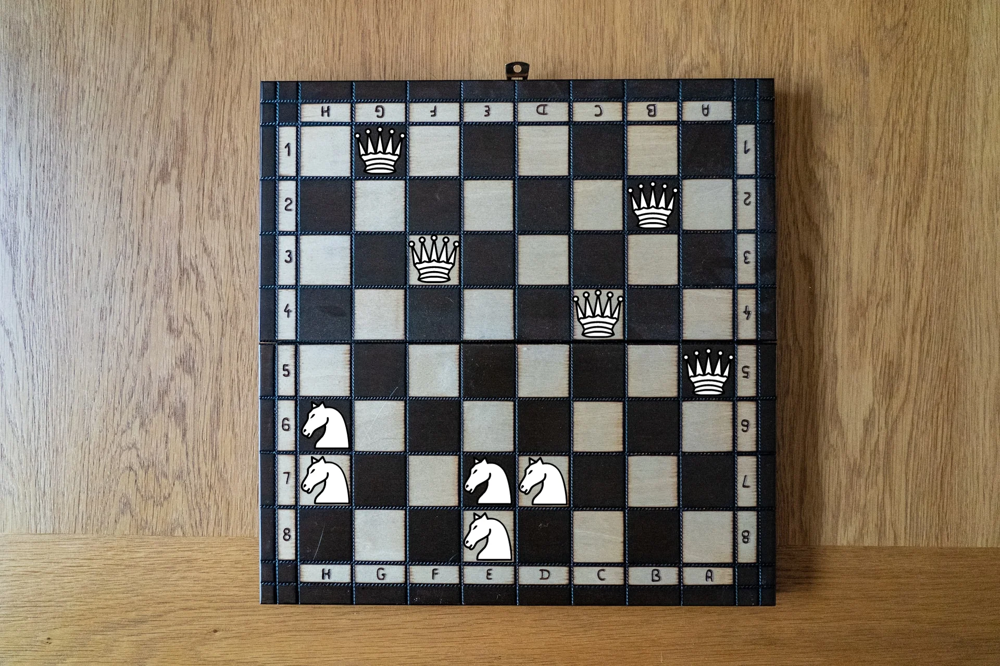

How many queens and knights can you place on a chessboard?

===

## Problem statement

This is a harder variant of the [8 queens][8-queens] problem.
As a warm-up for _this_ problem, consider solving that one first!

For the “queens and knights” problem,
you want to place as many queens and knights, as possible, on a chessboard.
However, queens and knights must be placed in equal numbers,
and no piece can attack any other piece.

While you are at it, can you do it in multiple ways?

For reference, here is a picture showing what squares a queen attacks:

Similarly, here is a picture showing what squares a knight attacks:

!!! Give it some thought!

If you need any clarification whatsoever, feel free to ask in the comment section below.

This problem was brought to my attention by the late [Roger Hui][roger-hui],
so let my sharing this problem be a small tribute to him.

## Solvers

Congratulations to the ones that solved this problem correctly and, in particular, to the ones
who sent me their correct solutions:

 - David H., Taiwan;

Know how to solve this?

Join the list of solvers by [emailing me][email] your solution!

## Solution

We can start by showing that it is impossible to have 6 queens and 6 knights on the board.

To place 6 queens on a board, they have to be in 6 different rows and 6 different columns, which means they leave a maximum of 4 squares (2 rows times 2 columns) free.
We cannot fit 6 knights into 4 squares.

By finding a configuration with 5 queens and 5 knights, we prove that the maximum is 5, which is what the figure shows:

In chess notation, we could place 5 queens at g1, b2, f3, c4, and a5, and the knights at h6, h7, e7, d7, and e8.

[Don't forget to subscribe to the newsletter][subscribe] to get bi-weekly
problems sent straight to your inbox.

[email]: mailto:rodrigo@mathspp.com?subject=Solution%20to%20{{ page.title|regex_replace(['/ /'], ['%20']) }}
[subscribe]: /subscribe
[8-queens]: /blog/problems/8-queens

[roger-hui]: https://rogerhui.rip/
