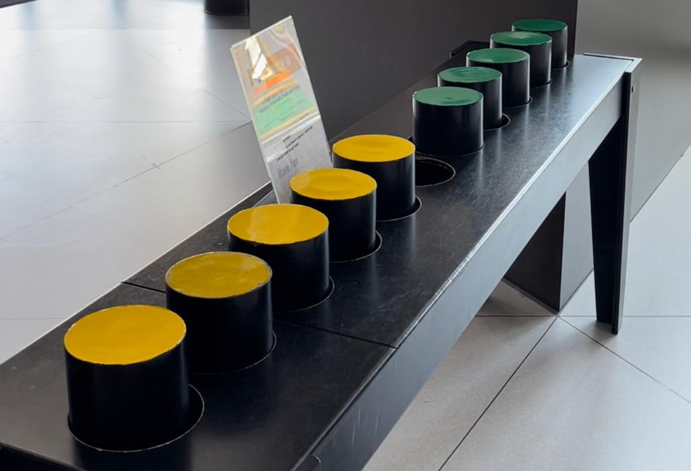

How can you swap the coloured pegs if they can only march forward?

===

 <script async src="https://platform.twitter.com/widgets.js" charset="utf-8"></script> 





## Problem statement

Imagine seven round slots:

```txt
O O O O O O O
```

In the three left slots, you have Yellow pegs:

```txt
Y Y Y O O O O
```

In the three right slots, you have Green pegs:

```txt
Y Y Y O G G G
```

You have to swap the yellow pegs and the green ones,
but of course there are some restrictions to what you can do:

 - pegs can only move forward (that is, yellow pegs can only move to the right and green pegs can only move to the left); and
 - pegs can only move:
   - to the next (adjacent) slot if it is available;
   - to the second next slot, if that means the peg “jumps over” a peg of another colour.

So, for example, in the configuration below, the green peg can move to the marked slot by jumping over a yellow peg:

```txt
G Y O
^   ^
```

As another example, in the situation below, no peg can move:

```txt
O G G Y Y O
```

With these restrictions, can you swap all pegs?
That is, can you move the pegs so that all green pegs end up on the left and all yellow pegs end up on the right?

!!! Give it some thought!
!!!
!!! You can try playing this out yourself: grab 6 coins and lay them in a straight line on a table.
!!! 3 coins on the left with the tails face up and the other 3 coins on the right with the other face up.

If you need any clarification whatsoever, feel free to ask in the comment section below.

This problem is based off of the puzzle you can see in the thumbnail picture,
which you can play at [Icon Park's Museum of Illusions][museum-illusions].


## Solvers

Congratulations to the ones that solved this problem correctly and, in particular, to the ones
who sent me their correct solutions:

 - David H., Taiwan;
 - Michael W., US;
 - Zech Z., US;
 - Michael H., US;
 - Tanishk S., India;

Know how to solve this?
Join the list of solvers by [emailing me][email] your solution!


## Solution

To solve this problem, my best suggestion is to go one move at a time,
and to try and think ahead 2 or 3 moves each time you are about to do something.
You don't need to look ahead too much to be able to tell if a move is a bad idea or not.

With that said, that can be easier for some and harder for others!

I will share one possible solution below.
Each line represents the positions of the pegs after one single move.
But first, let me show you a video shared on Twitter where one of you solved this problem with candy:

<blockquote class="twitter-tweet" data-conversation="none" data-theme="dark"><p lang="en" dir="ltr">G1 forward, Y1 hop, Y2 forward, G1 hop, G2 hop, G3 forward, Y1 hop, Y2 hop, Y3 hop, G1 forward, G2 hop, G3 hop, Y2 forward, Y3 hop, G3 forward, done.<br><br>And here it is with KitKats and Reeses lol <a href="https://t.co/eGAi3QQuMx">pic.twitter.com/eGAi3QQuMx</a></p>&mdash; Zech (@ZechCodes) <a href="https://twitter.com/ZechCodes/status/1516486703720144911?ref_src=twsrc%5Etfw">April 19, 2022</a></blockquote>


For your convenience, here is the sequence of steps taken in the video:

```txt
Y Y Y O G G G  <- starting position

Y Y O Y G G G  <- Y moves right

Y Y G Y O G G  <- G hops over

Y Y G Y G O G  <- G moves left

Y Y G O G Y G  <- Y hops over

Y O G Y G Y G  <- Y hops over

O Y G Y G Y G  <- Y moves right

G Y O Y G Y G  <- G hops over

G Y G Y O Y G  <- G hops over

G Y G Y G Y O  <- G hops over

G Y G Y G O Y  <- Y moves right

G Y G O G Y Y  <- Y hops over

G O G Y G Y Y  <- Y hops over

G G O Y G Y Y  <- G moves left

G G G Y O Y Y  <- G hops over

G G G O Y Y Y  <- Y moves right
```

And that's it!


[Don't forget to subscribe to the newsletter][subscribe] to get bi-weekly
problems sent straight to your inbox.

[email]: mailto:rodrigo@mathspp.com?subject=Solution%20to%20{{ page.title|regex_replace(['/ /'], ['%20']) }}
[subscribe]: /subscribe

[museum-illusions]: https://iconparkorlando.com/attractions/museum-of-illusions-orlando/
