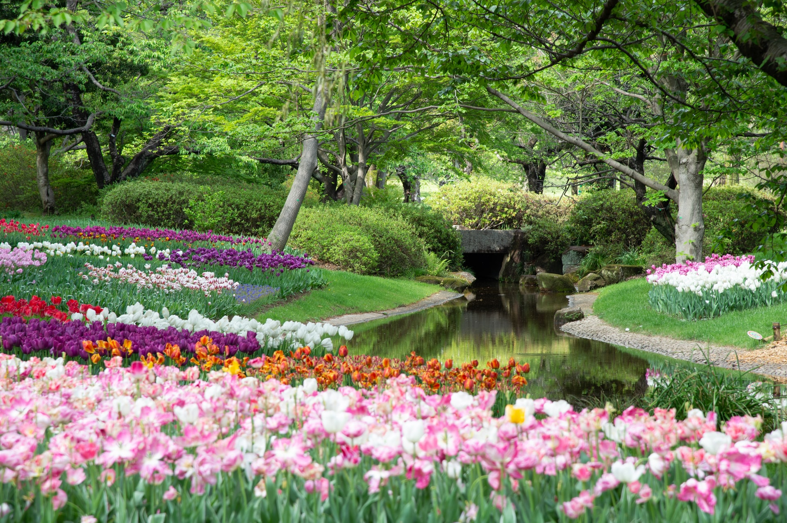

Three mathematicians discuss a beautiful flower garden and the coloured flowers within.

===

# Problem statement

Three mathematicians were discussing a beautiful flower garden.
The first mathematician said:

 > “It's a beautiful garden.
 > All flowers are either red, yellow, or blue...
 > And whatever three flowers you pick, one of them is bound to be red.”

The second mathematician said:

 > “It is indeed a beautiful garden!
 > There are red flowers, yellow flowers, and blue flowers!
 > I also noticed that, whatever three flowers you pick, one of them is bound to be yellow.”

The third mathematician, who had never been to the garden, remarked:

 > “That's interesting!
 > If that's true, I can say that, whatever three flowers I pick, one of them is bound to be blue!”

The first two mathematicians glanced at each other and smiled.

Is the third mathematician right? Or wrong? Why?

!!! Give it some thought!

This problem is from the amazing [book “To Mock a Mockingbird”][mock-mockingbird] by the mathematician Raymond Smullyan.[^1]

# Solvers

Congratulations to the ones that solved this problem correctly and, in particular, to the ones
who sent me their correct solutions:

 - David H., Taiwan;
 - Christ van W., The Netherlands;
 - David R., Mexico;
 - Michał D., Poland;

Know how to solve this?
Join the list of solvers by [emailing me][email] your solution!

# Solution

The third mathematician is right.

The first sentence of each mathematician establishes that all flowers in the garden are one of three colours (red, yellow, blue) and that all colours are represented; that is, there is _at least_ one red flower, _at least_ one yellow flower, and _at least_ one blue flower.

Then, the first mathematician says that whatever three flowers you pick, one is bound to be red.
This means that the garden cannot contain three or more flowers that are not red.
After all, if there were, say, two yellow flowers and one blue flower,
you could pick those three and there wouldn't be a red flower in there.

At the same time, we know there has to be at least one yellow flower and one blue flower,
so we conclude the garden has an unknown number of red flowers, one yellow flower, and one blue flower.

Then, the second mathematician speaks!
From their remark, we could make a similar independent conclusion:
the garden has an unknown number of yellow flowers, one red flower, and one blue flower.

Thus, if we combine the two conclusions,
we get that the garden has three flowers only:

 - one red flower;
 - one yellow flower; and
 - one blue flower.

Therefore, the third mathematician is also right:
whatever three flowers you pick, one is bound to be blue.

[^1]: This is an Amazon Affiliate link and I may earn a commission if you purchase the book. This comes at no extra cost to you.

[mock-mockingbird-amazon]: https://amzn.to/3zzViS2

[Don't forget to subscribe to the newsletter][subscribe] to get bi-weekly
problems sent straight to your inbox.

[email]: mailto:rodrigo@mathspp.com?subject=Solution%20to%20{{ page.title|regex_replace(['/ /'], ['%20']) }}
[subscribe]: /subscribe
