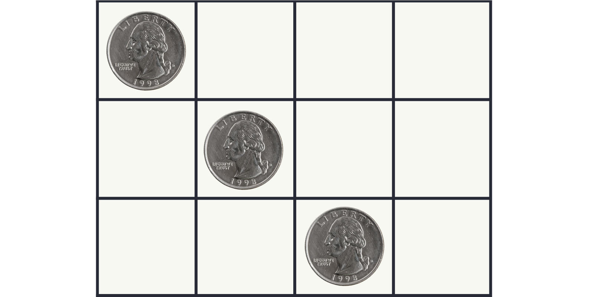
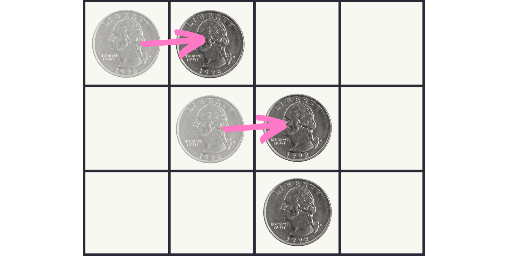
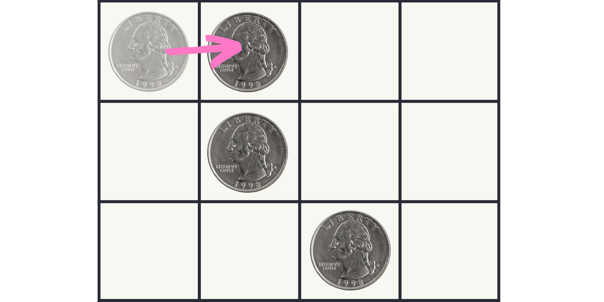
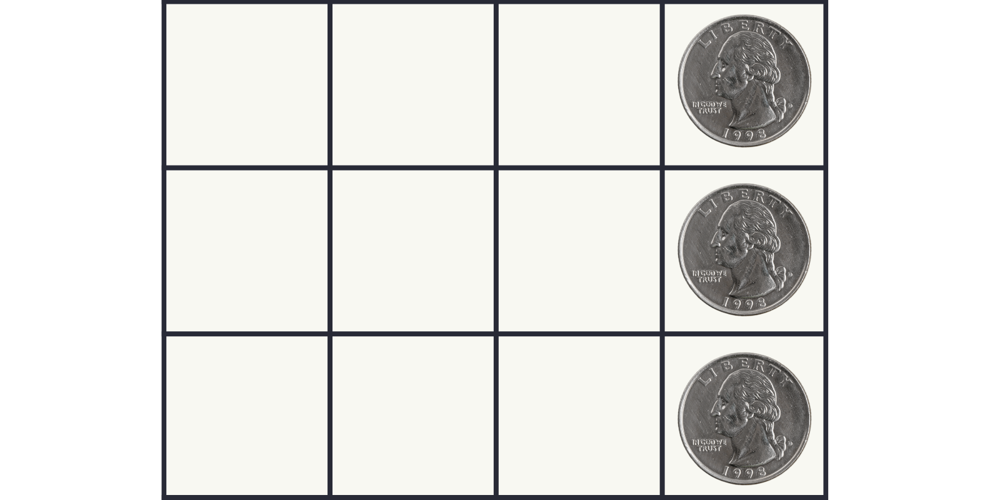

Can you align all of the coins on the right edge of the board?

===





## Problem statement

The diagram above shows a 3 by 4 grid with 3 coins, one per row and one per column,
such that the rightmost column of the grid is empty.

You are allowed to slide the coins to the columns on their right,
but the coins can never leave the board (nor can they be moved back to the left).
Also, you always have to move two coins at a time.

Thus, this is a legal move:



But moving a single coin, such as in the diagram below, is not allowed:



Your objective is to reach this position:



Can you do it?

What if you extend the board two columns to the left and two rows up,
and add another two coins along the diagonal?

!!! Give it some thought!

This is an adaptation of a problem from the [book “Algorithmic Puzzles”][algorithmic-puzzles-amazon] by Anany Levitin and Maria Levitin.[^1]


## Solvers

Congratulations to the ones that solved this problem correctly and, in particular, to the ones
who sent me their correct solutions:

 - David H., Taiwan;

Know how to solve this?
Join the list of solvers by [emailing me][email] your solution!


## Solution

You can move all coins to the right in 3 moves:

 1. move the top and bottom coins (this aligns the top and middle coins while placing the bottom coin in the rightmost column);
 2. move the top and middle coins; and
 3. move the top and middle coins again.

This diagram shows the evolution of the grid:

```
X . . .  start
. X . .
. . X .

. X . . >
. X . .
. . . X >

. . X . >
. . X . >
. . . X

. . . X >
. . . X >
. . . X
```

If we extend the board up and left, we'd have this starting configuration:

```
X . . . . .
. X . . . .
. . X . . .
. . . X . .
. . . . X .
```

Now, consider the total number of spaces to the right of the coins:

```
X 1 2 3 4 5
. X 6 7 8 9
. . X 0 1 2
. . . X 3 4
. . . . X 5
```

We see that there are 15 spaces on the grid to the right of coins.
We also know that each time we move two coins, the number of spaces to the right of the coins decreases by 2.
Now, if we were to align all coins on the rightmost column, the number of spaces to the right of the coins would be 0.
However, we can't go from 15 to 0 in decrements of 2, so with the extended setup it is impossible to solve the puzzle.

[^1]: This is an Amazon Affiliate link and I may earn a commission if you purchase the book. This comes at no extra cost to you.

[algorithmic-puzzles-amazon]: https://amzn.to/3NJUn5D


[Don't forget to subscribe to the newsletter][subscribe] to get bi-weekly
problems sent straight to your inbox.

[email]: mailto:rodrigo@mathspp.com?subject=Solution%20to%20{{ page.title|regex_replace(['/ /'], ['%20']) }}
[subscribe]: /subscribe
