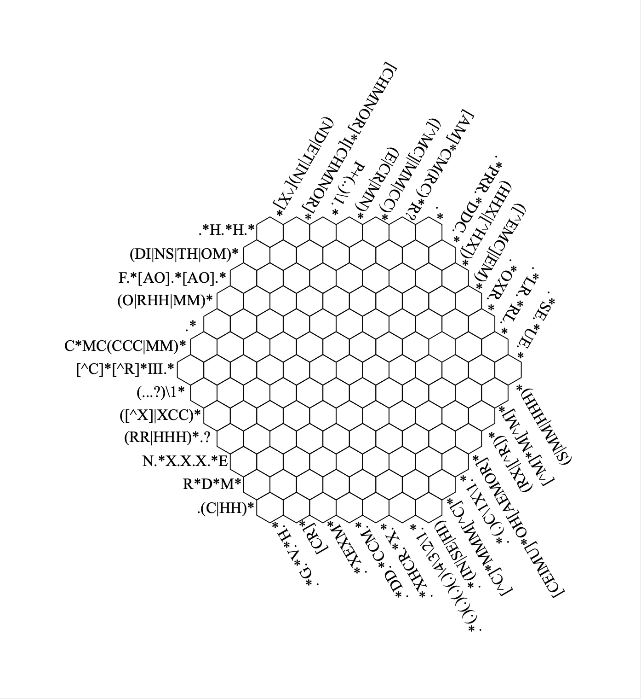

Can you solve this crossword where all hints are regular expressions?

===

## Problem statement

At [EuroPython 2024](https://ep2024.europython.eu) I watched a lightning talk about the art of puzzle solving.
In it, the speaker showed the regex crossword puzzle that you can see above, [that I took from this URL](https://puzzles.mit.edu/2013/coinheist.com/rubik/a_regular_crossword/).
You are supposed to fill the hexagonal grid with letters so that all of the regular expressions shown match.

If you don't know regular expressions, the puzzle only uses a simple subset of the syntax:

 - literal character matches;
 - wildcard matches with `.`;
 - alternatives with `|`;
 - the quantifiers `?`, `+`, and `*`;
 - character sets with `[...]` and negated character sets with `[^...]`; and
 - groups with `()` and group references with `\1`, `\2`, etc.

You can look this up and then you will be able to solve the challenge.
You can also use [the site regex101](https://regex101.com) to help you check what each regular expression means.

!!! Give it some thought!

## Solution

In the spirit of the puzzle hunting community, I will not share my solved grid here.
If you need help, feel free to [email me](mailto:rodrigo@mathspp.com) and we can talk it over.

P.S. if I understood correctly, in the puzzle hunting community you're not supposed to just fill in the grid.
In some way, somehow, you are supposed to be able to extract an English word or phrase from that filled puzzle without any extra information, and then you check that you got it correctly by [“checking your answer spoiler-free” in the website where I took the regex crossword from](https://puzzles.mit.edu/2013/coinheist.com/rubik/a_regular_crossword/)
I am still stuck in that step!
