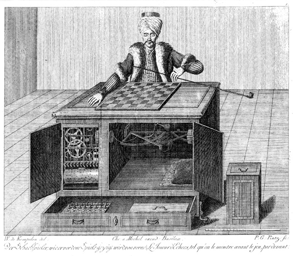

Today I learned about a fake chess-playing AI from the 1700s.

===

# Mechanical Turk

The [Mechanical Turk][mech-turk] was a device that was said to be an automaton capable of playing chess,
defeating many players around the world.
Later on, it was found that the machine was just a hoax,
as it hid a seasoned chess player that could then operate the machine.

I learned this from a tweet I saw, that jokingly asked if the Mechanical Turk was the first AI in the world:

<blockquote class="twitter-tweet">
Interesting!  Also is this the world&#39;s first &quot;AI&quot;?<a href="https://t.co/bqPOypCnFU">https://t.co/bqPOypCnFU</a>
&mdash; Nat Miletic (@natmiletic) <a href="https://twitter.com/natmiletic/status/1438564131859157003?ref_src=twsrc%5Etfw">September 16, 2021</a></blockquote>

Reading about this reminded me of [Deep Blue][deep-blue],
the first computer to beat the reigning world champion in a chess game
and a chess match, using the regular time constraints from competitions.

Deep Blue was from IBM and it was in the year of 1997 (the year I was born!)
that it beat Kasparov, the then-world champion.

If you are into machine learning and all these cool things,
you might also be interested in googling [Stockfish] (a powerful chess engine)
or [AlphaGo] (arguably the best Go player in the world – even better than professional humans)
from [DeepMind].

[mech-turk]: https://en.wikipedia.org/wiki/Mechanical_Turk
[deep-blue]: https://en.wikipedia.org/wiki/Deep_Blue_(chess_computer)
[Stockfish]: https://stockfishchess.org/
[AlphaGo]: https://deepmind.com/research/case-studies/alphago-the-story-so-far
[DeepMind]: https://deepmind.com/
