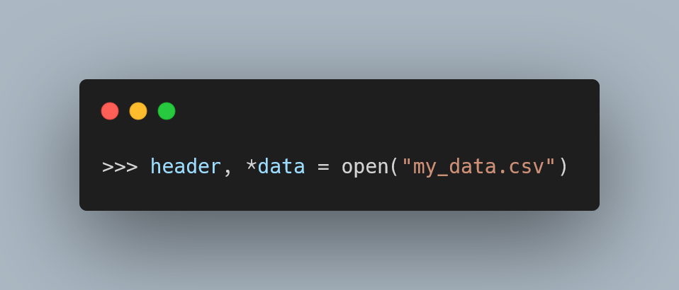

Today I learned that files can _also_ be unpacked in Python.

===

<script async src="https://platform.twitter.com/widgets.js" charset="utf-8"></script>




# File unpacking

[After learning that strings can be unpacked in Python][til-005],
I shared the short article on Twitter.

As a reply, [@dabeaz][dabeaz] suggested I tried doing it with a file:

<blockquote class="twitter-tweet"><p lang="en" dir="ltr">Now, try it with a file...<br><br>header, *data = open(&quot;somedata.csv&quot;)</p>&mdash; David Beazley (@dabeaz) <a href="https://twitter.com/dabeaz/status/1441405123540893703?ref_src=twsrc%5Etfw">September 24, 2021</a></blockquote>

After seeing how strings can be unpacked,
unpacking a file didn't look so weird, but it was still a pleasant surprise!

But it “does make sense”, after all you can iterate directly over a file,
which essentially iterates over the lines of the file.

Grab a CSV file `"my_data.csv"`, for example with this data:

```csv
Name, Surnames
John, Doe
Mary, Smith
```

Then, in your Python REPL, you can get this to work:

```py
>>> header, *data = open("my_data.csv")
>>> header
'Name, Surnames\n'
>>> data
['John, Doe\n', 'Mary, Smith\n']
```

It is not as useful as using the [`csv`][csv] module to read the CSV
data in and process it, but it is still a nifty trick.

Come to think of it, if there is a place when this will be useful,
probably won't be with CSV files...

I'll let you know if I put this little trick to good use!

That's it for now! [Stay tuned][subscribe] and I'll see you around!


[subscribe]: /subscribe
[til-005]: /blog/til/005
[dabeaz]: https://twitter.com/dabeaz
