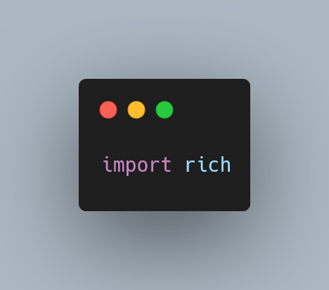

Today I learned how to use the package `rich` by Will McGugan.

===




# `rich`

The package `rich` is a Python package created by [Will McGugan][will].
Honestly, I think it's my favourite 3rd-party package,
and it's something well worth learning:
in a sentence, it enriches your Python experience.

It allows effortless styling of your output,
better and more informative error tracebacks,
beautiful logging,
elegant tables,
and many more things.
Just [take a peek at the docs][rich-docs].

`rich` is an _open-source_ package that you can [find on GitHub][rich-gh],
so you can take a look at its code and learn a ton while doing so.


# How to install `rich`

`rich` is on PyPI and installing it is straightforward:

```bash
python -m pip install rich
```

Now I'll show you some of the cool things you can do with `rich`.


# `rich.print`

## Styling your print statements

`rich` has a function called `print` that works exactly like the built-in `print`...
Except it does much more!

With `rich`'s `print`, you can easily style your output by writing styles within `"[]"`.

Try running this code on your REPL:

```py
from rich import print
print("[red]Hello[/] [green]world[/]!")
print("[underline]Hello world![/]")
print("[black on white]Hello world![/]")
```

Before seeing the result, can you _guess_ what the result will be?

Here is a screenshot for you:


## Pretty printing Python objects

The `print` function from `rich` also does pretty-printing of your Python objects, by default.
For example, here is the example output from printing `locals()`:


This does syntax highlighting for your Python objects, which is great,
because the colours encode information, making it easier for your brain to extract the information it needs.


## Persistent highlighting in the REPL

If you enjoy the syntax highlighting of your objects in the REPL, you can make it more “permanent” with the following code:

```py
>>> from rich import pretty
>>> pretty.install()
```

By calling this function, `rich` is automatically used every time the REPL evaluates something.
Put this together with the function `rich.print`, and you will have a very colourful REPL!

Try running the following code in the REPL before and after using `pretty.install()`
(you can just copy and paste it):

```py
def foo():
    return "Hello, world!"

foo()
foo
len(foo())
```

Here is a screenshot of the REPL output:


# `rich.inspect`

I hope you are familiar with the built-in `help`, because if you are, you probably love it.
Then, let me introduce you to `rich.inspect`, which is like `help` on strong steroids!

What does `inspect` do?
Well, it's good to “Inspect any Python object.”...
Except it does so, wonderfully!

Part of the magic of this function is the beautiful colours it uses to inspect the objects you pass it in!

First step to beautiful inspection of all Python objects?
Import it!

```py
from rich import inspect
```

Now, I often forget how to use `inspect`, so I always start by inspecting `inspect` itself:


But `inspect` is really great for anything.
For example, setting `help=True` is useful to inspect built-ins:


It is also great to inspect instances of custom classes, for example:

 class.")


That's it for now! [Stay tuned][subscribe] and I'll see you around!

[subscribe]: /subscribe
[will]: https://twitter.com/willmcgugan
[rich-gh]: https://github.com/Textualize/rich
[rich-docs]: https://rich.readthedocs.io/en/latest/
