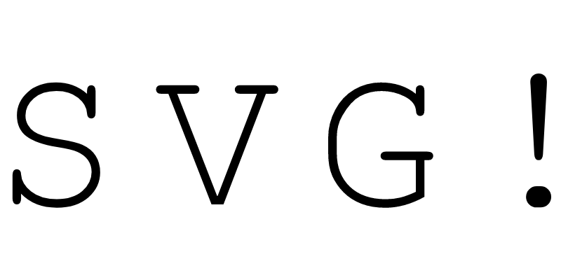

Today I understood how the `viewBox` of SVGs really works.

===




# SVG

SVG stands for Scalable Vector Graphics and it is an XML-based language
that you can use to describe two-dimensional vector graphics.

Does that sound redundant?
It does, a bit...
Vector graphics are graphics that are based off of geometric shapes like polygons, lines, and points.
With SVG, you define an image by the set of mathematical objects that make it up,
which means that the image can be rendered with arbitrary resolution!

Why?

Because the geometrical shapes you define in SVG do not depend on resolution/zoom level,
they are just mathematical objects.


# SVG of the alphabet

There is another project I am working on,
and I needed image versions of the uppercase letters of the latin alphabet.
So, I decided to create an SVG with each letter.

Here is the SVG for the letter “A”:

```xml
<svg xmlns="http://www.w3.org/2000/svg">
    <text x="0" y="11">A</text>
</svg>
```

You can save this to a text file and call it, say, `A.svg`.
After you do that,
you should be able to open it with your browser and see the letter “A”:


I thought of creating one such SVG per letter of the alphabet,
but that would be a pain.
Then, I realised I could probably use the attribute `viewBox` of the SVG to put the whole alphabet together in a single file,
but only display the letter I care about.


# What is the `viewBox` in an SVG

The attribute `viewBox` is an attribute that defines the portion of the SVG that we are looking at.
In my case, I want to draw the whole alphabet in the SVG,
but I want to display one letter at a time.
It's like the attribute `viewBox` defines a spotlight on top of the SVG.

I'll show you what this means in practical terms.

First, let's write the whole alphabet in the SVG,
with the help of Python:

```py
for x, letter in zip(range(0, 12 * 26, 12), string.ascii_uppercase): 
    print(f'    <text x="{x}" y="11">{letter}</text>')
```

This helps write the following SVG:

```xml
<svg xmlns="http://www.w3.org/2000/svg">
    <text x="0" y="11">A</text>
    <text x="12" y="11">B</text>
    <text x="24" y="11">C</text>
    <text x="36" y="11">D</text>
    <text x="48" y="11">E</text>
    <text x="60" y="11">F</text>
    <text x="72" y="11">G</text>
    <text x="84" y="11">H</text>
    <text x="96" y="11">I</text>
    <text x="108" y="11">J</text>
    <text x="120" y="11">K</text>
    <text x="132" y="11">L</text>
    <text x="144" y="11">M</text>
    <text x="156" y="11">N</text>
    <text x="168" y="11">O</text>
    <text x="180" y="11">P</text>
    <text x="192" y="11">Q</text>
    <text x="204" y="11">R</text>
    <text x="216" y="11">S</text>
    <text x="228" y="11">T</text>
    <text x="240" y="11">U</text>
    <text x="252" y="11">V</text>
    <text x="264" y="11">W</text>
    <text x="276" y="11">X</text>
    <text x="288" y="11">Y</text>
    <text x="300" y="11">Z</text>
</svg>
```

(The `x` value increases by 12 and the `y` value is always set to 11 because of some trial and error I did.)

You can save this to `alphabet.svg` and open it with your browser:


Now, what we want to do
is define the attribute `viewBox` so that we can only see one letter at a time when we open it.
We do so by specifying some numbers:

 - the minimum `x` position the spotlight points to;
 - the minimum `y` position the spotlight points to;
 - the width of the spotlight; and
 - the height of the spotlight.

We can set the minimum `x` and `y` positions to the upper left corner of the letter “A”,
and then set the width and height of the spotlight to be just big enough to let us see
only the “A”.
How can we do that?

Maybe there is a better way, but I did it by trial and error.
So, we set `viewBox=viewBox="0 0 12 12"` inside the tag `svg`:

```xml
<svg viewBox="0 0 12 12" xmlns="http://www.w3.org/2000/svg">
    ...
</svg>
```

We can save this in the `alphabet.svg` from before.

Now, we can only see the “A”,
but this time it takes up the whole window.
When I resize the browser window to be square(-ish),
this is what I see:


If I tweak the attribute `viewBox`,
and change the minimum value of `x` to 36, for example,
now what I see is a “D”:


Thus, by fiddling with the `viewBox`,
I can have the SVG display the letter I want.


# Making it more precise

To make this even more precise,
I needed to switch to a monospaced font
(so that all letters take up the same horizontal space)
and I tweaked the sizes again a little bit:

```xml
<svg viewBox="120 0 10 9" xmlns="http://www.w3.org/2000/svg">
    <style>
        text { font-family: monospace; }
    </style>
    <text x="1" y="8">A</text>
    <text x="11" y="8">B</text>
    <text x="21" y="8">C</text>
    <text x="31" y="8">D</text>
    <text x="41" y="8">E</text>
    <text x="51" y="8">F</text>
    <text x="61" y="8">G</text>
    <text x="71" y="8">H</text>
    <text x="81" y="8">I</text>
    <text x="91" y="8">J</text>
    <text x="101" y="8">K</text>
    <text x="111" y="8">L</text>
    <text x="121" y="8">M</text>
    <text x="131" y="8">N</text>
    <text x="141" y="8">O</text>
    <text x="151" y="8">P</text>
    <text x="161" y="8">Q</text>
    <text x="171" y="8">R</text>
    <text x="181" y="8">S</text>
    <text x="191" y="8">T</text>
    <text x="201" y="8">U</text>
    <text x="211" y="8">V</text>
    <text x="221" y="8">W</text>
    <text x="231" y="8">X</text>
    <text x="241" y="8">Y</text>
    <text x="251" y="8">Z</text>
</svg>
```

As it stands, the attribute `viewBox` on this SVG is setting it to only show the letter “M”,
and the value `x` of the attribute `viewBox` can be changed in multiples of 10 to show other letters.
For example, `viewBox="250 0 10 9"` shows “Z”:


That's it for now! [Stay tuned][subscribe] and I'll see you around!

[subscribe]: /subscribe
