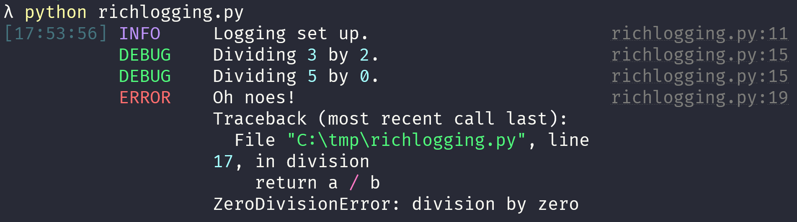

Today I learned how to use `rich` for beautiful tracebacks in the REPL and how to use it to log prettier exceptions.

===


# How to make your tracebacks more beautiful

The module [`rich`][rich] comes with an option that lets you modify the way your tracebacks are printed in the REPL.
In order to use it, you only need to install the traceback handler that comes with `rich`.
Here is the code you need:

```py
from rich import traceback
traceback.install
```

If you are in the REPL, the second line will produce some output:

```py
>>> from rich import traceback
>>> traceback.install()
<built-in function excepthook>
```

That's because `traceback.install` “returns the previous exception handler that was replaced”.
You can safely ignore that or, as I prefer to do it, just use a throwaway variable:

```py
>>> from rich import traceback
>>> _ = traceback.install()
```

Let me show you what the `traceback` handling does for you.
First, let us define a couple of dummy functions:

```py
def f():
    return 1 / 0

def g():
    return 1 + f()
```

Notice how calling `f` will always raise an error.
Without having `traceback` installed, the error looks like this:


If you install `traceback` in your console, the output is now much more beautiful and, above all, easier to read:


# How to use `rich` for logging exceptions

Yesterday I wrote about how you can [use `rich` for beautiful logging][til-rich-logging].
Today I learned that you can also make it so that the exception logging has the nice colours of `rich.traceback`!
All you need to do is set `rich_tracebacks=True` when instantiating the logging handler `RichHandler`.

If we go back to the short example I had in the previous article,
I can modify `RichHandler` to set `rich_tracebacks=True`:

```py
import logging
from rich.logging import RichHandler

FORMAT = "%(message)s"
logging.basicConfig(
    level="NOTSET",
    format=FORMAT,
    datefmt="[%X]",
    handlers=[RichHandler(rich_tracebacks=True)],  # <- not sets rich_tracebacks
)

# ...
```

Before the modification, running the program would generate logging output that contains a pretty plain Python exception.
I included a screenshot here:



However, by setting `rich_tracebacks=True`, the exception that is logged is also rendered beautifully:


`rich` is the gift that just keeps on giving...
I wonder what I'll learn tomorrow!


[rich]: https://github.com/Textualize/rich
[til-rich-logging]: /blog/til/042

That's it for now! [Stay tuned][subscribe] and I'll see you around!

[subscribe]: /subscribe
