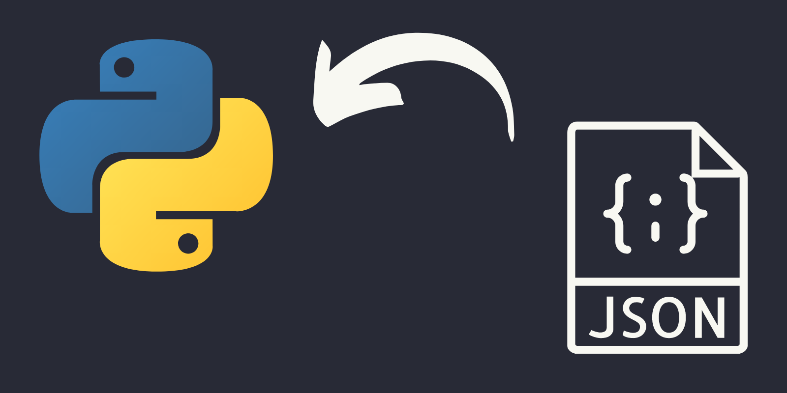

Today I learned how to do custom JSON decoding in Python with the module `json`.

===



# How to decode Python objects as JSON

The module `json` is your go-to tool whenever you need to work with JSON data in Python.
Much like you have the methods `json.dump` and `json.dumps` to turn Python objects into JSON,
you can use the methods `json.load` and `json.loads` to turn JSON into Python.

By using `json.loads`,
you can take a JSON string and turn it into a valid Python object:

```py
import json

string = '[42, {"key": null, "other_key": false}]'

print(json.loads(string))
```
```py
[42, {'key': None, 'other_key': False}]
```

The method `json.load` comes in handy if you have a file (or something similar) to read the data from.

You can read more about `json`, `json.load`, and `json.loads` [in the `json` documentation][json].

If you want to take a look at how to **encode** Python as JSON,
take a look at the TIL about [custom JSON encoding of Python objects][til-json-encode].

Because we **cannot encode arbitrary Python objects as JSON** by default,
we [implement custom JSON encoders][til-json-encode] to work around that.

The reverse side of that coin is that we must be able to decode those objects again.
However, the module `json` cannot guess what custom encodings we may have done,
so we need to **specify our custom decodings** when appropriate.

But first, let us take a look at what the module `json` does in its default decoding.


# Default JSON decoding into Python objects

According to [the `json` docs][json],
this is what the default decoding does:

| JSON | Python |
| :- | :- |
| object | `dict` |
| array | `list` |
| string | `str` |
| number (integer) | `int` |
| number (real) | `float` |
| true | `True` |
| false | `False` |
| null | `None` |

Thus, if you want to obtain, as a Python object,
anything that is not on the right column,
you need to **implement a custom JSON decoder**.


# Custom JSON decoding into arbitrary Python objects

We have two mechanisms that let us do custom JSON decoding.
By taking a look at the [`json.load` documentation][json-load],
we see that we care about the keyword-arguments `object_hook` and `object_pairs_hook`.
Let us play with `object_hook` a bit.

The function you provide as the `object_hook` argument is a function that:
 - will be called whenever the JSON decoding process builds a dictionary (a Python `dict`); and
 - must return the Python object to be used in place of the dictionary that was built.

In essence, the function you provide as the `object_hook` will be “intercepting” the decoding process,
and you can use it to build custom objects!

Going back to the example where we [used a custom JSON encoder for complex numbers][til-json-encode-example],
now we may want to let our code know how to **decode complex numbers**.
In other words, we might want to do the reverse process.

So, we want to go from:

```json
{
    "real": 2,
    "imag": 3
}
```

to the complex number

```py
2+3j  # also represented as complex(2, 3)
```

We start by defining our object hook function,
and use it to recognise dictionaries that look like complex numbers:

```py
def object_hook(dct):
    try:
        return complex(dct["real"], dct["imag"])
    except KeyError:
        return dct
```

What our function above does is:

 1. try to build a `complex` from a dictionary with keys `"real"` and `"imag"`;
 2. return the dictionary unchanged if the step above fails.

! Maybe you expected the function `object_hook` to use an `if` to determine if we had the keys necessary.
! The distinction between that approach and what I did is discussed in my Pydon't about the [LBYL and EAFP coding styles][pydont-lbyl-eafp].

Now that we have implemented an object hook,
we just have to plug it in when we are doing some JSON decoding:

```py
import json


def object_hook(dct):
    try:
        return complex(dct["real"], dct["imag"])
    except KeyError:
        return dct

json_string = """[
    42,
    null,
    false,
    {
        "key": true,
        "complex": {
            "real": 2,
            "imag": 3
        }
    }
]"""

# Use the object hook when calling `json.loads`.
# --------------------------------vvvvvvvvvvvvvvvvvvvvvvv
my_list = json.loads(json_string, object_hook=object_hook)
print(my_list)
```
```py
[42, None, False, {'key': True, 'complex': (2+3j)}]
```

Therefore,
implementing a custom function `object_hook` is the easiest way to do custom decoding of JSON into arbitrary Python objects.
Of course, this specific approach assumes your arbitrary Python objects are represented as dictionaries in their JSON form.

!!! Read the follow-up article on [defining a custom JSON decoder class][til-json-decoder]
!!! or read up on how to implement a system that lets you [extend JSON][extend-json].


[til-json-encode]: /blog/til/custom-json-encoder
[til-json-encode-example]: /blog/til/custom-json-encoder#custom-json-encoding-of-python-objects
[pydont-lbyl-eafp]: /blog/pydonts/eafp-and-lbyl-coding-styles
[extend-json]: /blog/custom-json-encoder-and-decoder
[til-json-decoder]: /blog/til/custom-json-decoder-part-2
[json]: https://docs.python.org/3/library/json.html
[json-load]: https://docs.python.org/3/library/json.html#json.load

That's it for now! [Stay tuned][subscribe] and I'll see you around!

[subscribe]: /subscribe
