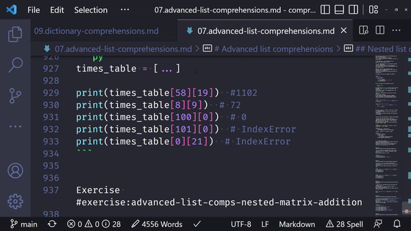

Today I learned how to edit multiple lines in the VS Code code editor.

===

# How to edit multiple file locations in VS Code?

Inside VS Code, if you hold <kbd>Ctrl</kbd> while clicking different lines with your mouse left button,
you will place multiple cursors.
Then, you can start typing and those changes will affect all the locations you clicked.

# How to edit multiple lines in VS Code?

With this keyboard shortcut, you can hold <kbd>Ctrl</kbd> and click the end of multiple lines to edit them all at once.

That's it for now! [Stay tuned][subscribe] and I'll see you around!

[subscribe]: /subscribe
