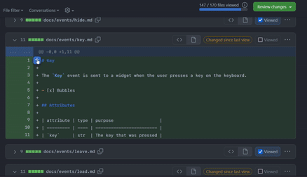

Today I learned that you can add suggestions directly when reviewing pull requests on GitHub.

===

# Add a suggestion in a GitHub pull request review

When you are reviewing a pull request on GitHub, you can add comments to one or multiple lines at a time,
but you can also leave a direct suggestion that makes it extremely convenient for the other person to make the change that you want to see implemented.

When leaving a comment in a line of code, just look for the icon that looks like a page with a plus sign on top of a minus sign.
If you click that icon, GitHub will insert the content of the line(s) of code that is highlighted inside triple backticks.
Then, just edit that however you like.
Whatever changes you make there will be shown as a “suggested edit” that the other party can accept with a click of a button.

Below, you can find a little animatied GIF showing how this works:

 1. highlight the lines of code where you want to suggest an edit;
 2. press the “add a suggestion” icon; and
 3. make your edits directly in the comment.

That's it for now! [Stay tuned][subscribe] and I'll see you around!

[subscribe]: /subscribe
