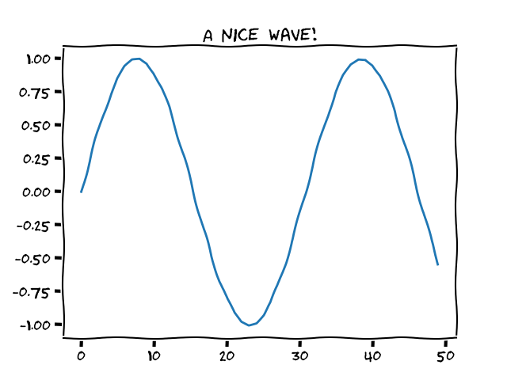
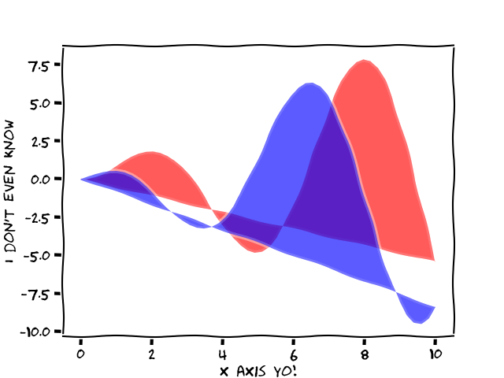
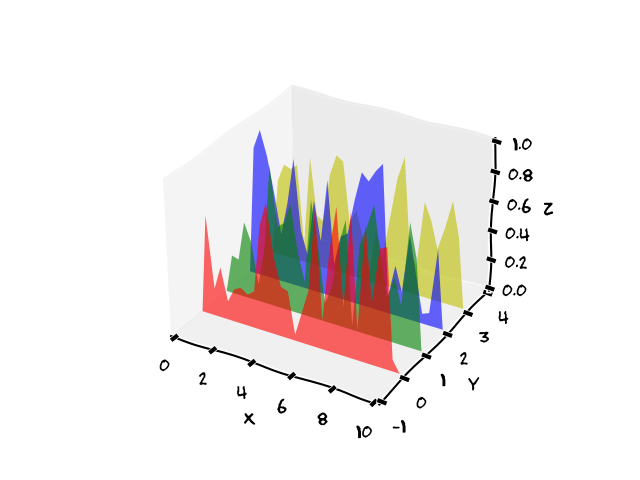
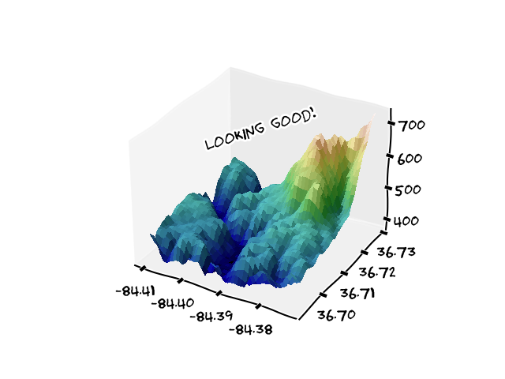

Today I learned how to create xkcd-style plots in Python with matplotlib.

===

# xkcd plots

A friend of mine showed me how to create [xkcd]-style plots in Python with matplotlib, and they look great:




# How to create an xkcd plot in Python?

You can set the style of a plot to follow the xkcd style by using `matplotlib.pyplot.xkcd`.
You can use it as a context manager to set the style of a specific plot, as the example below shows.

```py
import matplotlib.pyplot as plt
from numpy import sin, linspace

with plt.xkcd():
    plt.plot(sin(linspace(0, 10)))
    plt.title("A nice wave!")
    plt.show()
```

This piece of code creates the simple wave plot you see above.

You can also call `plt.xkcd()` to set the style of all the plots that will be created next.

I tried adding the xkcd style to a series of different plots I got directly from the matplotlib library and it seems like the style works for pretty much everything.
If you find something for which the style does not work, add a comment below so I can update this article.


# More plots in the style of xkcd

Here you can find some more plots in the style of xkcd, followed by the accompanying code that was taken almost verbatim from the references.



```py
import matplotlib.pyplot as plt
from numpy import cos, linspace, sin

x = linspace(0, 10)
y1 = x * sin(x)
y2 = x * cos(x)

with plt.xkcd():
    plt.fill(x, y1, 'red', alpha=0.4)
    plt.fill(x, y2, 'blue', alpha=0.4)
    plt.xlabel('x axis yo!')
    plt.ylabel("I don't even know")
    plt.show()
```



```py
from matplotlib.collections import PolyCollection
import matplotlib.pyplot as plt
import numpy as np

plt.xkcd()
fig = plt.figure()
ax = fig.add_subplot(projection='3d')

x = np.linspace(0, 10, 30)
colors = ['r', 'g', 'b', 'y']
y = np.random.random((len(colors), len(x)))
y[:, 0] = y[:, -1] = 0

edges = [list(zip(x, yi)) for yi in y]

poly = PolyCollection(edges, facecolors=colors, alpha=0.6)
ax.add_collection3d(poly, zs=range(4), zdir='y')

ax.set_xlabel('X')
ax.set_xlim3d(0, 10)
ax.set_ylabel('Y')
ax.set_ylim3d(-1, 4)
ax.set_zlabel('Z')
ax.set_zlim3d(0, 1)
plt.show()
```



```py
from matplotlib import cbook
from matplotlib import cm
from matplotlib.colors import LightSource
import matplotlib.pyplot as plt
import numpy as np

# Load and format data
dem = cbook.get_sample_data('jacksboro_fault_dem.npz', np_load=True)
z = dem['elevation']
nrows, ncols = z.shape
x = np.linspace(dem['xmin'], dem['xmax'], ncols)
y = np.linspace(dem['ymin'], dem['ymax'], nrows)
x, y = np.meshgrid(x, y)

region = np.s_[5:50, 5:50]
x, y, z = x[region], y[region], z[region]

# Set up plot
plt.xkcd()
fig, ax = plt.subplots(subplot_kw=dict(projection='3d'))

ls = LightSource(270, 45)
# To use a custom hillshading mode, override the built-in shading and pass
# in the rgb colors of the shaded surface calculated from "shade".
rgb = ls.shade(z, cmap=cm.gist_earth, vert_exag=0.1, blend_mode='soft')
surf = ax.plot_surface(x, y, z, rstride=1, cstride=1, facecolors=rgb,
                       linewidth=0, antialiased=False, shade=False)

ax.text(-84.4, 36.7, 700, "Looking good!", (1, 2, 0))

plt.show()
```


# How to turn off xkcd style?

If you call `plt.xkcd()` as a regular function, all plots that follow will use the xkcd style.
If you want to disable that style for other plots, just call `matplotlib.pyplot.rcdefaults` before constructing the next plot.
Alternatively, use the context manager `with plt.xkcd():` to style plots explicitly.


That's it for now! [Stay tuned][subscribe] and I'll see you around!

[subscribe]: /subscribe
[xkcd]: https://xkcd.com
