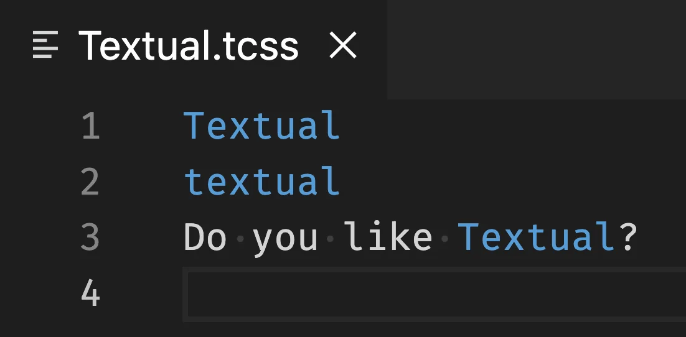

Today I learned how to create a VS Code extension to do custom syntax highlighting.

===

# Textual CSS

At my day job, developing [Textual], I have been [tasked with writing a VS Code extension that does proper syntax colouring of Textual CSS][gh-issue].

That's because Textual CSS looks a lot like regular CSS but the syntax highlighting of regular CSS doesn't look great.
For example, notice how the Textual CSS below looks uneven:

```css
ModalScreen, #input, .some-class {
    border: heavy white;
    tint: $primary 30%;
}
```

For example, the selectors `#input` and `.some-class` are highlighted but the selector `ModalScreen` isn't.
Furthermore, Textual CSS has rules that regular CSS doesn't, and that is why `border` is a different colour than `tint`.


# Writing a VS Code extension

After getting started with VS Code's guide on [writing your first extension](https://code.visualstudio.com/api/get-started/your-first-extension), I found [a guide specific to creating extensions that do custom syntax highlighting](https://code.visualstudio.com/api/language-extensions/syntax-highlight-guide).

A few rabbit holes later and I had an extension that does syntax highlighting of the words "textual" and "Textual" in `.tcss` files.

"All" I needed to do was create a new extension template with `yo code` (as the first guide teaches).

Then, I went to the extension manifest file `package.json` and modified the `"contributes"` key:

```json
{
  "contributes": {
    "languages": [
      {
        "id": "Textual CSS",
        "extensions": [".tcss"]
      }
    ],
    "grammars": [
      {
        "language": "Textual CSS",
        "scopeName": "source.tcss",
        "path": "./syntaxes/tcss.tmGrammar.json"
      }
    ]
  }
}
```

First, we need to "contribute" a language, which is Textual CSS, and that corresponds to the language that we want to target with our extension.

Then, we contribute a grammar, which is the TextMate grammar file that specifies how tokens get parsed.
Token names and scopes are still a bit confusing to me, but after reading [an article that is linked to by the VS Code guide](https://www.apeth.com/nonblog/stories/textmatebundle.html), I seem to understand that we prefix the scope name with `source` so that we create a nested scope inside `source`.

In other words, the scope `source` is already a scope that VS Code knows about and we are saying that our Textual CSS files not only contain source code (scoped as `source`), but that they contain a more specific type of source code.
This nesting is achieved with the `.tcss`.

Finally, we need to create the actual grammar file.
The file `tcss.tmGrammar.json` currently looks like this:

```json
{
    "scopeName": "source.tcss",
    "patterns": [{"include": "#textual"}],
    "repository": {
        "textual": {
            "match": "(T|t)extual",
            "name": "keyword"
        }
    }
}
```

The value that you attribute to `"name"` inside `"textual"` inside `"repository"` is what classifies the words "textual" and "Textual" as a meaningful token.
In this example, I randomly chose `keyword`.
Then, it is up to the theme that you use to specify what is the colour that `keyword` tokens use.

In the screenshot below, you can see a couple of lines of text with some random highlighting:




[textual]: https://textual.textualize.io
[gh-issue]: https://github.com/Textualize/textual/issues/2888


That's it for now! [Stay tuned][subscribe] and I'll see you around!

[subscribe]: /subscribe
