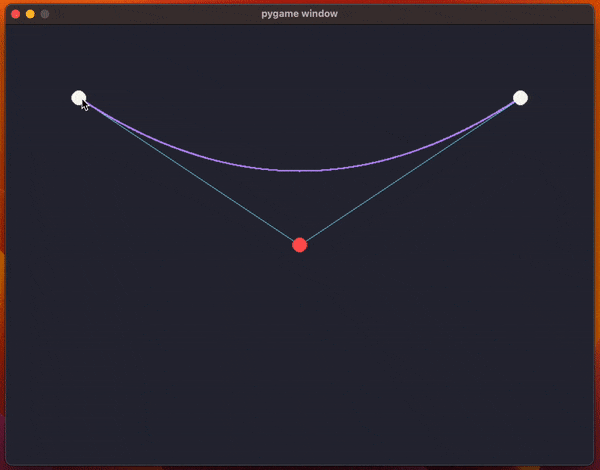

Today I learned how to draw a Bézier curve with the De Casteljau's algorithm.

===




# How to draw a Bézier curve

Today I learned that there is a straightforward way to draw Bézier curves and I wrote a small Python program to test this out.

The code uses `pygame` and it creates a window with the two endpoints for the curve and a control point (so, we're drawing a quadratic Bézier curve).

The animation above shows the program running and the code has been included below.

The main part of that program is the little bit of maths that actually computes the points of the curve itself.
For a given $t \in [0, 1]$, if $s$, $e$, and $c$ and the start, end, and control points, respectively, then the point $p(t)$ of the curve is

$$
\begin{cases}
p_1(t) = s + (c - s) \times t \\
p_2(t) = c + (e - c) \times t \\
p(t) = p_1(t) + (p_2(t) - p_1(t)) \times t
\end{cases}
$$

What the code does, inside the function `draw_curve`, is use a `for` loop to sample multiple values of `t` to approximate the curve by drawing a bunch of points.

The code below ran on Python 3.11 and pygame 2.5.1.
It shouldn't have major compatibility issues with other version of Python/pygame, though, as I'm only using fairly basic functionality.

```py
import dataclasses
from dataclasses import dataclass
import sys

import pygame
import pygame.locals


WIDTH = 800
HEIGHT = 600
ENDPOINT_COLOUR = (248, 248, 242)
BACKGROUND = (40, 42, 54)
CONTROL_POINT_COLOUR = (255, 85, 85)
CURVE_COLOUR = (189, 147, 249)
GUIDELINE_COLOUR = (139, 233, 253)
POINT_RADIUS = 10

screen = pygame.display.set_mode((WIDTH, HEIGHT))
screen.fill(BACKGROUND)


@dataclass
class Curve:
    start: tuple[int, int]
    end: tuple[int, int]
    control_point: tuple[int, int]


def dist_squared(p1, p2):
    x1, y1 = p1
    x2, y2 = p2
    return (x2 - x1) ** 2 + (y2 - y1) ** 2


def draw_endpoint(screen, point):
    pygame.draw.circle(
        screen,
        ENDPOINT_COLOUR,
        point,
        radius=POINT_RADIUS,
    )


def draw_control_point(screen, point):
    pygame.draw.circle(
        screen,
        CONTROL_POINT_COLOUR,
        point,
        radius=POINT_RADIUS,
    )


def draw_curve(screen, curve):
    pygame.draw.line(screen, GUIDELINE_COLOUR, curve.start, curve.control_point)
    pygame.draw.line(screen, GUIDELINE_COLOUR, curve.end, curve.control_point)

    sx, sy = curve.start
    ex, ey = curve.end
    cx, cy = curve.control_point

    iters = 1000
    for iter in range(0, iters + 1):
        delta = iter / iters
        m1x = sx + (cx - sx) * delta
        m2x = cx + (ex - cx) * delta
        m1y = sy + (cy - sy) * delta
        m2y = cy + (ey - cy) * delta
        px = m1x + (m2x - m1x) * delta
        py = m1y + (m2y - m1y) * delta
        pygame.draw.circle(screen, CURVE_COLOUR, (px, py), radius=1)

    draw_endpoint(screen, curve.start)
    draw_endpoint(screen, curve.end)
    draw_control_point(screen, curve.control_point)


previous_curve = None
curve = Curve((100, 100), (WIDTH - 100, 100), (WIDTH // 2, HEIGHT // 2))
dragging = False
point_being_dragged = None

print("Click a point to “pick it up” and click again to drop it.")

while True:
    for event in pygame.event.get():
        if (
            event.type == pygame.locals.QUIT
            or event.type == pygame.locals.KEYDOWN
            and event.key == pygame.locals.K_q
        ):
            pygame.quit()
            sys.exit()

        # Are we starting/stopping to drag something?
        elif (
            event.type == pygame.locals.MOUSEBUTTONDOWN
            and event.button == pygame.locals.BUTTON_LEFT
        ):
            if not dragging:
                pos = event.pos
                if dist_squared(pos, curve.start) <= POINT_RADIUS**2:
                    point_being_dragged = "start"
                elif dist_squared(pos, curve.end) <= POINT_RADIUS**2:
                    point_being_dragged = "end"
                elif dist_squared(pos, curve.control_point) <= POINT_RADIUS**2:
                    point_being_dragged = "control_point"
                if point_being_dragged is not None:
                    dragging = True
            else:
                dragging = False
                point_being_dragged = None

        # Are we dragging a point?
        elif dragging and event.type == pygame.locals.MOUSEMOTION:
            setattr(curve, point_being_dragged, event.pos)

    if previous_curve != curve:
        screen.fill(BACKGROUND)
        draw_curve(screen, curve)
        previous_curve = dataclasses.replace(curve)
    pygame.display.flip()

```
