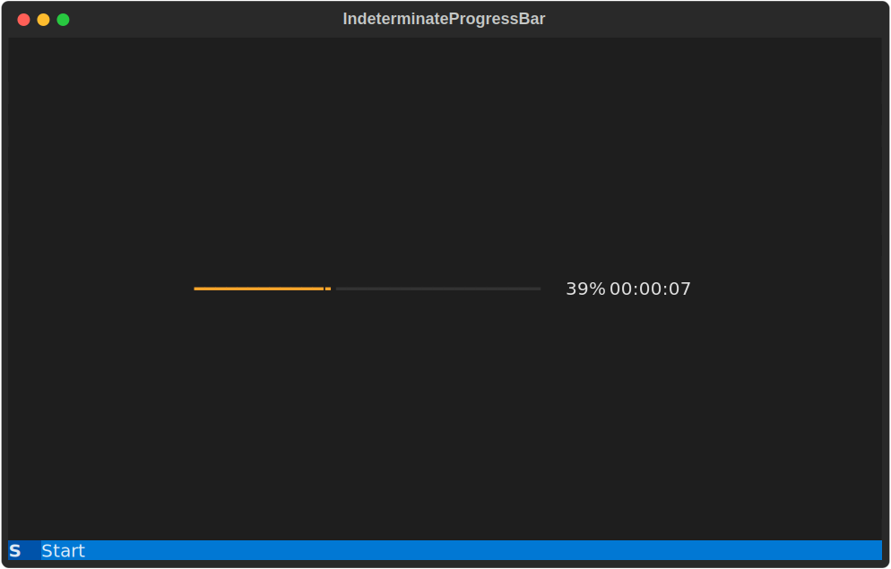

Today I learned how to create a sentinel value to use as a default argument in a way that respects Python typing.

===


# Sentinel value for default arguments

## Context

Today at work I had a problem.
I was working on a progress bar that [Textual] has:

<svg xmlns="http://www.w3.org/2000/svg" class="rich-terminal" viewBox="0 0 994 635.6">
 <style>@font-face{font-family:&quot;Fira Code&quot;;src:local(&quot;FiraCode-Regular&quot;),url(https://cdnjs.cloudflare.com/ajax/libs/firacode/6.2.0/woff2/FiraCode-Regular.woff2)format(&quot;woff2&quot;),url(https://cdnjs.cloudflare.com/ajax/libs/firacode/6.2.0/woff/FiraCode-Regular.woff)format(&quot;woff&quot;);font-style:normal;font-weight:400}@font-face{font-family:&quot;Fira Code&quot;;src:local(&quot;FiraCode-Bold&quot;),url(https://cdnjs.cloudflare.com/ajax/libs/firacode/6.2.0/woff2/FiraCode-Bold.woff2)format(&quot;woff2&quot;),url(https://cdnjs.cloudflare.com/ajax/libs/firacode/6.2.0/woff/FiraCode-Bold.woff)format(&quot;woff&quot;);font-style:bold;font-weight:700}.terminal-3440292978-r1{fill:#c5c8c6}.terminal-3440292978-r2{fill:#e1e1e1}.terminal-3440292978-r3{fill:#323232}</style><defs><clipPath id="terminal-3440292978-clip-terminal"><path d="M0 0h975v584.6H0z"/></clipPath><clipPath id="terminal-3440292978-line-0"><path d="M0 1.5h976v24.65H0z"/></clipPath><clipPath id="terminal-3440292978-line-1"><path d="M0 25.9h976v24.65H0z"/></clipPath><clipPath id="terminal-3440292978-line-2"><path d="M0 50.3h976v24.65H0z"/></clipPath><clipPath id="terminal-3440292978-line-3"><path d="M0 74.7h976v24.65H0z"/></clipPath><clipPath id="terminal-3440292978-line-4"><path d="M0 99.1h976v24.65H0z"/></clipPath><clipPath id="terminal-3440292978-line-5"><path d="M0 123.5h976v24.65H0z"/></clipPath><clipPath id="terminal-3440292978-line-6"><path d="M0 147.9h976v24.65H0z"/></clipPath><clipPath id="terminal-3440292978-line-7"><path d="M0 172.3h976v24.65H0z"/></clipPath><clipPath id="terminal-3440292978-line-8"><path d="M0 196.7h976v24.65H0z"/></clipPath><clipPath id="terminal-3440292978-line-9"><path d="M0 221.1h976v24.65H0z"/></clipPath><clipPath id="terminal-3440292978-line-10"><path d="M0 245.5h976v24.65H0z"/></clipPath><clipPath id="terminal-3440292978-line-11"><path d="M0 269.9h976v24.65H0z"/></clipPath><clipPath id="terminal-3440292978-line-12"><path d="M0 294.3h976v24.65H0z"/></clipPath><clipPath id="terminal-3440292978-line-13"><path d="M0 318.7h976v24.65H0z"/></clipPath><clipPath id="terminal-3440292978-line-14"><path d="M0 343.1h976v24.65H0z"/></clipPath><clipPath id="terminal-3440292978-line-15"><path d="M0 367.5h976v24.65H0z"/></clipPath><clipPath id="terminal-3440292978-line-16"><path d="M0 391.9h976v24.65H0z"/></clipPath><clipPath id="terminal-3440292978-line-17"><path d="M0 416.3h976v24.65H0z"/></clipPath><clipPath id="terminal-3440292978-line-18"><path d="M0 440.7h976v24.65H0z"/></clipPath><clipPath id="terminal-3440292978-line-19"><path d="M0 465.1h976v24.65H0z"/></clipPath><clipPath id="terminal-3440292978-line-20"><path d="M0 489.5h976v24.65H0z"/></clipPath><clipPath id="terminal-3440292978-line-21"><path d="M0 513.9h976v24.65H0z"/></clipPath><clipPath id="terminal-3440292978-line-22"><path d="M0 538.3h976v24.65H0z"/></clipPath></defs><rect width="992" height="633.6" x="1" y="1" fill="#292929" stroke="rgba(255,255,255,0.35)" rx="8"/><text x="496" y="27" fill="#c5c8c6" style="font-size:18px;font-weight:700;font-family:arial" text-anchor="middle">IndeterminateProgressBar</text><g transform="translate(26 22)"><circle r="7" fill="#ff5f57"/><circle cx="22" r="7" fill="#febc2e"/><circle cx="44" r="7" fill="#28c840"/></g><g clip-path="url(#terminal-3440292978-clip-terminal)" transform="translate(9 41)"><path fill="#1e1e1e" d="M0 1.5h207.4v24.65H0zM207.4 1.5h561.2v24.65H207.4zM768.6 1.5H976v24.65H768.6z" shape-rendering="crispEdges"/><path fill="#1e1e1e" d="M0 25.9h207.4v24.65H0zM207.4 25.9h561.2v24.65H207.4zM768.6 25.9H976v24.65H768.6z" shape-rendering="crispEdges"/><path fill="#1e1e1e" d="M0 50.3h207.4v24.65H0zM207.4 50.3h561.2v24.65H207.4zM768.6 50.3H976v24.65H768.6z" shape-rendering="crispEdges"/><path fill="#1e1e1e" d="M0 74.7h207.4v24.65H0zM207.4 74.7h561.2v24.65H207.4zM768.6 74.7H976v24.65H768.6z" shape-rendering="crispEdges"/><path fill="#1e1e1e" d="M0 99.1h207.4v24.65H0zM207.4 99.1h561.2v24.65H207.4zM768.6 99.1H976v24.65H768.6z" shape-rendering="crispEdges"/><path fill="#1e1e1e" d="M0 123.5h207.4v24.65H0zM207.4 123.5h561.2v24.65H207.4zM768.6 123.5H976v24.65H768.6z" shape-rendering="crispEdges"/><path fill="#1e1e1e" d="M0 147.9h207.4v24.65H0zM207.4 147.9h561.2v24.65H207.4zM768.6 147.9H976v24.65H768.6z" shape-rendering="crispEdges"/><path fill="#1e1e1e" d="M0 172.3h207.4v24.65H0zM207.4 172.3h561.2v24.65H207.4zM768.6 172.3H976v24.65H768.6z" shape-rendering="crispEdges"/><path fill="#1e1e1e" d="M0 196.7h207.4v24.65H0zM207.4 196.7h561.2v24.65H207.4zM768.6 196.7H976v24.65H768.6z" shape-rendering="crispEdges"/><path fill="#1e1e1e" d="M0 221.1h207.4v24.65H0zM207.4 221.1h561.2v24.65H207.4zM768.6 221.1H976v24.65H768.6z" shape-rendering="crispEdges"/><path fill="#1e1e1e" d="M0 245.5h207.4v24.65H0zM207.4 245.5h561.2v24.65H207.4zM768.6 245.5H976v24.65H768.6z" shape-rendering="crispEdges"/><path fill="#1e1e1e" d="M0 269.9h207.4v24.65H0zM207.4 269.9h12.2v24.65h-12.2zM219.6 269.9h12.2v24.65h-12.2zM231.8 269.9h97.6v24.65h-97.6zM329.4 269.9h12.2v24.65h-12.2zM341.6 269.9h256.2v24.65H341.6zM597.8 269.9h24.4v24.65h-24.4zM622.2 269.9h36.6v24.65h-36.6z" shape-rendering="crispEdges"/><path fill="#1e1e1e" d="M658.8 269.9H671v24.65h-12.2zM671 269.9h97.6v24.65H671zM768.6 269.9H976v24.65H768.6zM0 294.3h207.4v24.65H0z" shape-rendering="crispEdges"/><path fill="#1e1e1e" d="M207.4 294.3h561.2v24.65H207.4zM768.6 294.3H976v24.65H768.6zM0 318.7h207.4v24.65H0z" shape-rendering="crispEdges"/><path fill="#1e1e1e" d="M207.4 318.7h561.2v24.65H207.4zM768.6 318.7H976v24.65H768.6zM0 343.1h207.4v24.65H0z" shape-rendering="crispEdges"/><path fill="#1e1e1e" d="M207.4 343.1h561.2v24.65H207.4zM768.6 343.1H976v24.65H768.6zM0 367.5h207.4v24.65H0z" shape-rendering="crispEdges"/><path fill="#1e1e1e" d="M207.4 367.5h561.2v24.65H207.4zM768.6 367.5H976v24.65H768.6zM0 391.9h207.4v24.65H0z" shape-rendering="crispEdges"/><path fill="#1e1e1e" d="M207.4 391.9h561.2v24.65H207.4zM768.6 391.9H976v24.65H768.6zM0 416.3h207.4v24.65H0z" shape-rendering="crispEdges"/><path fill="#1e1e1e" d="M207.4 416.3h561.2v24.65H207.4zM768.6 416.3H976v24.65H768.6zM0 440.7h207.4v24.65H0z" shape-rendering="crispEdges"/><path fill="#1e1e1e" d="M207.4 440.7h561.2v24.65H207.4zM768.6 440.7H976v24.65H768.6zM0 465.1h207.4v24.65H0z" shape-rendering="crispEdges"/><path fill="#1e1e1e" d="M207.4 465.1h561.2v24.65H207.4zM768.6 465.1H976v24.65H768.6zM0 489.5h207.4v24.65H0z" shape-rendering="crispEdges"/><path fill="#1e1e1e" d="M207.4 489.5h561.2v24.65H207.4zM768.6 489.5H976v24.65H768.6zM0 513.9h207.4v24.65H0z" shape-rendering="crispEdges"/><path fill="#1e1e1e" d="M207.4 513.9h561.2v24.65H207.4zM768.6 513.9H976v24.65H768.6zM0 538.3h207.4v24.65H0z" shape-rendering="crispEdges"/><path fill="#1e1e1e" d="M207.4 538.3h561.2v24.65H207.4zM768.6 538.3H976v24.65H768.6z" shape-rendering="crispEdges"/><path fill="#0053aa" d="M0 562.7h36.6v24.65H0z" shape-rendering="crispEdges"/><path fill="#0178d4" d="M36.6 562.7H122v24.65H36.6zM122 562.7h854v24.65H122z" shape-rendering="crispEdges"/><g style="font-family:Fira Code,monospace;font-size:20px;line-height:24.4px;font-variant-east-asian:full-width"><text x="976" y="20" class="terminal-3440292978-r1" clip-path="url(#terminal-3440292978-line-0)" textLength="12.2">
 </text><text x="976" y="44.4" class="terminal-3440292978-r1" clip-path="url(#terminal-3440292978-line-1)" textLength="12.2">
 </text><text x="976" y="68.8" class="terminal-3440292978-r1" clip-path="url(#terminal-3440292978-line-2)" textLength="12.2">
 </text><text x="976" y="93.2" class="terminal-3440292978-r1" clip-path="url(#terminal-3440292978-line-3)" textLength="12.2">
 </text><text x="976" y="117.6" class="terminal-3440292978-r1" clip-path="url(#terminal-3440292978-line-4)" textLength="12.2">
 </text><text x="976" y="142" class="terminal-3440292978-r1" clip-path="url(#terminal-3440292978-line-5)" textLength="12.2">
 </text><text x="976" y="166.4" class="terminal-3440292978-r1" clip-path="url(#terminal-3440292978-line-6)" textLength="12.2">
 </text><text x="976" y="190.8" class="terminal-3440292978-r1" clip-path="url(#terminal-3440292978-line-7)" textLength="12.2">
 </text><text x="976" y="215.2" class="terminal-3440292978-r1" clip-path="url(#terminal-3440292978-line-8)" textLength="12.2">
 </text><text x="976" y="239.6" class="terminal-3440292978-r1" clip-path="url(#terminal-3440292978-line-9)" textLength="12.2">
 </text><text x="976" y="264" class="terminal-3440292978-r1" clip-path="url(#terminal-3440292978-line-10)" textLength="12.2">
 </text><text x="207.4" y="288.4" class="terminal-3440292978-r3" clip-path="url(#terminal-3440292978-line-11)" textLength="12.2">━</text><text x="219.6" y="288.4" class="terminal-3440292978-r3" clip-path="url(#terminal-3440292978-line-11)" textLength="12.2">╸</text><text x="231.8" y="288.4" clip-path="url(#terminal-3440292978-line-11)" style="fill:#b93c5b" textLength="97.6">━━━━━━━━</text><text x="329.4" y="288.4" class="terminal-3440292978-r3" clip-path="url(#terminal-3440292978-line-11)" textLength="12.2">╺</text><text x="341.6" y="288.4" class="terminal-3440292978-r3" clip-path="url(#terminal-3440292978-line-11)" textLength="256.2">━━━━━━━━━━━━━━━━━━━━━</text><text x="622.2" y="288.4" class="terminal-3440292978-r2" clip-path="url(#terminal-3440292978-line-11)" textLength="36.6">--%</text><text x="671" y="288.4" class="terminal-3440292978-r2" clip-path="url(#terminal-3440292978-line-11)" textLength="97.6">--:--:--</text><text x="976" y="288.4" class="terminal-3440292978-r1" clip-path="url(#terminal-3440292978-line-11)" textLength="12.2">
 </text><text x="976" y="312.8" class="terminal-3440292978-r1" clip-path="url(#terminal-3440292978-line-12)" textLength="12.2">
 </text><text x="976" y="337.2" class="terminal-3440292978-r1" clip-path="url(#terminal-3440292978-line-13)" textLength="12.2">
 </text><text x="976" y="361.6" class="terminal-3440292978-r1" clip-path="url(#terminal-3440292978-line-14)" textLength="12.2">
 </text><text x="976" y="386" class="terminal-3440292978-r1" clip-path="url(#terminal-3440292978-line-15)" textLength="12.2">
 </text><text x="976" y="410.4" class="terminal-3440292978-r1" clip-path="url(#terminal-3440292978-line-16)" textLength="12.2">
 </text><text x="976" y="434.8" class="terminal-3440292978-r1" clip-path="url(#terminal-3440292978-line-17)" textLength="12.2">
 </text><text x="976" y="459.2" class="terminal-3440292978-r1" clip-path="url(#terminal-3440292978-line-18)" textLength="12.2">
 </text><text x="976" y="483.6" class="terminal-3440292978-r1" clip-path="url(#terminal-3440292978-line-19)" textLength="12.2">
 </text><text x="976" y="508" class="terminal-3440292978-r1" clip-path="url(#terminal-3440292978-line-20)" textLength="12.2">
 </text><text x="976" y="532.4" class="terminal-3440292978-r1" clip-path="url(#terminal-3440292978-line-21)" textLength="12.2">
 </text><text x="976" y="556.8" class="terminal-3440292978-r1" clip-path="url(#terminal-3440292978-line-22)" textLength="12.2">
 </text><text y="581.2" clip-path="url(#terminal-3440292978-line-23)" style="fill:#dde8f3;font-weight:700" textLength="36.6"> S </text><text x="36.6" y="581.2" clip-path="url(#terminal-3440292978-line-23)" style="fill:#ddedf9" textLength="85.4"> Start </text></g></g>
</svg>


The `ProgressBar` class has a method `update` that you can use to update the status of the progress bar.
The method `update` looked _roughly_ like this:

```py
class ProgressBar(...):
    ...

    def update(
        self,
        total: float | None = None,
        progress: float | None = None,
        advance: float | None = None,
    ) -> None:
        """Update the status of the progress bar."""
        if total is not None:
            self.total = total
        if progress is not None:
            self.progress = progress
        if advance is not None:
            self.progress += advance
```

By calling `update`, you can change the total “size” of the progress bar (`total`), you can change how far along you are with the progress (`progress`), and you can increment the current progress by a given amount (`advance`).

For example, if you create a progress bar `pb` and then call `pb.update(total=100, progress=30, advance=9)`, your progress bar ends up at 39% completion and it would look something like this:



What's the problem, then?


## Using another default value instead of `None`

The default value for `total` is `None`, but the truth is that I also want to be able to set `total` to `None`, because that turns the progress bar into its indeterminate/pulsing state.
So, how can I do this?

The answer is obvious: just use another default value!

That's right, but I can't use any random default value, because then the typing will look odd!
For example, I could use the string `"default"`, and modify the method to look like this:

```py
class ProgressBar(...):
    ...

    def update(
        self,
        total: float | str | None = "default",
        progress: float | None = None,
        advance: float | None = None,
    ) -> None:
        """Update the status of the progress bar."""
        if not isinstance(total, str):
            self.total = total
        if progress is not None:
            self.progress = progress
        if advance is not None:
            self.progress += advance
```

The problem with this, I argue, is that it looks really odd to have `total` accept values of the type `str`, when it really doesn't, it's just so that the typing matches the default value given...

In other words, if I just had

```py
...
total: float | None = "default",
...
```

then the typing would be wrong.
And I want to have the code typed correctly, if possible.

So, how do we solve this?


## Using `object` as the default value

My next thought went to using `object` as the default value.
So, something like this:

```py
_sentinel = object()

class ProgressBar(...):
    ...

    def update(
        self,
        total: float | None | object = _sentinel,
        progress: float | object = _sentinel,
        advance: float | object = _sentinel,
    ) -> None:
        """Update the status of the progress bar."""
        if total is not _sentinel:
            self.total = total
        if progress is not _sentinel:
            self.progress = progress
        if advance is not _sentinel:
            self.progress += advance
```

This looked promising, but there is another typing issue with this approach...
And that's that _anything_ you pass in to `update` will satisfy the type-checker!

For example, if you write something like

```py
pb.update(total="billions", progress=(1, 2), advance=True)
```

the type-checker will not complain, because all the parameters accept the type `object`, and everything in Python is an instance of `object`:

```pycon
>>> isinstance("billions", object)
True
>>> isinstance((1, 2), object)
True
>>> isinstance(True, object)
True
```

So, `object` isn't quite the answer we are looking for.

I thought some more and I ended up going down a rabbit hole that involved `TypeVar` and `TypeGuard`...
And I got it to work with a bit of help!
But it was way more complicated than the solution I'm about to present next.


## Create a sentinel class

A simple solution that satisfies the type-checker involves creating an empty sentinel class!
Then, you create an instance of that class and use it as the default value for the parameters.
Something like this:

```py
class UnusedParameter:
    pass

_sentinel = UnusedParameter()

class ProgressBar(...):
    ...

    def update(
        self,
        total: float | None | UnusedParameter = _sentinel,
        progress: float | UnusedParameter = _sentinel,
        advance: float | UnusedParameter = _sentinel,
    ) -> None:
        """Update the status of the progress bar."""
        if not isinstance(total, UnusedParameter):
            self.total = total
        if not isinstance(progress, UnusedParameter):
            self.progress = progress
        if not isinstance(advance, UnusedParameter):
            self.progress += advance
```

With this simple solution, we satisfy all requirements!
Quite nice, right?

I got this pattern from Will McGugan's `rich` library, where he pointed me to a [method `update` that does a similar thing](https://github.com/Textualize/rich/blob/720800e6930d85ad027b1e9bd0cbb96b5e994ce3/rich/console.py#L170-L182).
If all goes well, my [new version of the method `ProgressBar.update` will be merged soon](https://github.com/Textualize/textual/pull/3286/commits/65a7f1ed7159b615e2d6509846727d4214fa20f3)!


[textual]: https://github.com/textualize/textual
