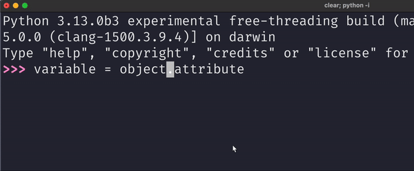

Today I learned how to fix an issue with <kbd>Ctrl</kbd>+<kbd>left</kbd> and <kbd>Ctrl</kbd>+<kbd>right</kbd> not working in the new Python REPL on MacOS.

===

# <kbd>Ctrl</kbd>+<kbd>left</kbd> and <kbd>Ctrl</kbd>+<kbd>right</kbd> not working in the Python REPL on MacOS

The (new) Python REPL (3.13+) has _many_ useful keyboard shortcuts and two of them are <kbd>Ctrl</kbd>+<kbd>left</kbd> and <kbd>Ctrl</kbd>+<kbd>right</kbd>, which are used to navigate the cursor by skipping to the beginning/end of words, as the GIT below shows:

On MacOS, the keybindings were not working at all.
With the help of the new REPL trace functionality, we found out they weren't even making it to Python!

After lots of digging, we found out what the issue was: MacOS was hijacking the two keybindings <kbd>Ctrl</kbd>+<kbd>left</kbd> and <kbd>Ctrl</kbd>+<kbd>right</kbd> for spaces-related shortcuts.
To turn those off, go to Settings > Keyboard Shortcuts > Mission Control > Mission Control dropdown > Untick “Move left a space” and “Move right a space”.

