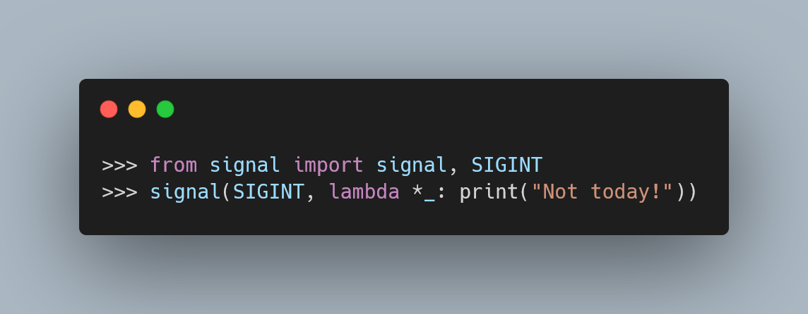

https://twitter.com/bindureddy/status/1450317088271126529

===

<script async src="https://platform.twitter.com/widgets.js" charset="utf-8"></script>




# Context

My talk at EuroPython 2021 was finally [uploaded to YouTube][europython2021-talk-yt].
I got really excited about this, so I decided to share it on Twitter:

<blockquote class="twitter-tweet"><p lang="en" dir="ltr">🚨📢 The recording 📽 of my <a href="https://twitter.com/europython?ref_src=twsrc%5Etfw">@EuroPython</a> 2021 talk has been uploaded to YouTube!<br><br>In it, I walk you through the refactoring of a function, introducing many Python features.<br><br>Go watch it, and let me know if you find the Easter egg! 🥚 No one has, yet!<a href="https://t.co/L3acpxN3mI">https://t.co/L3acpxN3mI</a></p>&mdash; Rodrigo 🐍📝 (@mathsppblog) <a href="https://twitter.com/mathsppblog/status/1443184281098997764?ref_src=twsrc%5Etfw">September 29, 2021</a></blockquote>

In my talk, I walk you through successive refactors of a piece of “bad” Python code,
until you reach a “better” piece of Python code.
The talk follows closely the [“bite-sized refactoring” Pydont'][pydont-refactoring].

In the talk, I started with this code:

```py
def myfunc(a):
    empty=[]
    for i in range(len(a)):
        if i%2==0:
            empty.append(a[i].upper())
        else:
            empty.append(a[i].lower())

    return "".join(empty)

# ---
>>> myfunc("Hello, world!")
'HeLlO, wOrLd!'
>>> myfunc("Spongebob.")
'SpOnGeBoB.'
```

And refactored it up until this point:

```py
def alternate_casing(text):
    return "".join([
        char.lower() if idx % 2 else char.upper()
        for idx, char in enumerate(text)
    ])
```


# `.join`

In a feedback tweet, someone said that I could've removed the `[]` of the list comprehension.
That would, instead, define a generator expression,
that should even be faster.

_Thankfully_, I was prepared for that:
before the talk, I checked the performance of both alternatives,
and found out that the generator expression was _not_ faster.

That surprised me, because I was under the impression that generator expressions
tend to be faster that list comprehensions, but the data in front of me didn't lie...
And so, I didn't change the list comprehension into a generator expression in the talk...

But why is the generator expression slower?

As it turns out, the `.join` method is a two-pass algorithm!

At least, according to a tweet that was quoted to me:

<blockquote class="twitter-tweet"><p lang="en" dir="ltr">This is incorrect — due to the implementation of str.join, the list comprehension is faster (annoyingly) <a href="https://t.co/gOdJm9hrd0">https://t.co/gOdJm9hrd0</a></p>&mdash; Alex Waygood (@AlexWaygood) <a href="https://twitter.com/AlexWaygood/status/1443327768327041027?ref_src=twsrc%5Etfw">September 29, 2021</a></blockquote>

Sadly, I haven't been able to verify this yet.

However, it does make some sense:
if `.join` really is a two-pass algorithm, then generator expressions hurt us,
because generators can only be traversed once.
Therefore, we need to do something before `.join` can actually start its work.

Peeking at the source code for `.join` will probably reveal this...

I'm a bit sleepy, but I'll interrupt typing _right now_ to take a quick peek at the source,
see if I can find this code.

[Me browsing through Python's source code.]

Ok, I think I found it 🎉🎉!

In [Python's GitHub repo][python-gh-repo], there's an `Objects` folder that contains a `stringlib`
that has a `join.h` file.
Opening it, you can see that there are two `for` loops over the data.

In the [exact commit I looked at][python-source-commit], at the beginning of the 30th of September of 2021,
those two `for` loops start on lines [61][join-61] and [125][join-125] or [133][join-133],
depending on some condition.

Cool, we checked that `.join` is indeed a two-pass algorithm!


That's it for now! [Stay tuned][subscribe] and I'll see you around!


[subscribe]: /subscribe
[europython2021-talk-yt]: https://www.youtube.com/watch?v=Vjq89-spPOk
[pydont-refactoring]: /blog/pydonts/bite-sized-refactoring
[python-gh-repo]: https://github.com/python/cpython
[python-source-commit]: https://github.com/python/cpython/tree/d441437ee71ae174c008c23308b749b91020ba77
[python-source-join]: https://github.com/python/cpython/blob/main/Objects/stringlib/join.h
[join-61]: https://github.com/python/cpython/blob/d441437ee71ae174c008c23308b749b91020ba77/Objects/stringlib/join.h#L61
[join-125]: https://github.com/python/cpython/blob/d441437ee71ae174c008c23308b749b91020ba77/Objects/stringlib/join.h#L125
[join-133]: https://github.com/python/cpython/blob/d441437ee71ae174c008c23308b749b91020ba77/Objects/stringlib/join.h#L133
