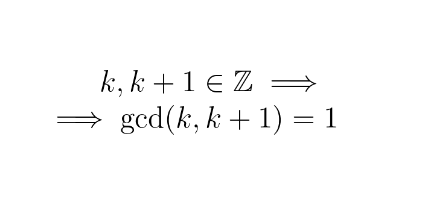

---
metadata:
    description: Nesta prova num tweet mostro que dois inteiros consecutivos são sempre coprimos.
title: 'Prova num tweet: inteiros consecutivos são coprimos'
---

Vamos provar que, se $k$ é um número inteiro, então $\gcd(k, k+1) = 1$, isto é, quaisquer dois inteiros consecutivos são coprimos.

===

# Prova num tweet

Seja $k$ um número inteiro e seja $d$ o máximo divisor comum de $k$ e $k + 1$.
Sabemos que $(k + 1)/d = k/d + 1/d$ e tanto $(k + 1)/d$ como $k/d$ são inteiros, logo $1/d$ também é inteiro. Assim sendo, só podemos ter $d = 1$.

E um tweet verdadeiro com a prova (em inglês):

<blockquote class="twitter-tweet">
Twitter proof: Let k be an integer and let d be the greatest common divisor of k and k+1. We have that (k+1)/d=k/d+1/d and both (k+1)/d and k/d are integers, so 1/d must be an integer and we can only have d=1.<a href="https://t.co/pItsAnueib">https://t.co/pItsAnueib</a>
&mdash; Mathspp (@mathsppblog) <a href="https://twitter.com/mathsppblog/status/1327660984266338321?ref_src=twsrc%5Etfw">November 14, 2020</a></blockquote>

Tens uma ideia para uma prova num tweet? Faz-me saber na secção de comentários!
