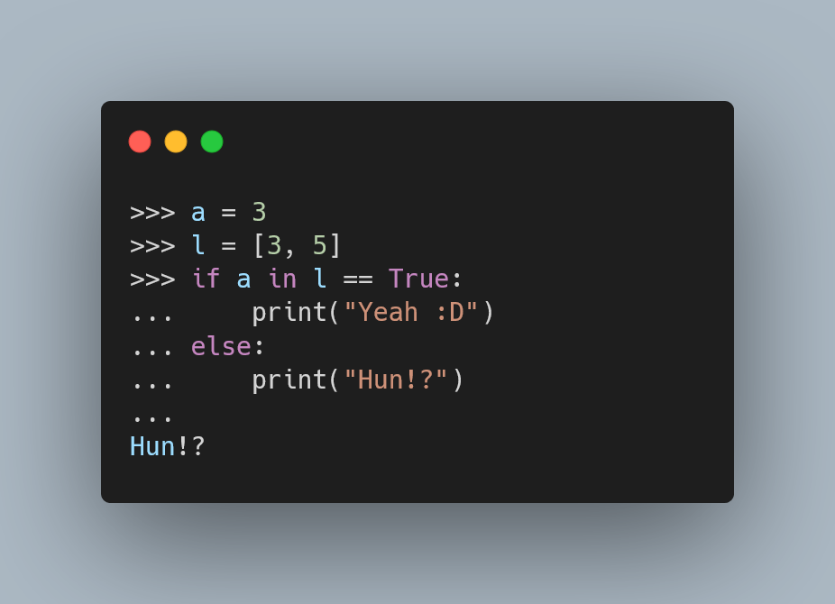

Python's comparisons operators can be chained to shorten
common comparison expressions.
Learn the ins and outs of comparison operator chaining
and especially the cases you should *avoid*,
namely those where you chain comparison operators that aren't aligned.

===



(If you are new here and have no idea what a Pydon't is, you may want to read the
[Pydon't Manifesto][manifesto].)


# Introduction

In this Pydon't we will go over the chaining of comparison operators:
 - how they work;
 - useful usages; and
 - weird cases to avoid.


# Chaining of comparison operators

One of the things I enjoy about Python is that some of its features make so much sense
that you don't even notice that you are using a feature until someone points out
that such code wouldn't work in other languages.
One such example is comparison chaining!
Look at this snippet of code and tell me if it doesn't look natural:

```py
>>> a = 1
>>> b = 2
>>> c = 3
>>> if a < b < c:
...     print("Increasing seq.")
... 
Increasing seq.
```

When Python sees two comparison operators in a row, like in `a < b < c`,
it behaves as if you had written something like `a < b and b < c`,
except that `b` only gets evaluated once (which is relevant if `b` is an
expression like a function call).

In my opinion, this features makes *a lot* of sense and does not look surprising.
Instead, now I feel kind of sad that most languages do not have support for this
behaviour.

Another example usage is for when you want to make sure that three
values are all the same:

```py
>>> a = b = 1
>>> c = 2
>>> if a == b == c:
...     print("all same")
... else:
...     print("some are diff")
... 
some are diff
>>> c = 1
>>> if a == b == c:
...     print("all same")
... else:
...     print("some are diff")
... 
all same
```

!!! Did you know that you can actually chain an arbitrary number of comparison operators?
!!! For example, `a == b == c == d == e` checks if all five variables are the same, while
!!! `a < b < c < d < e` checks if you have a strictly increasing sequence.


# Pit-falls

Even though this feature looks very sensible, there are a couple of pit-falls you have to
look out for.


## Non-transitive operators

We saw above that we can use `a == b == c` to check if `a`, `b` and `c` are all the same.
How would you check if they are all different?

If you thought about `a != b != c`, then you just fell into the first pit-fall!

Look at this code:

```py
>>> a = c = 1
>>> b = 2
>>> if a != b != c:
...     print("a, b, and c all different:", a, b, c)
a, b, and c all different: 1 2 1
```

The problem here is that `a != b != c` is `a != b and b != c`,
which checks that `b` is different from `a` and from `c`, but says nothing about
how `a` and `c` relate.

From the mathematical point of view, `!=` isn't transitive, i.e.,
knowing how `a` relates to `b` and knowing how `b` relates to `c` *doesn't*
tell you how `a` relates to `c`.
As for a transitive example, you can take `==`: if `a == b` and `b == c` then
it is also true that `a == c`.


## Non-constant expressions or side-effects

Recall that in a chaining of comparisons, like `a < b < c`, the expression `b` in the middle is only
evaluated _once_, whereas if you were to write the expanded expression, `a < b and b < c`,
then `b` would get evaluated twice.

If `b` contains an expression with side-effects or if it is something that isn't constant,
then the two expressions are not equivalent and you should think about what you are doing.

This snippet shows the difference in number of evaluations of the expression in the middle:

```py
>>> def f():
...     print("hey")
...     return 3
... 
>>> if 1 < f() < 5:
...     print("done")
... 
hey
done
>>> if 1 < f() and f() < 5:
...     print("done")
... 
hey
hey
done
```

This snippet shows that an expression like `1 < f() < 0` can actually evaluate to `True`
when it is unfolded:

```py
>>> l = [-2, 2]
>>> def f():
...     global l
...     l = l[::-1]
...     return l[0]
>>> if 1 < f() and f() < 0:
...     print("ehh")
...
ehh
```

Of course that `1 < f() < 0` should never be `True`, so this just shows that
the chained comparison and the unfolded one aren't always equivalent.

# Ugly chains

This feature looks really natural, but some particular cases aren't so great.
This is a fairly subjective matter, but I personally don't love chains where
the operators aren't "aligned", so chains like

 - `a == b == c`
 - `a < b <= c`
 - `a <= b < c`

look really good, but in my opinion chains like

 - `a < b > c`
 - `a <= b > c`
 - `a < b >= c`

don't look that good.
One can argue, for example, that `a < b > c` reads nicely as
“check if `b` is larger than both `a` and `c`”, but you could also write
`max(a, c) < b` or `b > max(a, c)`.

Now there's some other chains that are just confusing:

 - `a < b is True`
 - `a == b in l`
 - `a in l is True`

In Python, `is`, `is not`, `in`, and `not in` are comparison operators, so you can
also chain them with the other operators.
This creates weird situations like

```py
>>> a = 3
>>> l = [3, 5]
>>> if a in l == True:
...     print("Yeah :D")
... else:
...     print("Hun!?")
... 
Hun!?
```

What is happening above is that `a in l == True` evaluates to the same value
as `a in l and l == True`.
`a in l` is `True`, but `l == True` is `False`, so
`a in l == True` is `True and False` which is `False`.
The one who wrote `a in l == True`
probably meant `(a in l) == True`, but that is also the same as `a in l`.


# Examples in code

## Inequality chain

Having a simple utility function that ensures that a given value is between two bounds
becomes really simple, e.g.

```py
def ensure_within(value, bounds):
    return bounds[0] <= value <= bounds[1]
```

or if you want to be a little bit more explicit, while
[also ensuring `bounds` is a vector with *exactly* two items][pydont-debug-deep-unpacking],
you can also write

```py
def ensure_within(value, bounds):
    m, M = bounds
    return m <= value <= M
```

## Equality chain

Straight from Python's [`enum`][enum] module, we can find a helper function
(that is not exposed to the user), that reads as follows:

```py
def _is_dunder(name):
    """Returns True if a __dunder__ name, False otherwise."""
    return (len(name) > 4 and
            name[:2] == name[-2:] == '__' and
            name[2] != '_' and
            name[-3] != '_')
```

This function checks if a string is from a dunder method or not,
the first thing it does is checking if the beginning and the ending
of the string are the same and equal to `"__"`:

```py
>>> _is_dunder("__str__")
True
>>> _is_dunder("__bool__")
True
>>> _is_dunder("_dnd__") 
False
>>> _is_dunder("_______underscores__")
False
```

! You have seen the `__str__` and `__repr__` dunder methods
! in the [“str and repr” Pydon't][pydont-str-repr] and the `__bool__`
! dunder method in the [“Truthy, falsy, and bool” Pydon't][pydont-truthy-falsy-bool].
! I will be writing about dunder methods in general in a later Pydon't,
! so feel free to [subscribe] to stay tuned.

# Conclusion

Here's the main takeaway of this article, for you, on a silver platter:

 > “Chaining comparison operators feels so natural, you don't even notice it is a feature.
 > However, some chains might throw you off if you overlook them.”

This Pydon't showed you that:

 - you can chain comparisons, and do so arbitrarily many times;
 - chains with expressions that have side-effects or with non-deterministic outputs are not equivalent to
the extended version; and
 - some chains using `is` or `in` can look really misleading.

If you liked this Pydon't be sure to leave a reaction below and share this with your friends and fellow Pythonistas.

Also, [don't forget to subscribe to the newsletter][subscribe] so you don't miss
a single Pydon't!

# References

 - Python 3 Documentation, The Python Language Reference
[https://docs.python.org/3/reference/expressions.html#comparisons](https://docs.python.org/3/reference/expressions.html#comparisons);
 - Python 3 Documentation, The Python Standard Library, `enum`, [https://docs.python.org/3/library/enum.html][enum];
 - Reddit, comment on "If they did make a python 4, what changes from python 3 would you like to see?",
[https://www.reddit.com/r/Python/comments/ltaf3y/if_they_did_make_a_python_4_what_changes_from/gowuau5?utm_source=share&utm_medium=web2x&context=3](https://www.reddit.com/r/Python/comments/ltaf3y/if_they_did_make_a_python_4_what_changes_from/gowuau5?utm_source=share&utm_medium=web2x&context=3).

Online references last consulted on the 1st of March of 2021.

[subscribe]: https://mathspp.com/subscribe
[manifesto]: /blog/pydonts/pydont-manifesto
[pydont-debug-deep-unpacking]: /blog/pydonts/deep-unpacking#catching-bugs
[enum]: https://docs.python.org/3/library/enum.html
[pydont-truthy-falsy-bool]: /blog/pydonts/truthy-falsy-and-bool
[pydont-str-repr]: /blog/pydonts/str-and-repr
