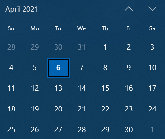

---
metadata:
    description: "If you need to access the items of an iterable but also keep track of their indices, have you considered using enumerate?"
title: "Enumerate me | Pydon't"
---

If you need to access the items of an iterable but also keep
track of their indices, have you considered using `enumerate`?
Let's talk about another of Python's amazing tools to work
with `for` loops.

===


(If you are new here and have no idea what a Pydon't is, you may want to read the
[Pydon't Manifesto][manifesto].)


# Introduction

Following up on last week's [Pydon't about `zip`][pydont-zip],
today we are talking about `enumerate`.

One of the things I appreciate most about Python, when compared to other programming
languages, is its `for` loops.
Python allows you to write very expressive loops,
and some of that expressiveness comes from the built-in `enumerate` function.

In this article you will
 - see what `enumerate` does;
 - take a look at its underrated optional `start` argument;
 - learn a couple of neat use cases for `enumerate`;
 - see some nice examples of code using `enumerate`.


# How `enumerate` works

Python newcomers are usually exposed to this type of `for` loop very early on:

```py
>>> for i in range(3):
...     print(i)
... 
0
1
2
```

This leads them to “learning” this anti-pattern of `for` loops to go over, say, a list:

```py
>>> words = ["Hey", "there"]
>>> for i in range(len(words)):
...     print(f"'<{words[i]}> has {len(words[i])} letters.'")
...
'<Hey> has 3 letters.'
'<there> has 5 letters.'
```

The Pythonic way of writing such a loop is by iterating directly over the list:

```py
>>> words = ["Hey", "there"]
>>> for word in words:
...     print(f"'<{word}> has {len(word)} letters.'")
...
'<Hey> has 3 letters.'
'<there> has 5 letters.'
```

However, the final step in this indices vs. elements stand-off comes when you need
to know the index of each element but also access the element at the same time.
The naïve approach would be to loop over the range of the length
and then index to get the element:

```py
for i in range(len(words)):
    word = words[i]
    # ...
```

_or_, if you read [my Pydon't on `zip`][pydont-zip] and are feeling imaginative,
you could also do

```py
for i, word in zip(range(len(words)), words):
    # ...
```

but the Pythonic way of doing so is by using the built-in `enumerate`:

```py
>>> words = ["Hey", "there"]
>>> for i, word in enumerate(words):
...     print(f"'Word #{i}: <{word}> has {len(word)} letters.'")
...
'Word #0: <Hey> has 3 letters.'
'Word #1: <there> has 5 letters.'
```


# Optional `start` argument

The `enumerate` function can also accept an optional argument that specifies
the first index it returns.
For example, if we are counting words (like in the example above),
we might want to start counting from `1`:

```py
>>> words = ["Hey", "there"]
>>> for i, word in enumerate(words, 1):
...     print(f"'Word #{i}: <{word}> has {len(word)} letters.'")
...
'Word #1: <Hey> has 3 letters.'
'Word #2: <there> has 5 letters.'
```

This optional argument can come in really handy as it saves you from having
to manually offset the index.

By the way, the argument has to be an integer but can be negative:

```py
>>> for i, v in enumerate("abc", start=-3243):
...   print(i)
...
-3243
-3242
-3241
```

Can you come up with a _sensible_ situation where it would make sense
to use `enumerate` with a negative integer as the optional argument?
Comment down below if you come up with something nice!


# Unpacking when iterating

The `enumerate` function produces a lazy generator, which means the
items you iterate over only become available as you need them.
This prevents Python from spending *a lot* of memory if you use
`enumerate` on a large argument, e.g. a really long list.

! This laziness of `enumerate` is something common in Python,
! for example `range` and `zip` are also lazy.
! Be sure to [subscribe] to the newsletter so you don't miss the Pydon'ts where
! I cover these concepts.

The items that `enumerate` returns are 2-item tuples,
where the first element is the index and the second element is the value:

```py
>>> for tup in enumerate("abc"):
...     print(tup)
... 
(0, 'a')
(1, 'b')
(2, 'c')
```

What we usually do is unpack that tuple right in the loop statement,
with something like

```py
for i, letter in enumerate("abc"):
    # use i and letter for whatever
```

which is roughly equivalent to

```py
for tup in enumerate("abc"):
    i, letter = tup
    # use i and letter for whatever
```


## Deep unpacking

Things can get even more interesting when you use `enumerate`,
for example, on a `zip`:

```py
>>> chapter_pages = [5, 17, 31, 50]     # book ends at page 50
>>> for i, (start, end) in enumerate(zip(chapter_pages, chapter_pages[1:]), start=1):
...     print(f"'{i}: {end-start} pages long.'")
...
'1: 12 pages long.'
'2: 14 pages long.'
'3: 19 pages long.'
```

(Here I explicitly named the `start=` argument in the `enumerate`
so that it was visually easier to separate it from the argument to `zip`.)

This code snippet takes a list of pages where chapters of a book start
and prints the length of each chapter.
Notice how `enumerate` returns tuples with indices and values,
but those values are extracted from a `zip`, which itself returns tuples:

```py
>>> chapter_pages = [5, 17, 31, 50]     # book ends at page 50
>>> for tup in enumerate(zip(chapter_pages, chapter_pages[1:]), start=1):
...     print(tup)
...
(1, (5, 17))
(2, (17, 31))
(3, (31, 50))
```

What we do is use deep unpacking to access all these values directly:

```py
>>> chapter_pages = [5, 17, 31, 50]     # book ends at page 50
>>> for tup in enumerate(zip(chapter_pages, chapter_pages[1:]), start=1):
...     i, (start, end) = tup
...     print(f"'{i}: {end-start} pages long.'")
...
'1: 12 pages long.'
'2: 14 pages long.'
'3: 19 pages long.'
```

! If you don't know what deep unpacking is or how it works,
! go ahead and take a look at my [Pydon't about unpacking][pydont-unpacking].


# Examples in code

Now you will see some usages of `enumerate` in _real_ Python code.


## Vanilla `enumerate`

I took a look at the Python Standard Library and by and large the
most common usage of `enumerate` is just a vanilla `enumerate(iter)`
to access iterable values and indices at the same time.
Let me share a textbook example with you:

The [`doctest` module][doctest] allows you to write simple tests for your code
inside the docstrings for your functions, classes, etc.
The way you write these tests is in the form of an interactive
session in the REPL.
`doctest` then locates those “interactive sessions” in your docstrings
and plays them to see if the actual output of the code matches
what your docstring showed.

If you open your Python REPL, you will see that it starts with the
prompt `>>> ` which has a blank space after the triple `>`.
You _cannot_ delete that blank space, it is part of the prompt.
When parsing a docstring to extract the actual tests,
the parser performs a check to see if the prompts have that
leading blank space or not, and here is the code that does it:

```py
# from Lib\doctest.py in Python 3.9
class DocTestParser:
    # ...

    def _check_prompt_blank(self, lines, indent, name, lineno):
        """
        Given the lines of a source string (including prompts and
        leading indentation), check to make sure that every prompt is
        followed by a space character.  If any line is not followed by
        a space character, then raise ValueError.
        """
        for i, line in enumerate(lines):
            if len(line) >= indent+4 and line[indent+3] != ' ':
                raise ValueError('line %r of the docstring for %s '
                                 'lacks blank after %s: %r' %
                                 (lineno+i+1, name,
                                  line[indent:indent+3], line))
```

Notice how the top `for` loop uses `enumerate` to traverse the lines
of the interactive examples.
If, inside the loop, we encounter a line that does not have
the extra blank space after `>>>` then we raise a `ValueError`
where we use `i` to compute the actual line number where the error occurred,
which is the `lineno+i+1` bit in the second to last line.

Want to see this in action?
Try running this short script:

```py
def sum_nats(n):
    """Sums the first n natural numbers.

    >>> sum_nats(1)
    1
    >>> sum_nats(10)
    55
    >>>sum_nats(100)
    5050
    """

    return int(n*(n+1)/2)

if __name__ == "__main__":
    import doctest
    doctest.testmod()
```

Notice how I intentionally wrote the third example without a space
between `>>>` and `sum_nats(100)`.
Running this script should throw a `ValueError` at your face,
that should go away when you put a blank space there.


## Using the optional argument

### Line numbers in docstring tests

If you were paying attention,
maybe you noticed that the `enumerate` usage of the previous example
called for the optional argument of `enumerate`!

Take a look at the code again:

```py
# from Lib\doctest.py in Python 3.9
class DocTestParser:
    # ...

    def _check_prompt_blank(self, lines, indent, name, lineno):
        # docstring elided.
        for i, line in enumerate(lines):
            if len(line) >= indent+4 and line[indent+3] != ' ':
                raise ValueError('line %r of the docstring for %s '
                                 'lacks blank after %s: %r' %
                                 (lineno+i+1, name,
                                  line[indent:indent+3], line))
```

Notice that in the string formatting at the end we compute `lineno+i+1`
to raise the error message with the correct line number for the prompt
that was faulty...
But this is the same as rewriting the loop to use the `start=` argument:

```py
class DocTestParser:
    # ...
    def _check_prompt_blank(self, lines, indent, name, lineno):
        # docstring elided.
        for line_n, line in enumerate(lines, start=lineno+1):
            if len(line) >= indent+4 and line[indent+3] != ' ':
                raise ValueError('line %r of the docstring for %s '
                                 'lacks blank after %s: %r' %
                                 (line_n, name,
                                  line[indent:indent+3], line))
```


### Counting days of the week

Definitely not as frequent as the plain `enumerate(iter)` usage,
but there were also quite some places that made use of the optional
argument to avoid computing unnecessary offsets.

An interesting use I found was in the [`calendar` module][calendar],
in the function `calendar.Calendar.itermonthdays2`.
The function `calendar.Calendar.itermonthdays2` does the following:
 - you give it an year and a month, e.g. `2021` and `4` (for April); and
 - it returns a generator with the days of the month paired with the days
of the week (`0` to `6`).
(There's the little caveat that the iterator returns sequences of whole weeks,
so it may pad the results in the beginning and/or end.)

Here is an example:

```py
>>> for arg in c.Calendar().itermonthdays2(2021, 4):
...   print(arg)
...
(0, 0)
(0, 1)
(0, 2)
(1, 3)
(2, 4)
(3, 5)
(4, 6)
(5, 0)
(6, 1)
(7, 2)
# ... cut for brevity
(28, 2)
(29, 3)
(30, 4)
(0, 5)
(0, 6)
```

The numbers on the left show the day of the month and the days on the
right encode the day of the week, where `0` is Monday, up to `6` which is Sunday.
The 6th of April of 2021 (the day I wrote this article on) was a Tuesday,
which is encoded by the `(6, 1)` in the output above.

Here is the code that implements `itermonthdays2`:

```py
# from Lib\calendar.py in Python 3.9
class Calendar(object):
    # ...

    def itermonthdays2(self, year, month):
        """
        Like itermonthdates(), but will yield (day number, weekday number)
        tuples. For days outside the specified month the day number is 0.
        """
        for i, d in enumerate(self.itermonthdays(year, month), self.firstweekday):
            yield d, i % 7
```

This function relies heavily on `itermonthdays(year, month)`
that just returns a sequence of month days with some leading and/or
trailing zeroes, so that the sequence represents the whole weeks
in which that month fell.

For example, look at my desktop calendar for the month of April of 2021:



If I tell the `Calendar` class to start counting weeks on Sundays (day `6`),
like my desktop calendar does, here is what `itermonthdays` produces:

```py
>>> for d in c.Calendar(6).itermonthdays(2021, 4):
...   print(d)
...
0
0
0
0
1
2
3
4
# ... cut for brevity
30
0
```

The first four `0` are the four March days that show up in the top week
and the final `0` corresponds to the 1st of May that is shown in the
bottom right corner of my calendar.

In order to return these days together with the respective day of the week,
`enumerate` is being fed a `start=` argument,
which is `self.firstweekday`, to sync up the days of the month to what
the `Calendar` sees as the first day of the week.


## Filtering the indices

A really neat usage of `enumerate` I found while probing the Python Standard Library
was to filter a list in search for the indices of the elements that satisfy a certain
predicate.

For example, say you have a list of integers and you have a function
that tells you if a number is odd or not:

```py
>>> nums = [4071, 53901, 96045, 84886, 5228, 20108, 42468, 89385, 22040, 18800, 4071]
>>> odd = lambda x: x%2
```

What code do you write to figure out the _indices_ of the numbers that are odd?
Notice that solutions making use of `nums.index` in general won't work because
the list may contain duplicates (cf. `nums[0]` and `nums[-1]` above).

In a helper file in the library with, and I quote, “Shared OS X support functions.”,
I found a really elegant solution:

```py
>>> [i for i, n in enumerate(nums) if odd(n)]
[0, 1, 2, 7, 10]
```

Of course the file I am talking about (`Lib\_osx_support.py`) didn't have this
code, but it did have the pattern I just showed.
The actual code there is the following:

```py
# from Lib\_osx_support.py in Python 3.9
def compiler_fixup(compiler_so, cc_args):
    # ...
    indices = [i for i,x in enumerate(compiler_so) if x.startswith('-isysroot')]
    # ...
```

While I have _no_ clue what the code is doing from the semantic point of view,
we can clearly see that `indices` is collecting the indices of the
elements in `compiler_so` that start with `"-isysroot"`.


## Making the most out of the tuples

Another interesting usage of the `enumerate` function I found was to create
dictionaries directly.
For example, if we take a look at the [`mailbox` module][mailbox] we can find
a line of code that is building a table of contents as a dictionary,
where the keys are the integers given by `enumerate` and the values
are tuples built by `zip`:

```py
# from Lib\mailbox.py in Python 3.9
class mbox(_mboxMMDF):
    # ...
    def _generate_toc(self):
        """Generate key-to-(start, stop) table of contents."""
        starts, stops = [], []
        last_was_empty = False
        self._file.seek(0)
        while True:
            # process self._file
        self._toc = dict(enumerate(zip(starts, stops)))
        # ...
```

Notice how the code initialises empty lists `starts` and `stops`,
which are then populated inside the `while` loop I deleted because
it was fairly long and would distract us from the main point:
the line

```py
self._toc = dict(enumerate(zip(starts, stops)))
```

Because `enumerate` returns 2-item tuples, `dict` can take that
and build a dictionary.
Curiously enough, we actually want `starts` and `stops` to be
paired up together, so we end up with calling `enumerate` on a `zip`,
so this is what the result could look like:

```py
>>> starts = [1, 10, 21, 30]
>>> stops = [9, 15, 28, 52]
>>> dict(enumerate(zip(starts, stops)))
{0: (1, 9), 1: (10, 15), 2: (21, 28), 3: (30, 52)}
```


# Conclusion

Here's the main takeaway of this article, for you, on a silver platter:

 > “*`enumerate` is your best friend if you need to traverse an iterator
to deal with its data and also need access to information about its index.*”

This Pydon't showed you that:

 - `enumerate` gives you access to an iterable's elements _and_ indices at the same time;
 - `enumerate` by itself returns a _lazy_ `enumerate` object that must be then iterated or
converted explicitly to a `list` (or something else that suits your needs) if you want its values;
 - `enumerate` takes a second argument to set an offset for the indexing;
   - and, in particular, that argument can be a negative integer;
 - the result of `enumerate` can be fed directly to `dict` to create a dictionary whose
keys are the indices;
 - using `enumerate` we get a nice idiom to find the indices of an iterable
that point to the elements that satisfy a given condition; and
 - coupling `zip`, `enumerate`, and deep unpacking allows you to loop over several
iterables elegantly.

If you liked this Pydon't be sure to leave a reaction below and share this with your friends and fellow Pythonistas.
Also, [don't forget to subscribe to the newsletter][subscribe] so you don't miss
a single Pydon't!


[subscribe]: https://mathspp.com/subscribe
[manifesto]: /blog/pydonts/pydont-manifesto
[pydont-unpacking]: https://mathspp.com/blog/pydonts/deep-unpacking
[pydont-zip]: /blog/pydonts/zip-up
[doctest]: https://docs.python.org/3/library/doctest.html
[calendar]: https://docs.python.org/3/library/calendar.html
[mailbox]: https://docs.python.org/3/library/mailbox.html
