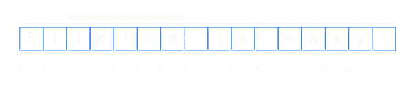
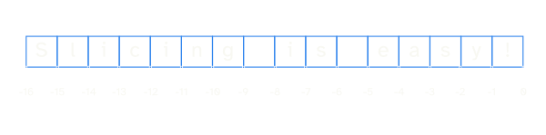

---
metadata:
    description: "This article covers the basics of sequence slicing in Python and teaches you some idiomatic slicing patterns to write more elegant code."
title: "Idiomatic sequence slicing | Pydon't"
---

This article covers the basics of sequence slicing in Python
and teaches you some idiomatic slicing patterns to write
more elegant code.

===


(If you are new here and have no idea what a Pydon't is, you may want to read the
[Pydon't Manifesto][manifesto].)


# Introduction

Last time we went over [sequence indexing][pydont-sequence-indexing] in Python
to cover the basics for our next topic of discussion: sequence slicing.
Slicing is a “more advanced” way of accessing portions of sequences (like lists and tuples).
I say it is more advanced just because indexing is the simplest form of accessing sequence items;
as you will see, indexing isn't that complicated either.

As it turns out, much can be said about sequence slicing, so I will split
all of the contents into two Pydon'ts, this and the next one.

In this Pydon't you will:

 - learn the slicing syntax;
 - learn how slicing works with 1 and 2 parameters;
 - relate slices to the `range` built-in;
 - master slicing with negative indices;
 - learn to write Pythonic and idiomatic slices; and
 - a couple of common use cases where slicing is _not_ the way to go.

In the next Pydon't we will continue on this train of thought
and cover the more advanced material related to slicing.
In particular, you will

 - learn about the step parameter in slicing;
 - learn about slice assignment;
 - see how slicing can be used to copy sequences;
 - learn some more idiomatic slicing patterns;
 - uncover the two layers of syntactic sugar surrounding list slicing; and
 - learn how to implement slicing for your custom objects.

Throughout both Pydon'ts we will try to keep an eye out for how slices
are actually used in real-world Python code,
namely in the Python Standard Library.

If you don't want to miss the next Pydon't on the more advanced slicing topics,
you can either [subscribe] to the
Pydon'ts newsletter or grab your copy of the [Pydon'ts book][pydonts-book]
right now.

!!! Turns out there was _so much_ to write about sequence slicing that
!!! I had to further divide the next Pydon't in two.


# Slicing syntax

Slicing in Python is the act of accessing a sequence of elements that are
extracted from successive positions of a larger sequence.
Just think of an actual knife cutting through the sequence you are working with
(which could be a string, list, tuple, etc) and extracting a smaller piece of your sequence.

For example, if we were working with the string `"Slicing is easy!"`,
which I present below.


Together with the characters of the string,
we have the little numbers indicating the index of each character.
Each little number gives the index for the box right in front of it.
This is the representation I go to in my head whenever I have to reason
about indices in Python, especially when I am working with negative indices.
(Just take a quick look at [this Pydon't][pydont-sequence-indexing]
if you need to jog your memory on how indexing is done in Python.)

Now, we could be interested in extracting the portion `"icing"` from the string:



How would we do that in Python?
If you didn't know how slicing worked,
you could come up with a solution involving a `for` loop and a `range`:

```py
>>> s = "Slicing is easy!"
>>> subs = ""
>>> for i in range(2, 7):
...     subs += s[i]
...
>>> subs
'icing'
```

This is all good, but there is a much shorter syntax for this type
of operation, the slicing syntax.

When you want to slice a sequence, you need to use brackets `[]` and
a colon `:` to separate the start and end points.
The key here is in figuring out what the start and end points are,
but that is just a matter of looking at the figure above _or_
at the solution with the `range(2, 7)`:

```py
>>> s = "Slicing is easy!"
>>> s[2:7]
'icing'
```

This is the very first important point to make about slicing:
the start and end points give you the bars that enclose what you will extract,
which, in other words, means that the start point (`2`, in the previous example)
is the index of the first element that _is included_ in the slice,
whereas the end point is the index of the first element that
_is **not** included_ in the slice:

```py
>>> s = "Slicing is easy!"
>>> s[2:7]
'icing'
>>> s[7]
' '
```

Now is a good time to fire up your Python interpreter,
define `s` as the string `"Slicing is easy!"`,
and work out a couple of slices for yourself.


# What to slice?

Just in case it wasn't clear earlier, here are just some of the things
that you can slice in Python:

```py
>>> "Hello"[1:3]                    # strings
'el'
>>> [True, False, 1, "hey"][1:3]    # lists
[False, 1]
>>> (True, False, 1, "hey")[1:3]    # tuples
(False, 1)
>>> range(10)[1:3]                  # ranges
range(1, 3)
>>> # etc...
```

However, we will be using string examples for most of the Pydon't,
just for the sake of consistency.


# Slicing from the beginning

Now assume that we wanted to extract `"Slicing"` from our string.


If we go back to our naïve `range` solution,
most of us would write the following:

```py
>>> s = "Slicing is easy!"
>>> subs = ""
>>> for i in range(7):
...     subs += s[i]
...
>>> subs
'Slicing'
```

Notice that, unlike when we used `range(2, 7)` for `"icing"`,
now our `range` only has one argument, the end point.
That is because `range` interprets the missing starting index as `0`.

When we are slicing, we can do a similar thing!
If we want to extract a portion from the beginning of a sequence,
the Pythonic way of writing that slice is _without_ specifying
the explicit `0` as a start point.
Therefore, both alternatives below work, but the second one is the preferred.

```py
>>> s = "Slicing is easy!"
>>> s[0:7]      # Works ...
'Slicing'
>>> s[:7]       # ... but this is preferred!
'Slicing'
```

In terms of the figures I have been sharing, think of it like this:
it's like you never tell Python where the slicing starts,
so the bar that is hovering the string ends up covering
the whole beginning of the string, stopping at the position you indicate.


# Slicing until the end

Similarly to omitting the start point,
you can omit the end point of your slice.
To predict what will happen if we do so,
we just have to look at the figure above and create a new one
with the bar pointing in the other direction:


Therefore, if we don't indicate the end point for the slice,
we extract all elements from the point specified, onwards.
Naturally, we can specify the end point of the slice to be the
length of the sequence, but that adds too much visual noise:

```py
>>> s = "Slicing is easy!"
>>> s[7:len(s)]     # Works...
' is easy!'
>>> s[7:]           # ... but this is preferred!
' is easy!'
```


# Slicing with negative indices

If you've read my previous Pydon't,
you will have seen how indexing works with negative indices.
Slicing can also use them, and the logic remains the same:
we just draw the bar that selects the elements that are
between the relevant indices.

To illustrate this, here is the representation of the negative
indices of the string we have been using so far:



Now, regardless of the fact that the numbers are negative,
if you had to tell me where to draw two vertical bars in order
to enclose the substring `"icing"`, what positions would you point to?
You would probably tell me
“Draw the bars on positions `-14` and `-9`”,
and that would be absolutely correct!


In fact, using `-14` and `-9` would work in my naïve `range`
solution but also – and most importantly – with the slice syntax:

```py
>>> s = "Slicing is easy!"
>>> subs = ""
>>> for i in range(-14, -9):
...     subs += s[i]
...
>>> subs
'icing'
>>> s[-14:-9]       # Also works and is preferred!
'icing'
```

# Slicing and `range`

At this point you should start to notice a pattern,
and that is that the parameters you insert in your slices
seem to be governing the _indices_ that Python uses to fetch elements
from your sequence, if those indices were generated with the `range`
function.
If you are looking at a slice and you have no clue what items
are going to be picked up by it,
try thinking about the slice in this way, with the `range`.
It might help you.


# Idiomatic slicing patterns

Now that you have taken a look at some basic slicing with positive
and negative indices,
and now that you know you can omit the first or the last parameters
of your slices, you should really learn about _four_ different
slice patterns that are really idiomatic.
Don't worry, I'll show you which _four_ patterns I am talking about.

Suppose you have a variable `n` that is a positive integer
(it may help to think of it as a small integer, like `1` or `2`),
and suppose `s` is some sequence that supports slicing.
Here are the four idiomatic slicing patterns I am talking about:

 - `s[n:]`
 - `s[-n:]`
 - `s[:n]`
 - `s[:-n]`

Why are these “idiomatic” slicing patterns?
These are idiomatic because, with a little practice, you stop
looking at them as “slice `s` starting at _position blah_ and
ending at _position blah blah_”,
and you will start looking at them for their semantic meaning.

Open your Python interpreter, set `s = "Slicing is easy!"` and
`n = 2`, and see what the four slices above return.
Experiment with other values of `n`.
Can you give an interpretation for what each slice means?

Go ahead...

Here is what the slicing patterns mean.


## `s[n:]`

If `n` is not negative (so `0` or more), then
`s[n:]` means “skip the first `n` elements of `s`”:

```py
>>> s = "Slicing is easy!"
>>> s[2:]
'icing is easy!'
>>> s[3:]
'cing is easy!'
>>> s[4:]
'ing is easy!'
```


## `s[-n:]`

If `n` is **positive** (so `1` or more), then
`s[-n:]` means “the last `n` elements of `s`”:

```py
>>> s = "Slicing is easy!"
>>> s[-2:]
'y!'
>>> s[-3:]
'sy!'
>>> s[-4:]
'asy!'
```

! Be careful with `n = 0`, because `-0 == 0` and
! that means we are actually using the _previous_ slicing
! pattern, which means “skip the first `n` characters”,
! which means we skip nothing and return the whole sequence:
!
! ```py
! >>> s = "Slicing is easy!"
! >>> s[-0:]
! 'Slicing is easy!''
! ```


## `s[:n]`

If `n` is not negative (so `0` or more), then
`s[:n]` can be read as “the first `n` elements of `s`”:

```py
>>> s = "Slicing is easy!"
>>> s[:2]
'Sl'
>>> s[:3]
'Sli'
>>> s[:4]
'Slic'
```


## `s[:-n]`

Finally, if `n` is positive (so `1` or more), then
`s[:-n]` means “drop the last `n` elements of `s`”:

```py
>>> s = "Slicing is easy!"
>>> s[:-2]
'Slicing is eas'
>>> s[:-3]
'Slicing is ea'
>>> s[:-4]
'Slicing is e'
```

! Like with the `s[-n:]` pattern, we need to be careful with
! `n = 0`, as the idiom `s[:-n]` doesn't really apply,
! and we should be looking at the previous idiom.


## Summary

Here is a short summary with the four slicing patterns next to each other:

```py
# Four idiomatic uses of sequence slicing in Python.
>>> s = "Slicing is easy!"
>>> s[4:]           # Drop the first 4 characters.
'ing is easy!'
>>> s[-4:]          # Take the last 4 characters.
'asy!'
>>> s[:4]           # Take the first 4 characters.
'Slic'
>>> s[:-4]          # Drop the last 4 characters.
'Slicing is e'
```


# Empty slices

Something worthy of note that may confuse some but not others,
is the fact that if you get your start and end points mixed up,
you will end up with empty slices,
because your start point is to the right of the end point...
And because of negative indices, it is _not_ enough to check
if the start point is less than the end point.

Take a look at the figure below:


Now try to work out why all of these slices are empty:

```py
>>> s = "Slicing is easy!"
>>> s[10:5]
''
>>> s[-6:-10]
''
>>> s[-9:3]
''
>>> s[10:-10]
''
```

All it takes is looking at the figure above, and realising
that the end point is relative to an index that is _to the left_
of the start point.


# More empty slices

Another really interesting thing about slicing is that if you
use numbers that are _too high_ or _too low_, slicing still works
and doesn't raise `IndexError` or something like that.
In a way, this makes sense, and goes in line with the interpretation
of the idioms we presented above.

If `s[50:]` is “skip the first `50` elements of `s`”,
and if `s` only has `16` elements, how many will there be left?
Zero, naturally, so it is no surprise that `s[50:]` returns
an empty string when `s = "Slicing is easy!"`:

```py
>>> s = "Slicing is easy!"
>>> s[50:]
''
```

This segues nicely into the first common usage pattern of slices.


# Examples in code

## Ensuring at most `n` elements

Imagine someone is writing a spellchecker, and they have a function
that takes a misspelled word and returns the top 5 closest
suggestions for what the user meant to type.

Here is what that function could look like:

```py
def compute_top_suggestions(misspelled, k, corpus):
    similar = find_similar(misspelled, corpus)
    ordered = rank_suggestions_by_similarity(misspelled, similar)
    top_k = []
    for i in range(min(k, len(ordered))):
        top_k.append(ordered[i])
    return top_k
```

The final loop there is to make sure you return _at most `k` results_.
However, the person who wrote this piece of code did not read
this Pydon't!
Because if they had, they would know that you can use slicing
to extract _at most `k` elements_ from `ordered`:

```py
def compute_top_suggestions(misspelled, k, corpus):
    similar = find_similar(misspelled, corpus)
    ordered = rank_suggestions_by_similarity(misspelled, similar)
    return ordered[:k]
    # ^ Idiom! Read as “return at most `k` from beginning”
```

A very similar usage pattern arises when you want to
return at most `k` from the end, but you already knew that
because you read about the four slicing idioms I shared earlier.

This usage pattern of slicing can show up in many ways,
as this is just us employing slicing because of the semantic
meaning this particular idiom has.
Above, we have seen four different idioms, so just keep those
in mind with working with sequences!


## Start of a string

Slicing is great, I hope I already convinced you of that,
but slicing is not the answer to all of your problems!

A common use case for slices is to check if a given
sequence starts with a predefined set of values.
For example, we might want to know if a string starts
with the four characters `">>> "`, which are the characters
that mark the REPL Python prompt.
The `doctest` Python module, for example, does a similar
check, so we will be able to compare our solution to `doctest`'s.

You just learned about slicing and you know that `s[:4]` can be
read idiomatically as “the first four characters of `s`”,
so maybe you would write something like

```py
def check_prompt(line):
    if line[:4] == ">>> ":
        return True
    return False
```

or, much more elegantly,

```py
def check_prompt(line):
    return line[:4] == ">>> "
```

_However_, it is important to note that this is not the best
solution possible, because Python strings have an appropriate
method for this type of check: the `startswith` function.

Therefore, the best solution would be

```py
def check_prompt(line):
    return line.startswith(">>> ")
```

This is better because this is a tested and trusted function
that does exactly what you need, so the code expresses
very clearly what you want.
What is more, if you later change the prompt,
you don't need to remember to also change the index used
in the slice.

If we take a look at the actual source code for `doctest`,
what they write is

```py
# Inside _check_prefix from Lib/doctest.py for Python 3.9.2
# ...
if line and not line.startswith(prefix):
    # ...
```

As we can see here, they are using the `startswith` method
to see if `line` starts with the `prefix` given as argument.

!!! Similar to `startswith`, strings also define an `endswith`
!!! method.


## Removing prefixes and suffixes

Similar to the example from above, another
common usage pattern for slices is to remove prefixes or suffixes
from sequences, more notably from strings.
For example, most of the code I present in these Pydon'ts starts
with `">>> "` because of the REPL prompt.
How could I write a short function to strip a line of code
of this prompt?
I am really hyped about slicing, so obviously I'll do something like

```py
>>> def strip_prompt(line):
...     if line.startswith(">>> "):
...         return line[4:]
...     else:
...         return line
...
>>> strip_prompt(">>> 3 + 3")
'3 + 3'
>>> strip_prompt("6")
'6'
```

Or even better, I might do it in a generic way and suppress the `else`:

```py
>>> def strip_prefix(line, prefix):
...     if line.startswith(prefix)
...         return line[len(prefix):]
...     return line
...
>>> prompt = ">>> "
>>> strip_prefix(">>> 3 + 3", prompt)
'3 + 3'
>>> strip_prefix("6", prompt)
'6'
```

_However_, I already have Python 3.9 installed on my machine,
so I _should_ be using the string methods that Python provides
me with:

```py
def strip_prefix(line, prefix):
    return line.removeprefix(prefix)
```

Of course, at this point, defining my own function is redundant
and I would just go with

```py
>>> prompt = ">>> "
>>> ">>> 3 + 3".removeprefix(prompt)
'3 + 3'
>>> "6".removeprefix(prompt)
'6'
```

In case you are interested, Python 3.9 also added a `removesuffix`
method that does the analogous, but at the end of strings.

This just goes to show that it is nice to try and stay more or less
on top of the features that get added to your favourite/most used
programming languages.
Also (!), this also shows that one has to be careful when looking
for code snippets online, e.g. on StackOverflow.
StackOverflow has amazing answers... that get outdated,
so always pay attention to the most voted answers, but also
the most recent ones, those could contain the more modern approaches.

# Conclusion

Here's the main takeaway of this Pydon't, for you, on a silver platter:

 > “*The relationship between slicing and indexing means there
 are four really nice idiomatic usages of slices that are well-worth
 knowing.*”

This Pydon't showed you that:

 - slicing sequences lets you access series of consecutive elements;
 - you can slice strings, lists, tuples, ranges, and more;
 - if the start parameter is omitted, the slice starts from the
 beginning of the sequence;
 - if the end parameter is omitted, the slice ends at the end of
 the sequence;
 - slicing is the same as selecting elements with a `for` loop
 and a `range` with the same parameters;
 - much like with plain indexing, negative integers can be used
 and those count from the end of the sequence;
 - `s[n:]`, `s[-n:]`, `s[:n]`, and `s[:-n]` are four idiomatic
 slicing patterns that have a clear semantic meaning:
   - `s[n:]` is “skip the first `n` elements of `s`”;
   - `s[-n:]` is “the last `n` elements of `s`”;
   - `s[:n]` is “the first `n` elements of `s`”;
   - `s[:-n]` is “skip the last `n` elements of `s`”;
 - slices with parameters that are too large produce empty sequences;
 - if the parameters are in the wrong order, empty sequences are produced; and
 - some operations that seem to ask for slicing might have better
 alternatives, for example using `startswith`, `endswith`,
 `removeprefix`, and `removesuffix` with strings.

If you liked this Pydon't be sure to leave a reaction below and share this with your friends and fellow Pythonistas.
Also, [don't forget to subscribe to the newsletter][subscribe] so you don't miss
a single Pydon't!


[subscribe]: https://mathspp.com/subscribe
[manifesto]: /blog/pydonts/pydont-manifesto
[pydont-sequence-indexing]: /blog/pydonts/sequence-indexing
[pydonts-book]: https://leanpub.com/pydonts
