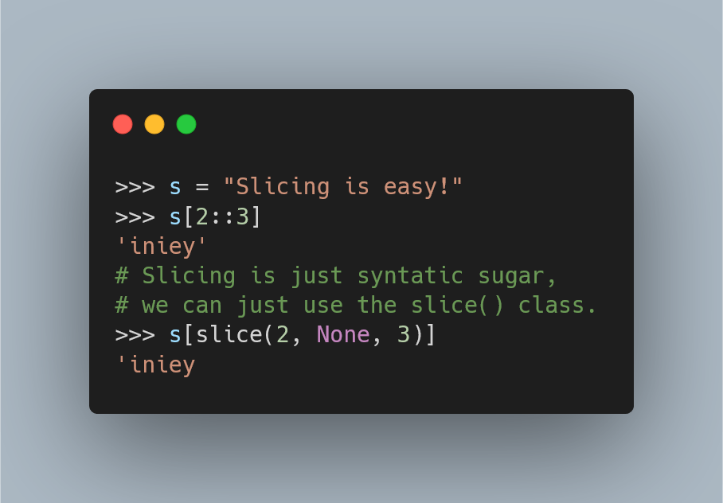

---
metadata:
    description: "Neste Pydon't exploramos o funcionamento interno das “fatias” em Python, desde o tipo `slice` até aos métodos dunder da família do `__getitem__`."
show_call_to_action: false
title: "Funcionamento interno das fatias | Pydon't"
---

Neste Pydon't concluímos a trilogia sobre fatias
em Python e vamos ver como estas funcionam internamente:
vamos falar sobre o tipo `slice` e vamos ainda falar
sobre o método `__getitem__` e os seus dois irmãos.

===

(Se és novo aqui e não sabes o que é uma Pydon't, então talvez queiras começar por
ler a [Proclamação das Pydon'ts][manifesto].)

Infelizmente, para poupar algum tempo, ainda não traduzi este artigo para português...
Hei de o fazer eventualmente...
Se quiseres, deixa um comentário em baixo a pedir que eu traduza o artigo ASAP ou [submete um PR][pr] com a tua tradução.

[pr]: https://github.com/mathspp/mathspp/blob/master/pages/02.blog/04.pydonts/inner-workings-of-sequence-slicing/item.pt.md
[subscribe]: https://mathspp.com/subscribe
[manifesto]: /blog/pydonts/pydont-manifesto
[csv]: https://docs.python.org/3/library/csv.html
[pathlib]: https://docs.python.org/3/library/pathlib.html
