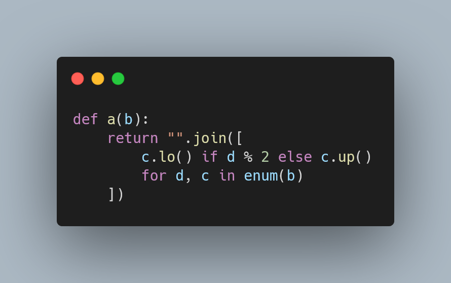

---
metadata:
    description: "In this Pydon't you'll learn the importance of being good at naming and I'll give some tips to help you."
title: "Naming matters | Pydon't"
---

In this Pydon't you'll learn the importance of being good at naming and I'll give some tips to help you.

===



(If you are new here and have no idea what a Pydon't is, you may want to read the
[Pydon't Manifesto][manifesto].)


# Introduction

Names are like real estate in our brains.
They are labels we give to things, concepts, ideas, objects,
so that it is easier for us to refer to those things,
but they take up space.
As it turns out,
we can only hold a very small number of different ideas in our heads,
so these labels are very expensive...

We might as well do the best job we can to manage them as well as possible!

In this Pydon't, you will:

 - learn about some naming conventions;
 - learn the suggested naming conventions for Python code; and
 - understand some do's and don'ts for naming variables, functions, methods, etc, in Python.


<!--v-->
 > You can now get your copy of the ebook “Pydon'ts – Write beautiful Python code” [on Gumroad][gumroad-pydonts]
 > to help support the series of “Pydon't” articles 💪.
<!--^-->


# Naming conventions

When we talk about names, there are two things that need to be discussed.
One of them is the actual name that you give to things,
and the other is the way in which you write the name:
the casing of the letters and how consecutive words are separated.

These are often referred to as naming conventions, and there are a few of them.
I will present them here, so that I can refer to them later in the Pydon't.

The list that follows is _not_ comprehensive,
in that there are more naming conventions out there.
However, they are not relevant for this article.

 - CAPSLOCK – all letters of all words are upper case and there is nothing to separate consecutive words;
 - CAPS_LOCK_WITH_UNDERSCORES – like the one above, but with underscores separating words;
 - lowercase – all letteres of all words are lower case and there is nothing to separate consecutive words;
 - snake_case – like the one above, but with underscores separating words;
 - CamelCase – all words are put together, but their initials are capitalised to help you know where one word ends and the other begins; and
 - pascalCase – like the one above, except the very first word starts with a lower case letter as well.

On top of these naming conventions, sometimes leading
and/or trailing underscores can be added to the mix.
That isn't strictly related to the naming conventions by themselves,
but it is related to the way Python uses names.
In case you need a refresher, I wrote a Pydon't
that teaches you [all the usages of underscore][pydont-underscore] and, in particular,
it tells you what the underscores do for you if in the
beginning and/or end of a name.


# PEP 8 recommendations

[PEP 8][pep8] is a document – a Python Enhancement Proposal –
that contains a style guide for Python, and it is the most widely
accepted and used style guide for Python.
In case you don't know it, it might be worth taking a look at it.

[PEP 8][pep8] starts by acknowledging that
“the naming conventions of Python's library are a bit of a mess”,
so bear in mind that if you start working on some project
that already uses a specific naming convention,
you should stick to it.
Remember that being consistent is more important than
following the PEP 8 guide.


## CamelCase

You can find the CamelCase convention often on classes.
That is the most common use case for this convention.

What this means is that your classes will look like:

```py
class Shape:
    # ...

class Circle(Shape):
    # ...
```

and

```py
class GameArena:
    # ...

class HumanPlayer:
    # ...

class NPC:
    # ...

class AIPlayer:
    # ...
```

Notice that the `NPC` and `AIPlayer` classes
are actually using acronyms:
`NPC` stands for non-playable character and
`AI` stands for artificial intelligence.
PEP 8 recommends that you capitalise all letters of
an acronym in a CamelCase name.
Sometimes this makes it look like we are using the
CAPSLOCK convention.

Other common use cases for the CamelCase convention
include exceptions – which shouldn't surprise you
because exceptions come from classes –,
and type variables.

## snake_case

The snake_case naming convention is the bread and butter
of naming in Python.
Variables, functions, methods, arguments,
they all use the snake_case convention.

So, prefer

```py
def cool_function(cool_argument, optional_info):
    # ...
```

to things like

```py
def coolFunction(coolargument, optionalinfo):
    # ...

def CoolFunction(coolArgument, optionalInfo):
    # ...

def COOL_FUNCTION(cool_argument, optional_info):
    # ...
```

As an additional note, PEP 8 also recommends that you append an underscore
to a name that you want to use, when that name is a keyword.
So, for example, you cannot have a variable called `for`,
but you could call it `for_`.


## CAPS_LOCK_WITH_UNDERSCORES

This naming convention, that might look a bit clunky
to you, is actually used to represent global constants.
Python doesn't have support for variables that are
truly constant – in the sense that trying to change
them would throw an error – and so we use this
widely adopted convention that variables that are used
as global constants are named with the
CAPS_LOCK_WITH_UNDERSCORES convention.

Generally, you will find these “constants”
in the beginning of a file.

For example, I often have a couple of paths defined this way:

```py
IMG_BIN = "images"
LOG_FILE = "logs/app.log"

# ...
```


# Standard names

There are a few cases where certain names are the golden standard
in those situations.

## `self`

A great example of that is the name of the first argument to instance methods.
The first argument of such a method is always `self`.

Therefore, do

```py
class Square:
    def __init__(self, side_length):
        # ...
```

instead of

```py
class Square:
    def __init__(square, side_length):
        # ...

class Square:
    def __init__(a, b):
        # ...

class Square:
    def __init__(bananas, side_length):
        # ...
```

Notice that all three alternatives above (that I claim you should avoid) are actually functional.
Here is an example:

```py
>>> class Square:
...     def __init__(a, b):
...         a.side_length = b
... 
>>> sq = Square(10)
>>> sq.side_length
10
```

However, they look utterly wrong to any (!?) Python programmer worth their salt.
Ok, let's not get fundamental here,
it's just a matter of respecting the one Python convention
that is probably the most widely used.

## `cls`

In a similar setting, `cls` is the widely accepted name for class methods.

! Class methods are _not_ the regular methods you define when you implement a custom class.
! Those are called instance methods.
! Class methods are instance methods decorated with `@classmethod`.

Why is that?
Well, `class` is a keyword so we can't really have that as the parameter name.
And for some reason, people started sticking to `cls` instead of something like `class_`.
So, nowadays, class methods have their first parameter be `cls`.

A great example of a class method is the method `dict.fromkeys`,
which you call to initialise a dictionary in a different way:

```py
>>> dict.fromkeys("abc") 
{'a': None, 'b': None, 'c': None}
```

Class methods are often used to implement different ways of building instances of your classes,
and that's precisely what is happening in the previous example:
we are creating a dictionary (or, in other words, an instance of the class `dict`)
in a different way from what is the usual way.


# Verbosity

Having discussed some of the most widely spread conventions when dealing with names in Python,
I will now share my experience regarding good naming principles.

One thing that is often object of many worries is the length of the name you are picking.
Should you pick a long name that contains much information but is a pain to type?
Should you pick a short name that is easy to type but a pain to recall what it is for?

Balance is key, always.

Remember that Python imposes a soft limit on the maximum length of a line,
so if your variables look like

```py
number_of_times_user_tried_to_login_unsuccessfully = 2
```

then you won't be able to do much in each line of code you write.

However, if you go down the other extreme,
you end up with names that are one, two, three characters long,
and those names won't tell you anything.

There are two metrics that you can use to help you decide how long a name should be:

 1. the number of times a name is used; and
 2. the distance between definition of the name and its usage.

What do these things mean?

If a name is used very often, because it is a function that you call all the time
or maybe a variable that you need to access very frequently,
then that name can be shorter, because you are always aware of the existence
and purpose of that name.

On the other hand, if a name is _rarely_ used, then the name should be longer,
because you will need more help to remember what is the purpose of that name.

The reasoning behind bullet point 2. is similar.
If you define a name and use it right after it was defined,
then it's purpose will be fresh in your memory,
and you might be able to afford a shorter name.

On the other hand, if you define a name – like a function or a variable –
and only use it far down the file, or even in other files or modules,
then it is probably best if you use a longer, more descriptive name.


## One-char names

At one of the ends of the spectrum are one-character names.
One-character names consist of a letter, either uppercase or lowercase,
or the underscore.

One-character names should generally be avoided,
because they contain little to no information about what they refer to.
However, there are a couple of exceptions that make some sense in their given contexts.

Whenever you need to assign to a variable, even though you don't need its value,
you could use a sink, and the one-character name `_` **is** the recommended variable name for a sink.
A sink is a variable that is assigned to even though we don't care about its value.
An example of a sink shows up in [unpacking][pydont-unpacking],
when you care about the first and last elements of a list, but not about the middle:

```py
>>> l = [42, 10, 20, 73]
>>> first, *_, last = l
>>> first
42
>>> last
73
```

In numerical contexts, `n` is also a common name for an integer
and `x` for a real number (a float).
This might seem silly, but it is recommended that you do not use `n`
for values that might not be whole integers.
People get so used to these conventions that breaking them
might mean that understanding your code will take much longer.

`c` and `z` are also occasionally used for complex numbers,
but those are conventions that come from the world of mathematics.
In other words, these conventions are more likely to be followed
by people that are close to mathematics/mathematicians.

Still along the lines of conventions drawn from mathematics,
`i`, `j`, and `k`, in this order, are often used for (integer) indices.
For example, you often see the following beginning of a for loop:

```py
for i in range(n):
    pass
```

`j` and `k` are then used for nested loops, or for when `i`
is already referring to another fixed index:

```py
for i in range(...):
    for j in range(...):
        for k in range(...):
            pass
```

Other common one-character names include the first letters
of built-in types:
`d` for dictionaries, `s` for sets or strings, and `l` for lists.

However, `l` is a particularly bad one-character name,
and so are `I` (capital i) and `O`, (capital o),
because for many fonts, these characters are easily mistaken by the numbers one and zero.

One-character names should only be used if the surrounding
context _clearly_ validates what the names refer to.
For example, `s` will be a terrible one-character name if you are dealing
with sets and strings in the same place.

Finally, you can try to use other short names to replace the one-character names.
For example, `idx` instead of `i` makes it clearer that we are talking about an index,
and `char` instead of `c` makes it clearer that we are talking about a character.


## Abbreviations

Abbreviations need to be used sparingly.
They might make sense if it is a widely recognise abbreviation...
But that, itself, is a dangerous game to play, because you cannot know what abbreviations
the readers of your code might know.

Something that might be safer is to use abbreviations
that are relative to the domain knowledge of the code.
For example, if your code handles a network of logistics drones,
at some point it might make sense to use “eta” – which stands for “estimated time of arrival” –
for a variable name that holds the _estimated time of arrival_ of a drone.
But then again, try to reason about whether the readers of your code will be
familiar with the domain-specific lingo or not.

While this first guideline is fairly subjective,
there is one type of abbreviation that is definitely a terrible idea,
and that's non-standard abbreviations.
If you can't Google that abbreviation and get its meaning in the first couple of results,
then that's not a standard abbreviation, at all.

For example, taking the long variable name from above and abbreviating it is a _bad_ idea:

```py
# Don't
number_of_times_user_tried_to_login_unsuccessfully = 2

# but this is even worse:
ntutlu = 2
```

This also has the inconvenience that it is not a name that you can _pronounce_,
and that makes it harder for you to talk about your code with others.

On the flip side, there is also a very specific situation in which
non-standard abbreviations can make sense, and that is in short-lived scopes.
A prototypical example arises from iterating over a collection:

```py
data_sets = [ds for ds in data_sets if not is_complete(ds)]
```

Notice that there is a container, a list, with a name in the plural: `data_sets`.
Then, as we traverse through that container, what do we expect each element to be?
Because the container is called `data_sets`, we immediately expect it to contain,
well, data sets.
Therefore, each element is naturally thought of as a single data set.
As an extension to that, the name `ds` – that abbreviates “data set” –
is a perfectly acceptable name for the consecutive elements of `data_sets`,
as that name only lives inside the list comprehension.


## Sentences

Rather than having names like

```py
number_of_times_user_tried_to_login_unsuccessfully = 2
```

or

```py
def compute_number_of_unsuccessful_login_attempts():
    pass
```

consider shortening those names, and instead include a comment
that gives further context, if needed.
As you will see, more often than not, you don't even need the extra comment:

```py
# Number of unsuccessful attempts made by the user:
unsuccessful_logins = 2
```

I mean, we are clearly working with a number, so we can just write:

```py
# Unsuccessful attempts made by the user:
unsuccessful_logins = 2
```

We also know we are talking about unsuccessful attempts,
because that's in the variable name:

```py
# Attempts made by the user:
unsuccessful_logins = 2
```

We can, either stop at this point,
or remove the comment altogether if the user is the only entity
that could have made login attempts.

For functions, include the extra context in the docstring.
This ensures that that helpful context is shown to you/users
when using calling your function.
Nowadays, IDEs will show the docstring of the functions we are calling in our code.


# Picking a name

When picking the actual name for whatever it is that you need to name,
remember to:

 - pick a name that is consistent in style/wording with your surroundings;
 - use always the same vocabulary and spelling;

```py
# Bad:
first_color = "red"
last_colour = "blue"

# Good:
first_colour = "red"
last_colour = "blue"
# (or use `color` in both)

# Bad:
item.has_promotion = True
item.discount_percentage = 30

# Good:
item.has_discount = True    # or item.is_discounted, for example.
item.discount_percentage = 30
```

 - use a name that reflects what we are dealing with,
instead of a generic name that reflects the type of the data.

```py
# Bad:
num = 18
string = "Hello, there."

# Good:
legal_age = 18
greeting = "Hello, there."
```

For variables, you can also consider a name that reflects
a major invariant property of the entity you are working with.
“Invariant” means that it doesn't change.
This is important, otherwise you will have a name that indicates
something when the value itself is something else.
I'll show you an example of this by the end of the Pydon't.


## Naming functions and methods

A guideline that is specific for functions/methods
is that they should be named with verbs.
This reflects the action that the function/method will do
when called and makes it clear that things _happen_
when the function/method is called.


## Naming variables

Similarly, variables are better named with nouns,
when they refer to entities.

For Boolean variables (also known as predicates), adjectives might
be a good choice as well, in the sense that the value of the Boolean
reflects the presence or absence of that adjective.

For example:

```py
if painting.colourful:
    print("I like colours!")
```

Notice that the noun “painting” leads us into assuming we are talking
about some object that may be an instance of some class `Painting`
that was created earlier, and `painting.colourful` leads us into
assuming that that's a Boolean value indicating whether or not
the painting is colourful.

Notice how redundant the paragraph above was.
When the names used in the code are good,
English explanations become easily too verbose.
That's a good thing, it means that the code speaks for itself.

Having variables be names/adjectives _and_ functions be verbs improves
readability when you call functions on your own variables,
because the function (the verb) will be acting on the variables
(the nouns).
That's exactly how English and most natural languages work,
and thus we are writing our code in a way that is similar to natural
languages.


# Context is key

This has been mentioned heavily throughout this Pydon't,
but I want it to be highlighted even more,
so there's a heading devoted to just this: context is key.

Remember that the context in which you are writing your code
will impact a lot the names that you pick.

Contexts that matter include the domain(s) that your code belongs to
(are you writing software to handle bank transactions,
to manage a network of logistics drones,
or are you implementing a game?),
the specific module and functions you are in,
and whether or not you are inside a statement like a loop,
a list comprehension, or a `try: ... except: ...` block.

As an example of how the domain you are working in can drastically
affect your naming, consider the following example,
drawn from my experience with mathematics.
Sometimes it is useful to be able to add polynomials,
and therefore you might want to implement that function:

```py
def poly_addition(poly1, poly2):
    pass
```

However, if you are in the context of a module that specialises
in working with polynomials,
then that function's signature could probably be boiled down to:

```py
def add(p, q):
    pass
```

(`p` and `q` are common names for polynomials in mathematics.)

See?
Context is key.


# Practical example

In [my Pydon'ts talk][pydonts-talk] and in the
[Pydon't about refactoring][pydont-refactor],
I showed a piece of code written by a beginner
and then proceeded to refactor it little by little.
One of the steps was renaming things.

Here is said piece of code:

```py
def myfunc(a):
    empty = []
    for i in range(len(a)):
        if i % 2 == 0:
            empty.append(a[i].upper())
        else:
            empty.append(a[i].lower())

    return "".join(empty)
```

This is what the code does:

```py
>>> myfunc("abcdef")
'AbCdEf'
>>> myfunc("ABCDEF")
'AbCdEf'
>>> myfunc("A CDEF")
'A CdEf'
```

It alternates the casing of the characters of the argument.

As an exercise for you, try improving the names in the piece
of code above before you keep reading.

Ok, have you had a go at improving the names?

Here are all of the names that show up in the function above:

 - `myfunc` is the function name;
 - `a` is the parameter of the function;
 - `empty` is a list that grows with the new characters of the result; and
 - `i` is the index into the argument string.

Here is a suggestion of improvement:

```py
def alternate_casing(text):
    letters = []
    for idx in range(len(text)):
        if idx % 2 == 0:
            letters.append(text[idx].upper())
        else:
            letters.append(text[idx].lower())

    return "".join(letters)
```


## `myfunc` is now `alternate_casing`

`myfunc` was a generic name for a function and it gave you
no information whatsoever as to what the function did.

Instead, we can pick a name like `alternate_casing` that
tells you that this function will alternate the casing
of its argument.

Notice that we did not go for something like

```py
def alternate_casing_starting_with_uppercase(...):
    pass
```

That implementation detail is better suited for the docstring
of the function.


## `a` is now `text`

Our function accepts a generic string as input.
There is nothing particularly special or interesting
about this string, so perfectly good names include `text` and `string`.

I opted for `text` because it gives off the feeling that we will
be working with human-readable strings.


## `empty` is now `letters`

The variable name `empty` here is a great counter-example
of one of the guidelines presented before.
This Pydon't suggested that you give variable names according
to important _invariant_ properties of your objects.

Well, `[]` is clearly an empty list, and so the author decided
to name this variable as `empty`,
which actually looks sensible.
However, three lines down, that list is appended to consecutively,
so it stops being empty rather quickly.
Therefore, the list being empty is not an _invariant_ property and
also not a good name.

The name `letters` is more appropriate than `empty`,
but you might argue that it might be misleading –
after all, we put all characters in there, not just the letters.

What name would you use, then?


## `i` is now `idx`

`i` is a very typical name for an index and I don't think there
was anything wrong with it.
I have a personal preference for the 110% explicit `idx` for an index,
and that is why I went with it.


# Conclusion

Having gone through this Pydon't,
you might be thinking that most of the guidelines
in here are fairly subjective, and you are right!

I know it can be frustrating to not have objective
rules to pick names for your variables, functions, etc...
But you know what they say!
Naming things is the hardest problem you have to solve in programming.

Don't fret, with experience you will become better and better
at using good names in your code, and remember,
Python reads almost like English, so the names you pick
should help with that.

Here's the main takeaway of this Pydon't, for you, on a silver platter:

 > “*While naming can be hard, there are guidelines to help you
 > make the best decisions possible.*”

This Pydon't showed you that:

 - consistency with existing code is paramount in naming things;
 - pick up all the hints you can from the context to determine
 the best names;
 - [PEP 8][pep8] suggests some naming conventions for your code,
   - most notably `snake_case` for almost everything; and
   - `CamelCase` for classes and exceptions.
 - `CAPS_WITH_UNDERSCORE` is a widely accepted convention for global constants;
 - variables should be named with nouns, Boolean variables sometimes
 with adjectives, and functions with verbs;


<!-- v -->
If you liked this Pydon't be sure to leave a reaction below and share this with your friends and fellow Pythonistas.
Also, [don't forget to subscribe to the newsletter][subscribe] so you don't miss
a single Pydon't!
<!-- ^ -->

[subscribe]: https://mathspp.com/subscribe
[manifesto]: /blog/pydonts/pydont-manifesto
[gumroad-pydonts]: https://gum.co/pydonts
[pydont-underscore]: /blog/pydonts/usages-of-underscore
[pydont-refactor]: /blog/pydonts/bite-sized-refactoring
[pydont-unpacking]: /blog/pydonts/unpacking-with-starred-assignments
[pep8]: https://www.python.org/dev/peps/pep-0008/
[pydonts-talk]: https://ep2021.europython.eu/talks/Bz5dtEe-pydonts/
