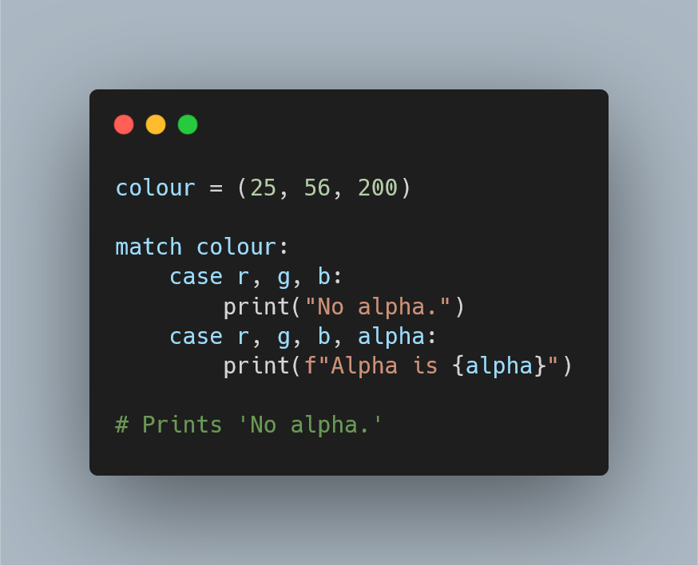

Correspondência estrutural é uma funcionalidade que vai ser introduzida
com Python 3.10, e este artigo mostra como a usar para
escrever código elegante com a instrução `match`.

===

(Se és novo aqui e não sabes o que é uma Pydon't, então talvez queiras começar por
ler a [Proclamação das Pydon'ts][manifesto].)

Infelizmente, ainda não traduzi este artigo para português...
Hei de o fazer eventualmente, a sério!
([Se me comprares uma fatia de pizza][pizza], podes pedir-me
para eu traduzir este artigo e eu prometo que o faço logo!
Afinal de contas, ofereceste-me uma fatia de pizza...)

# Referências (em inglês)

 - PEP 622 -- Structural Pattern Matching, [https://www.python.org/dev/peps/pep-0622/][pep-622].
 - PEP 634 -- Structural Pattern Matching: Specification, [https://www.python.org/dev/peps/pep-0634/][pep-634].
 - PEP 635 -- Structural Pattern Matching: Motivation and Rationale, [https://www.python.org/dev/peps/pep-0635/][pep-635].
 - PEP 636 -- Structural Pattern Matching: Tutorial, [https://www.python.org/dev/peps/pep-0636/][pep-636].
 - Dynamic Pattern Matching with Python,
[https://gvanrossum.github.io/docs/PyPatternMatching.pdf](https://gvanrossum.github.io/docs/PyPatternMatching.pdf).
 - Python 3.10 Pattern Matching in Action, YouTube video by “Big Python”, [https://www.youtube.com/watch?v=SYTVSeTgL3s](https://www.youtube.com/watch?v=SYTVSeTgL3s).

Consultadas pela última vez a 9 de março de 2021.

[pizza]: https://buymeacoffee.com/mathspp
[subscribe]: https://mathspp.com/subscribe
[manifesto]: /blog/pydonts/pydont-manifesto
[pep-622]: https://www.python.org/dev/peps/pep-0622/
[pep-634]: https://www.python.org/dev/peps/pep-0634/
[pep-635]: https://www.python.org/dev/peps/pep-0635/
[pep-636]: https://www.python.org/dev/peps/pep-0636/
[py-pre-re]: https://www.python.org/download/pre-releases/
[pydont-du]: https://mathspp.com/blog/pydonts/deep-unpacking
[pydont-sa]: https://mathspp.com/blog/pydonts/unpacking-with-starred-assignments
[pydont-str-repr]: https://mathspp.com/blog/pydonts/str-and-repr
