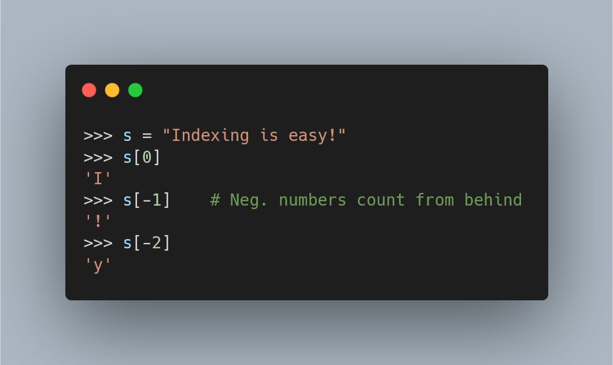

---
metadata:
    description: "A short article with all you need to know about sequence indexing in Python – and a bit more."
title: "Sequence indexing | Pydon't"
---

A short article with all you need to know about sequence indexing in Python – and a bit more.

===



(If you are new here and have no idea what a Pydon't is, you may want to read the
[Pydon't Manifesto][manifesto].)


# Introduction

Sequences in Python, like strings, lists, and tuples, are objects that
support indexing: a fairly simple operation that we can use to access specific elements.
This short article will cover the basics of how sequence indexing works and then give you
some tips regarding anti-patterns to avoid when using indices in your Python code.

In this article you will:

 - learn the basic syntax for indexing sequences;
 - learn how negative indices work;
 - see some tools that are often used to work with sequences and indices;
 - learn a couple of tricks and things to avoid when indexing;


# Sequence indexing

First and foremost, I am talking about _sequence indexing_ here to distinguish the type
of indexing you do to access the values of a dictionary, where you use _keys_ to index
into the dictionary and retrieve its values.
In this article we will be talking about using _integers_ to index _linear sequences_,
that is, sequences that we can traverse from one end to the other, in an ordered fashion.

A very simple example of such a sequence is a string:

```py
>>> s = "Indexing is easy!"
>>> s
'Indexing is easy!'
```

To index a specific character of this string I just use square brackets and the integer
that corresponds to the character I want.
Python is 0-indexed, which means it starts counting indices at 0.
Therefore, the very first element of a sequence can be obtained with `[0]`.
In our example, this should give a capital `"I"`:

```py
>>> s = "Indexing is easy!"
>>> s[0]
'I'
```

Then, each following character is obtained by increasing the index by 1:

```py
>>> s = "Indexing is easy!"
>>> s[1]
'n'
>>> s[2]
'd'
>>> s[3]
'e'
```

Here is a figure that shows how to look at a sequence and figure out which
index corresponds to each element:


Imagine vertical bars that separate consecutive elements,
and then number each of those vertical bars,
starting with the leftmost bar.
Each element gets the index associated with the bar immediately to its left:


# Maximum legal index and index errors

Because indices start at 0, the last legal index to a sequence is the index that is equal
to the length of the sequence, _minus_ one:

```py
>>> s = "Indexing is easy!"
>>> len(s)
17
>>> s[16]
'!'
>>> s[17]
Traceback (most recent call last):
  File "<stdin>", line 1, in <module>
IndexError: string index out of range
```

As you can see above, if you use an index that is too large
(read: greater than or equal to the length of the sequence)
Python will raise an `IndexError`, warning you about your
usage of an integer that is too large for that specific indexing operation.


# Negative indices

If the last legal index is the length of the sequence minus 1,
then there is an obvious way to access the last item of a sequence:

```py
>>> s = "Indexing is easy!"
>>> s[len(s)-1]
'!'
>>> l = [12, 45, 11, 89, 0, 99]
>>> l[len(l)-1] 
99
```

However, Python provides this really interesting feature where you can
use negative indices to count from the end of the sequence.
In order to figure out which negative index corresponds to which element,
think about writing the sequence to the left of itself:


Then you just have to continue the numbering from the right to the left,
therefore making use of negative numbers:


From the figure above you can see that the index `-1` refers to the last element of the sequence,
the index `-2` refers to the second to last, etc:

```py
>>> s = "Indexing is easy!"
>>> s[-1]
'!'
>>> s[-2]
'y'
```

We can also take a look at all the negative indices that work for our specific sequence:


Another way to look at negative indices is to pretend there is a `len(s)` to their left:

| Negative index | | Corresponding positive index |
| :- | :- | :- |
| `-1` | | `len(s) - 1` |
| `-2` | | `len(s) - 2` |
| `-3` | | `len(s) - 3` |
| ... | | ... |
| `-len(s)` | | `len(s) - len(s)` (same as `0`) |

And a couple of examples:

```py
>>> s = "Indexing is easy!"
>>> s[-5]
'e'
>>> s[len(s)-5]
'e'
>>> s[-13]
'x'
>>> s[len(s)-13]
'x'
>>> len(s)
17
>>> s[-17]
'I'
>>> s[len(s)-17]
'I'
```

# Indexing idioms

Having seen the basic syntax for indexing,
there are a couple of indices that would be helpful
if you were able to read them immediately for what they are,
without having to think about them:

| Index operation | | Interpretation |
| :- | :- | :- |
| `s[0]` | | First element of `s` |
| `s[1]` | | Second element of `s` |
| `s[-1]` | | Last element of `s` |
| `s[-2]` | | Second to last element of `s` |


# To index or not to index?

Just a quick note on something that I trip over every
now and then.

Python has many useful built-ins and built-in data types.
Of them, strings, lists and tuples are indexable with integers.
Sets are not.

You should also be careful about things that you _think_
are like lists, but really are _not_.
These include `enumerate`, `zip`, `map`, and
other objects.
None of these are indexable, none of these have a `len` value, etc.
Pay attention to that!

```py
>>> l = [0, 1, 2, 3, 4, 5, 6, 7, 8, 9]
>>> e = enumerate(l)
>>> e[3]
Traceback (most recent call last):
  File "<stdin>", line 1, in <module>
TypeError: 'enumerate' object is not subscriptable
>>> z = zip(l)
>>> z[3]
# ...
TypeError: 'zip' object is not subscriptable
>>> m = map(str, l)
>>> m[3]
# ...
TypeError: 'map' object is not subscriptable
```

# Best practices in code

## A looping pattern with `range`

Because of the way both `range` and indices work,
one can understand that `range(len(s))` will generate
all the legal indices for `s`:

```py
>>> s = "Indexing is easy!"
>>> list(range(len(s)))     # use list() to print the values
[0, 1, 2, 3, 4, 5, 6, 7, 8, 9, 10, 11, 12, 13, 14, 15, 16]
>>> s[0]
'I'
>>> s[16]
'!'
```

A consequence of this is that beginners, and people who are
more distracted or used to other programming languages,
end up employing a very common anti-pattern in `for` loops.

To exemplify this, suppose we wanted to write a fairly
naïve program to find the unique letters in our string.
Here is what the anti-pattern would look like:

```py
>>> s = "Indexing is easy!"
>>> uniques = []
>>> for idx in range(len(s)):
...     if s[idx] not in uniques:
...             uniques.append(s[idx])
... 
>>> uniques
['I', 'n', 'd', 'e', 'x', 'i', 'g', ' ', 's', 'a', 'y', '!']
```

! This is a naïve solution to the problem of “find unique characters”,
! you probably want to use a Python `set` for a more efficient implementation :)

The problem here is that the `for` loop
is being done in a roundabout way:
we have access to a sequence (the string) that we could
_iterate over_, but instead we find its length,
so that we can use `range` to compute its legal indices,
which we then _iterate over_,
only to then access the elements of the sequence through their indices.

This way of writing `for` loops is similar to the way one would
write `for` loops in other programming languages, if you were
to iterate over the elements of an array.

However, we are using Python, not any other language.
One of the things I enjoy the most about Python's `for` loops
is that you can access directly the consecutive elements of
a sequence.
Hence, we can actually rewrite our `for` loop slightly,
but in a way that makes it much more elegant:

```py
>>> s = "Indexing is easy!"
>>> uniques = []
>>> for letter in s:
...     if letter not in uniques:
...             uniques.append(letter)
... 
>>> uniques
['I', 'n', 'd', 'e', 'x', 'i', 'g', ' ', 's', 'a', 'y', '!']
```

What I really like about these types of loops is that if your
variables are named correctly, the statements express your intent
very clearly.
The line `for letter in s:` is read as

 > “For each `letter` in (the string) `s`...”

This type of `for` loop iterates directly over the values you
care about, which is often what you want.
If you care about the indices,
then be my guest and use `range(len(s))`!

! Another anti-pattern to be on the lookout for happens
! when you need to work with the indices _and_ the values.
! In that case, you probably want to use the `enumerate`
! function.
! I tell you all about that function [in a Pydon't of its own][pydont-enumerate-me],
! so go check that if you haven't.


## Large expressions as indices

When you are dealing with sequences and with indices
for those sequences, you may end up needing to perform some
calculations to compute new indices that interest you.
For example, suppose you want the middle element of a string
and you don't know about `//` yet:

```py
>>> s = "Indexing is easy!"
>>> s[len(s)/2]     # len(s)/2 isn't an integer!!
Traceback (most recent call last):
  File "<stdin>", line 1, in <module>
TypeError: string indices must be integers
>>> len(s)/2
8.5
>>> import math
>>> s[math.floor(len(s)/2)]
' '
>>> s[len(s)//2]    # Pro-tip: the operation // is ideal here
' '
```

Where am I going with this?

Take a look at the expression you just used:

```py
s[math.floor(len(s)/2)]
```

Maybe it is me getting old, but I struggle a bit to read that
because of the `[]` enclosing the expression which then has
a couple of `()` that I also have to parse, to figure out
what goes where.

If you have _large_ expressions to compute indices
(and here, _large_ will be subjective),
inserting those expressions directly inside `[]` may
lead to long lines of code that are then complicated to read
and understand.
If you have lines that are hard to understand,
then you probably need to comment them, creating even
more lines of code.

Another alternative is to create a _well-named_ variable
to hold the result of the computation of the new index:

```py
>>> s = "Indexing is easy!"
>>> mid_char_idx = math.floor(len(s)/2)
>>> s[mid_char_idx]
' '
```

For this silly example, notice that the new variable name
is almost as long as the expression itself!
_However_, `s[mid_char_idx]` is very, very, easy to read
and does not need any further comments.

So, if you have large expressions to compute indices,
think twice before using them to index directly into the sequence
at hands and consider using an intermediate variable
with a descriptive name.


## Unpacking with indexing

You will find yourself often working with small groups of data,
for example pairs of things that you keep together in a small
list for ease of use.
For example, the first and last names of a person:

```py
>>> names = ["Mary", "Doe"]
```

Now you have this little function that creates a formal
or informal greeting for a given name:

```py
>>> names = ["Mary", "Doe"]
>>> def greet(names, formal):
...     if formal:
...             return "Hello Miss " + names[1]
...     else:
...             return "Hey there " + names[0]
... 
>>> greet(names, True)
'Hello Miss Doe'
>>> greet(names, False)
'Hey there Mary'
```

Something you might consider and that adds a bit of clarity
to your code is unpacking the `names` before you reach the `if`
statement:

```py
def greet(names, formal):
    first, last = names
    if formal:
        return "Hello Miss " + last
    else:
        return "Hey there " + first
```

Why would this be preferable, if I just added a line of code?
It makes the _intent_ of the code _much_ more obvious.
Just from looking at the function as is, you can see
from the first line `first, last = names` that
`names` is supposed to be a pair with the first and last names
of a person and then the `if: ... else: ...` is very, very
easy to follow because we see _immediately_ that we want to
use the `last` name `if` we need a `formal` greeting, and otherwise
(`else`) we use the `first` name.

Furthermore, the action of unpacking (like so:)

```py
first, last = names
```

forces your `greet` function to expect pairs as the `names` variable,
because a list with less or more elements will raise an error:

```py
>>> first, last = ["Mary", "Anne", "Doe"] 
Traceback (most recent call last):
  File "<stdin>", line 1, in <module>
ValueError: too many values to unpack (expected 2)
```

We are assuming we really are working with _pairs_,
so if the `greet` function gets something that is not a pair,
this error is useful in spotting a problem in our code.
Maybe someone didn't understand how to use the function and
called it with the first name of the person?

```py
>>> greet("Mary", True)
Traceback (most recent call last):
  File "<stdin>", line 1, in <module>
  File "<stdin>", line 2, in greet
ValueError: too many values to unpack (expected 2)
```

This would help you find a location where the `greet`
function was not being properly used.

!!! I have written at length about unpacking in Python
!!! (another favourite feature of mine!) so feel free
!!! to read my articles on [unpacking with starred assignments][pydont-starred-unpack]
!!! and on [deep-unpacking][pydont-deep-unpacking].

# Conclusion

Here's the main takeaway of this article, for you, on a silver platter:

 > “*Indexing is simple and powerful, but sometimes when indexing
 looks like the answer, there is another Python feature waiting
 to be used.*”

This Pydon't showed you that:

 - Indexing in Python is 0-based;
 - Python allows negative indices in sequences;
 - Using indices in a `for` loop to access the elements of a sequence is an anti-pattern in Python;
 - Using large expressions when indexing bloats your code and you are better off with a descriptive variable,
even if that variable has a long name;
 - If you know the exact structure of the sequence you are dealing with, unpacking might be preferable to indexing.

If you liked this Pydon't be sure to leave a reaction below and share this with your friends and fellow Pythonistas.
Also, [don't forget to subscribe to the newsletter][subscribe] so you don't miss
a single Pydon't!


[subscribe]: https://mathspp.com/subscribe
[manifesto]: /blog/pydonts/pydont-manifesto
[pydont-enumerate-me]: /blog/pydonts/enumerate-me
[pydont-starred-unpack]: /blog/pydonts/unpacking-with-starred-assignments
[pydont-deep-unpacking]: /blog/pydonts/deep-unpacking
