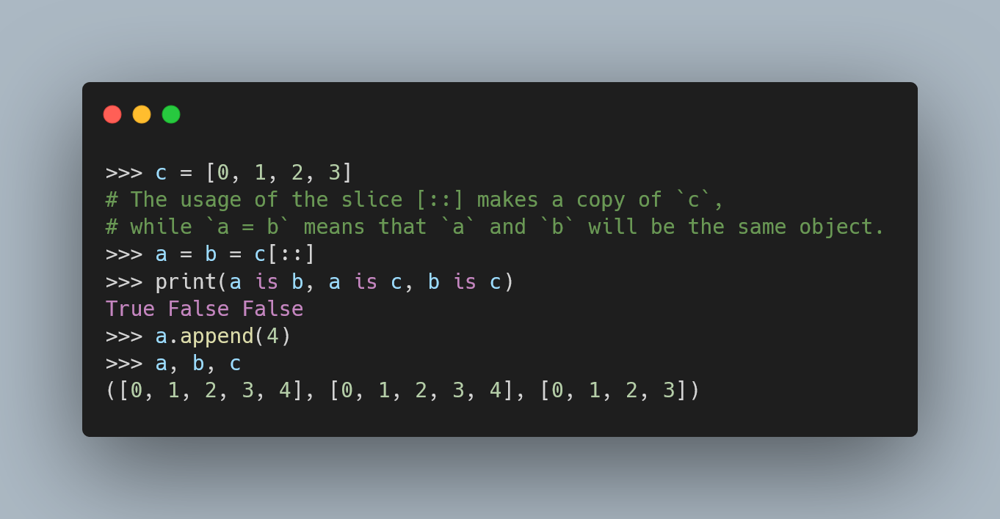

---
metadata:
    description: "Did you know that slices are actual Python objects? And those you can use to access portions of sequences, like lists or strings."
title: "Slices and slicing sequences | Pydon't"
---

Did you know that slices are actual Python objects? And you can use them to access portions of sequences, like lists or strings.

===

(If you are new here and have no idea what a Pydon't is, you may want to read the
[Pydon't Manifesto][manifesto].)

# Introduction

! By the way, I don't want to be annoying, but did you know that I _just_
! published the [“Pydon'ts – Writing beautiful Python code”][pydonts-book] book?
! If you grab the book now, you can get it at a discounted price ;)

# Examples in code

# Conclusion

Here's the main takeaway of this article, for you, on a silver platter:

 > “**”

This Pydon't showed you that:

 - 

If you liked this Pydon't be sure to leave a reaction below and share this with your friends and fellow Pythonistas.
Also, [don't forget to subscribe to the newsletter][subscribe] so you don't miss
a single Pydon't!

[subscribe]: https://mathspp.com/subscribe
[manifesto]: /blog/pydonts/pydont-manifesto
[pydont-unpacking]: https://mathspp.com/blog/pydonts/deep-unpacking
[pydont-zip]: /blog/pydonts/zip-up
[doctest]: https://docs.python.org/3/library/doctest.html
[calendar]: https://docs.python.org/3/library/calendar.html
[mailbox]: https://docs.python.org/3/library/mailbox.html
