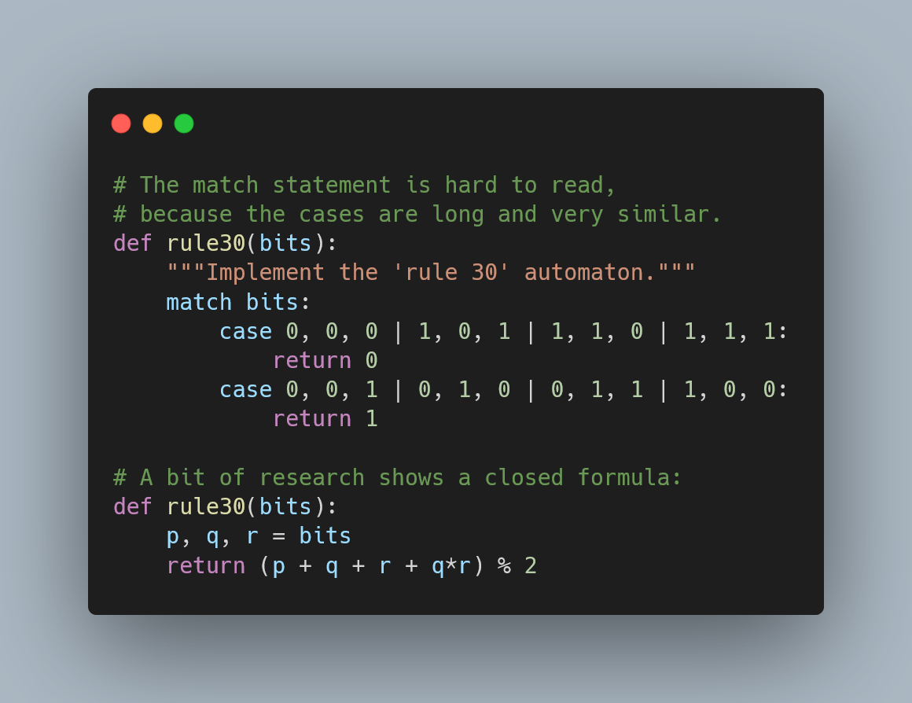

Structural pattern matching is coming in Python 3.10 and
[the previous Pydon't][pm-tutorial-pydont] explored some interesting use cases
for the new `match` statement.
This article explores situations for which `match` isn't the answer.

===



(If you are new here and have no idea what a Pydon't is, you may want to read the
[Pydon't Manifesto][manifesto].)


# Introduction

Structural pattern matching is coming to Python, and while it may look
like a plain switch statement like many other languages have,
Python's `match` statement was not introduced to serve as a simple
switch statement.

In [this article][pm-tutorial-pydont] I explored plenty of use cases
for the new `match` statement, and in this blog post I will try
to explore some use cases for which a `match` is _not_ the answer.
This article will assume you know how structural pattern matching
works in Python, so if you are unsure how that works feel free
to read my [“Pattern matching tutorial for Pythonic code”][pm-tutorial-pydont].

! At the time of writing, Python 3.10 is still a pre-release,
! so you have to look [in the right place][py-pre-re] if you want to download
! Python 3.10 and play with it.


# There should be only one obvious way to do it

As per [the Zen of Python][zp-pydont],

 > “There should be one-- and preferably only one --obvious way to do it.”

The introduction of the `match` statement may seem to violate
this sentence...
However, you have to remember that the point of the `match` statement
is _not_ to serve as a basic `switch` statement, as we already have
plenty of alternatives for that – if `match` was supposed to be a simple
switch, then it would probably be called “switch” and not “match”.
No, the point of the `match` statement is to do _structural pattern
matching_, so there's plenty of basic types of matching and casing
that can be done with the traditional tools that we have been using up
until Python 3.10.

Below I will share some of these tools with you, and I'll try to describe
the situations in which they are helpful.
Of course, this is much easier to understand with code so there will be
plenty of code examples along the way.


# A short and sweet `if` statement

The [Collatz conjecture][collatz] is a mathematical conjecture that says
that the following function terminates for any positive integer given
as input:

```py
def collatz_path(n):
    path = [n]
    while n != 1:
        match n % 2:
            case 0:
                n //= 2
            case 1:
                n = 3*n + 1
        path.append(n)
    return path
```

Which gives the following two example outputs:

```py
>>> collatz_path(8)
[8, 4, 2, 1]
>>> collatz_path(15)
[15, 46, 23, 70, 35, 106, 53, 160, 80, 40, 20, 10, 5, 16, 8, 4, 2, 1]
```

If we look at the usage of `match` above, we see it basically served
as a simple switch to match either `0` or `1`, the only two values
that the operation `n % 2` could result in for a positive integer `n`.
Notice that if we use a plain `if` we can write exactly the same code
*and* save one line of code:

```py
def collatz_path(n):
    path = [n]
    while n != 1:
        if n % 2:
            n = 3*n + 1
        else:
            n //= 2
        path.append(n)
    return path
```

We saved one line of code and reduced the maximum depth of our indentation:
with the `match` we had code that was indented four times, whereas the
implementation with the `if` only has three levels of depth.
When you only have a couple of options and you are checking for explicit equality,
a short and sweet `if` statement is most likely the way to go.


# Be smart(er)

In case you never heard of it, [Rule 30][rule-30] is an “elementary cellular automaton”.
You can think of it as a rule that receives three bits (three zeroes/ones) and produces
a new bit, depending on the three bits it received.
Automatons are really, really, interesting, but discussing them is past the point of
this article.
Let us just look at a possible implementation of the “Rule 30” automaton:

```py
def rule30(bits):
    match bits:
        case 0, 0, 0:
            return 0
        case 0, 0, 1:
            return 1
        case 0, 1, 0:
            return 1
        case 0, 1, 1:
            return 1
        case 1, 0, 0:
            return 1
        case 1, 0, 1:
            return 0
        case 1, 1, 0:
            return 0
        case 1, 1, 1:
            return 0
```

This seems like a sensible use of the `match` statement, except that we just wrote
16 lines of code...
Ok, you are right, let us put together the rules that return the same values,
that should make the code shorter:

```py
def rule30(bits):
    match bits:
        case 0, 0, 0 | 1, 0, 1 | 1, 1, 0 | 1, 1, 1:
            return 0
        case 0, 0, 1 | 0, 1, 0 | 0, 1, 1 | 1, 0, 0:
            return 1
```

Yup, much better.
But now we have four options on each `case`, and I have to squint to figure out
where each option starts and ends, and the long strings of zeroes and ones aren't
really that pleasant to the eye...
Can we make it better..?

With just a little bit of research you can find out that the “Rule 30” can be written
as a _closed formula_ that depends on the three input bits, which means we don't
have to `match` the input bits with all the possible inputs, we can just _compute_ the output:

```py
def rule30(bits):
    p, q, r = bits
    return (p + q + r + q*r) % 2
```

You might argue that this formula obscures the relationship
between the several inputs and their outputs.
You are right in principle, but having the explicit “Rule 30” written
out as a `match` doesn't tell you much about why each input maps to
each output either way, so why not make it short and sweet?


# Basic mappings

## Getting from dictionaries

There are many cases in which you just want to take a value in
and map it to something else.
As an example, take this piece of code that takes an expression
and writes it in prefix notation:

```py
import ast

def prefix(tree):
    match tree:
        case ast.Expression(expr):
            return prefix(expr)
        case ast.Constant(value=v):
            return str(v)
        case ast.BinOp(lhs, op, rhs):
            match op:
                case ast.Add():
                    sop = "+"
                case ast.Sub():
                    sop = "-"
                case ast.Mult():
                    sop = "*"
                case ast.Div():
                    sop = "/"
                case _:
                    raise NotImplementedError()
            return f"{sop} {prefix(lhs)} {prefix(rhs)}"
        case _:
            raise NotImplementedError()

print(prefix(ast.parse("1 + 2 + 3", mode="eval")))     # + + 1 2 3
print(prefix(ast.parse("2**3 + 6", mode="eval"))       # + * 2 3 6
print(prefix(ast.parse("1 + 2*3 - 5/7", mode="eval"))) # - + 1 * 2 3 / 5 7
```

Notice the inner `match` to convert the `op` inside a `BinOp`
to a string?
For starters, that nested `match` takes up too much horizontal space
and distracts us from what is actually going on, which is us traversing
the recursive structure of the tree, so we could actually refactor
this as a utility function:

```py
import ast

def op_to_str(op):
    match op:
        case ast.Add():
            sop = "+"
        case ast.Sub():
            sop = "-"
        case ast.Mult():
            sop = "*"
        case ast.Div():
            sop = "/"
        case _:
            raise NotImplementedError()
    return sop

def prefix(tree):
    match tree:
        case ast.Expression(expr):
            return prefix(expr)
        case ast.Constant(value=v):
            return str(v)
        case ast.BinOp(lhs, op, rhs):
            return f"{op_to_str(op)} {prefix(lhs)} {prefix(rhs)}"
        case _:
            raise NotImplementedError()

print(prefix(ast.parse("1 + 2 + 3", mode="eval")))     # + + 1 2 3
print(prefix(ast.parse("2**3 + 6", mode="eval"))       # + * 2 3 6
print(prefix(ast.parse("1 + 2*3 - 5/7", mode="eval"))) # - + 1 * 2 3 / 5 7
```

This makes it harder to read and interpret the `prefix` function,
but now we have another problem that really annoys me:
a simple, but long function, the `op_to_str` function.
For every type of operator you support, your function grows by two lines...
If you replace the `match` with a chain of `if` and `elif` statements
you only save one line at the top...

The fix I suggested [in the original article][pm-tutorial-pydont-dict]
was using a dictionary to map the type of `op` to its string representation:

```py
def op_to_str(op):
    ops = {
        ast.Add: "+",
        ast.Sub: "-",
        ast.Mult: "*",
        ast.Div: "/",
    }
    return ops.get(op.__class__, None)
```

This usage pattern of a dictionary is quite common in Python,
using the `get` method to compute the mapping of a value
to another value.
In case you are wondering, you can use the second argument of the
`get` function to provide for a default value, in case your
dictionary hasn't listed every single possible value.


## `getattr`

Another useful mechanism that we have available is the [`getattr`][pydocs-getattr] function,
which is part of a trio of Python built-in functions:
`hasattr`, `getattr` and `setattr`.

I will be writing about this trio in a future Pydon't;
be sure to [subscribe] to the Pydon't newsletter so you don't miss it!
For now, I'll just show you briefly what `getattr` can do for you.

I am writing an [APL] interpreter called [RGSPL], and there is a function
named `visit_F` where I need to map APL symbols like `+`, `-`, and `⍴` to a Python
function that implements them, that I stored in the `functions.py` file.
If I were using a `match` statement, here is what this `visit_F` could look like:

```py
import functions

def visit_F(self, func):
    """Fetch the callable function."""

    name = func.token.type.lower()      # Get the name of the symbol.
    match name:
        case "plus":
            function = functions.plus
        case "minus":
            function = functions.minus
        case "reshape":
            function = functions.reshape
        case _:
            function = None
    if function is None:
        raise Exception(f"Could not find function {name}.")
    return function
```

This is a similar problem to the one I showed above, where
we wanted to get a string for each type of operator we got,
so this could actually be written with the dictionary mapping.
I invite you to do it, as a little exercise.

However, here's the catch: I have still a long way to go
in my [RGSPL] project, and I already have a couple dozen
of those primitives, so my `match` statement would be around
40 lines long, if I were using that solution,
or 20 lines long if I were using the dictionary solution,
with a key, value pair per line.

_Thankfully_, Python's `getattr` can be used to _get_
an _attribute_ from an object, if I have the name of that
attribute.
It is no coincidence that the value of the `name` variable
above is supposed to be exactly the same as the name
of the function defined inside `functions.py`:

```py
import functions

getattr(functions, "plus", None)        # returns functions.plus
getattr(functions, "reshape", None)     # returns functions.reduce
getattr(functions, "fasfadf", None)     # returns None
```

With the `getattr` function that Python provides, my `visit_F` stays
with a constant size, regardless of how many functions I add to the `functions.py` file:

```py
def visit_F(self, func):
    """Fetch the callable function."""

    name = func.token.type.lower()      # Get the name of the symbol.
    function = getattr(functions, name, None)
    if function is None:
        raise Exception(f"Could not find function {name}.")
    return function
```

The `getattr` function can also be used to get attributes from
an instance of a class, e.g.,

```py
class Foo:
    def __ini__(self, a, b):
        self.a = a
        self.b = b

foo = Foo(3, 4)
print(getattr(foo, "a"))    # prints 3
bar = Foo(10, ";")
print(getattr(bar, ";"))    # prints ';'
```

This goes to show that it is always nice to know the tools you have
at your disposal.
Not everything has very broad use cases, but that also means that
the more specialised tools are the ones that make the most difference
when they are brought in.

Speaking of knowing your tools, the last use case in this article for which
`match` is a bad alternative, is related to calling different functions
when your data has different types.

## Single-dispatch generic functions

If you have programming experience in a programming language like Java,
you will be familiar with the concept of overloading a function:
you implement the same function several times, but you get to specify
the behaviour of the function for different types of arguments and/or
number of arguments.

For example, you might want to implement a function to pretty-print
a series of different types of objects:

```py
def pretty_print(arg):
    if isinstance(arg, complex):
        print(f"{arg.real} + {arg.imag}i")
    elif isinstance(arg, (list, tuple)):
        for i, elem in enumerate(arg):
            print(i, elem)
    elif isinstance(arg, dict):
        for key, value in arg.items():
            print(f"{key}: {value}")
    else:
        print(arg)
```

Which then works like so:

```py
>>> pretty_print(3)
3
>>> pretty_print([2, 5])
0 2
1 5
>>> pretty_print(3+4j)
3.0 + 4.0i
```

You can see that the branching introduced by the `if` statement
is merely to separate the different types that the `arg` could have,
and while the handling logic might be different, the final purpose
is always the same: to pretty-print an object.
But what if the code to handle each type of argument took 10 or 20
lines?
You would be getting a really long function with what would essentially
be embedded subfunctions.

You can separate all these subfunctions by making use of the `functools.singledispatch`
decorator:

```py
import functools

@functools.singledispatch
def pretty_print(arg):
    print(arg)

@pretty_print.register(complex)
def _(arg):
    print(f"{arg.real} + {arg.imag}i")

@pretty_print.register(list)
@pretty_print.register(tuple)
def _(arg):
    for i, elem in enumerate(arg):
        print(i, elem)

@pretty_print.register(dict)
def _(arg):
    for key, value in arg.items():
        print(f"{key}: {value}")
```

The `pretty_print` example isn't the _best_ example because you
spend as many lines decorating as in defining the actual subfunctions,
but this shows you the pattern that you can now be on the look out for.
You can read more about `singledispatch` [in the docs][pydocs-singledispatch].

# Conclusion

Here's the main takeaway of this article, for you, on a silver platter:

 > “The new `match` statement _is_ great, but that does not mean the `match`
statement will be the best alternative always and, in particular,
the `match` statement is generally being misused if you use it as a simple switch.”

This Pydon't showed you that:

 - `match` isn't necessarily always the best way to implement control flow;
 - short and basic `match` statements could be vanilla `if` statements;
 - sometimes there is a way to _compute_ what you need, instead of having
to list many different cases and their respective values;
 - built-in tools like `dict.get` and `getattr` can also be used to fetch
different values depending on the matching key; and
 - you can use `functools.singledispatch` when you need to execute different
subfunctions when the input has different types.

If you liked this Pydon't be sure to leave a reaction below and share this with your friends and fellow Pythonistas.
If you found this article really valuable then you could [buy me a slice of pizza 🍕][pizza]!

Also, [don't forget to subscribe to the newsletter][subscribe] so you don't miss
a single Pydon't!

# References

 - PEP 622 -- Structural Pattern Matching, [https://www.python.org/dev/peps/pep-0622/][pep-622];
 - PEP 634 -- Structural Pattern Matching: Specification, [https://www.python.org/dev/peps/pep-0634/][pep-634];
 - PEP 635 -- Structural Pattern Matching: Motivation and Rationale, [https://www.python.org/dev/peps/pep-0635/][pep-635];
 - PEP 636 -- Structural Pattern Matching: Tutorial, [https://www.python.org/dev/peps/pep-0636/][pep-636];
 - PEP 443 -- Single-dispatch generic functions, [https://www.python.org/dev/peps/pep-0443/](https://www.python.org/dev/peps/pep-0443/);
 - Python 3 Documentation, The Python Standard Library, `getattr`, [https://docs.python.org/3/library/functions.html#getattr][pydocs-getattr];
 - Python 3 Documentation, The Python Standard Library, `functools.singledispatch`, [https://docs.python.org/3/library/functools.html#functools.singledispatch][pydocs-singledispatch];
 - Wikipedia, “Collatz Conjecture”, [https://en.wikipedia.org/wiki/Collatz_conjecture][collatz];
 - WolframAlpha, “Rule 30”, [https://www.wolframalpha.com/input/?i=rule+30][rule-30];
 - Wikipedia, “Rule 30”, [https://en.wikipedia.org/wiki/Rule_30][rule-30-wiki];


Online references last consulted on the 16th of March of 2021.

[pizza]: https://buymeacoffee.com/mathspp
[subscribe]: https://mathspp.com/subscribe
[manifesto]: /blog/pydonts/pydont-manifesto
[pm-tutorial-pydont]: /blog/pydonts/pattern-matching-tutorial-for-pythonic-code
[pm-tutorial-pydont-options]: /blog/pydonts/pattern-matching-tutorial-for-pythonic-code#your-first-match-statement
[pm-tutorial-pydont-dict]: https://mathspp.com/blog/pydonts/pattern-matching-tutorial-for-pythonic-code#traversing-recursive-structures
[zp-pydont]: /blog/pydonts/pydont-disrespect-the-zen-of-python
[pydocs-getattr]: https://docs.python.org/3/library/functions.html#getattr
[pydocs-singledispatch]: https://docs.python.org/3/library/functools.html#functools.singledispatch
[pep-622]: https://www.python.org/dev/peps/pep-0622/
[pep-634]: https://www.python.org/dev/peps/pep-0634/
[pep-635]: https://www.python.org/dev/peps/pep-0635/
[pep-636]: https://www.python.org/dev/peps/pep-0636/
[py-pre-re]: https://www.python.org/download/pre-releases/
[gvanrossum-article]: https://gvanrossum.github.io/docs/PyPatternMatching.pdf
[collatz]: https://en.wikipedia.org/wiki/Collatz_conjecture
[rule-30]: https://www.wolframalpha.com/input/?i=rule+30
[rule-30-wiki]: https://en.wikipedia.org/wiki/Rule_30
[APL]: https://apl.wiki
[RGSPL]: https://github.com/RojerGS/RGSPL
